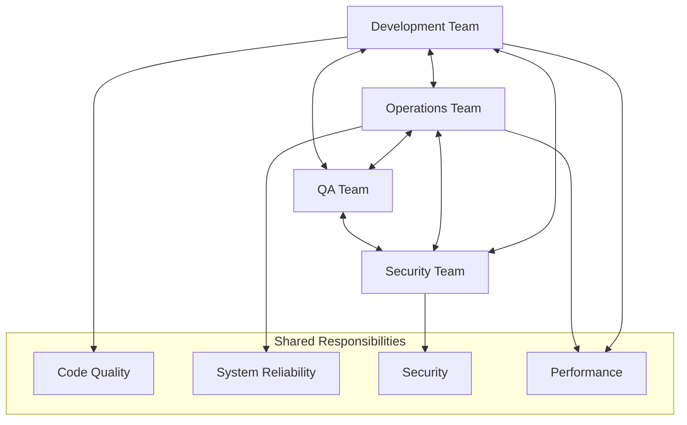
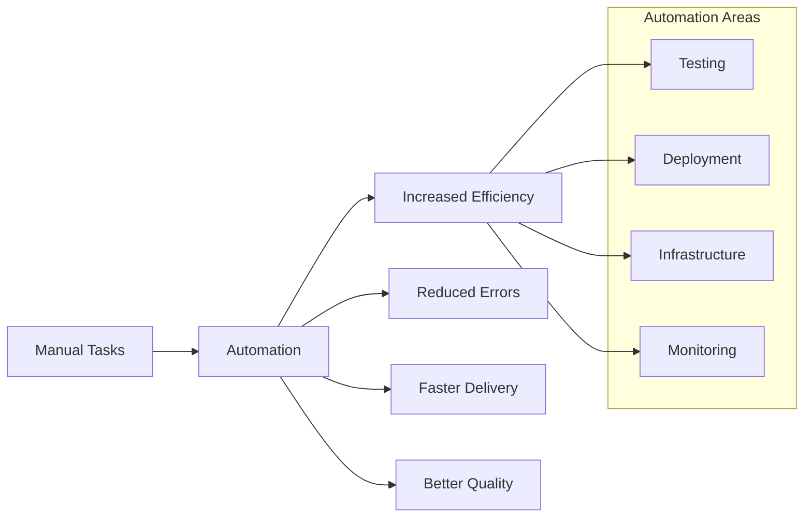
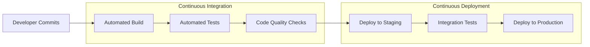
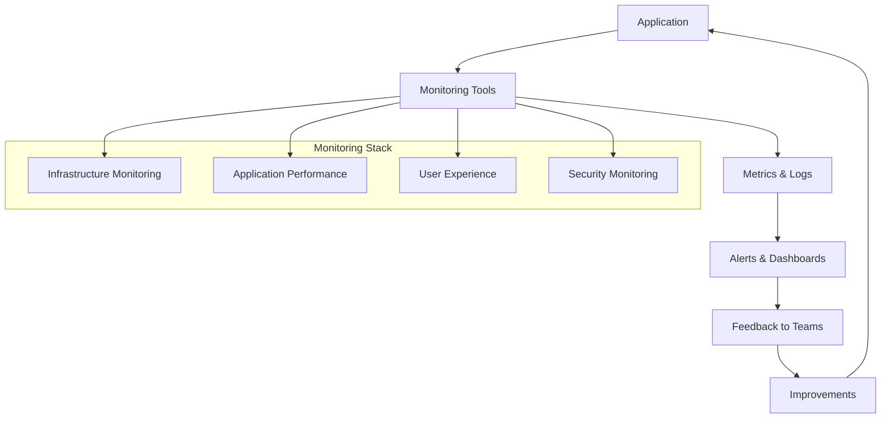
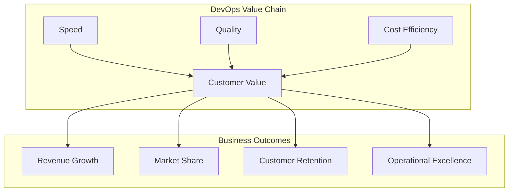
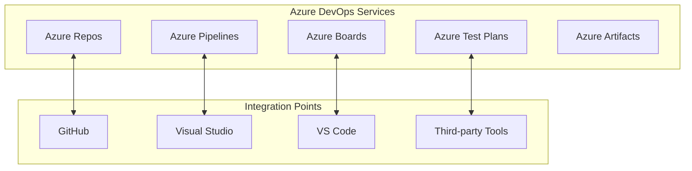

# DevOps Principles & Value

## Overview
DevOps is a cultural philosophy and set of practices that combines software development (Dev) and IT operations (Ops) to shorten the systems development life cycle while delivering features, fixes, and updates frequently in close alignment with business objectives.

## Core DevOps Principles

### 1. Collaboration and Communication
Breaking down silos between development, operations, and other stakeholders.

### 2. Automation
Automating repetitive tasks to reduce human error and increase efficiency.

### 3. Continuous Integration/Continuous Deployment (CI/CD)
Frequent integration of code changes and automated deployment processes.

### 4. Monitoring and Feedback
Continuous monitoring of applications and infrastructure to provide feedback loops.

## Business Value of DevOps

### Speed and Agility
- **Faster Time to Market**: Reduce deployment time from weeks to minutes
- **Quick Response to Changes**: Rapidly adapt to market demands
- **Competitive Advantage**: First-to-market with new features

### Quality and Reliability
- **Reduced Failure Rates**: Automated testing catches issues early
- **Faster Recovery**: Quick rollback and fix capabilities
- **Improved Customer Satisfaction**: More stable and reliable services

### Cost Optimization
- **Resource Efficiency**: Better utilization of infrastructure
- **Reduced Manual Labor**: Automation eliminates repetitive tasks
- **Lower Maintenance Costs**: Proactive monitoring prevents costly outages

## Azure DevOps Ecosystem

## Common DevOps Metrics

| Metric | Description | Target |
|--------|-------------|---------|
| **Lead Time** | Time from code commit to production | < 1 day |
| **Deployment Frequency** | How often deployments occur | Multiple times per day |
| **Mean Time to Recovery (MTTR)** | Time to recover from failures | < 1 hour |
| **Change Failure Rate** | Percentage of deployments causing failures | < 15% |

## Discussion Questions

1. **For Managers**: How can DevOps principles help your team respond faster to business requirements?

2. **For Technical Teams**: What are the biggest barriers to implementing DevOps in your current projects?

3. **For Everyone**: How do you measure success in your current development and deployment processes?

## Exercise: DevOps Maturity Assessment

### Instructions (5 minutes)
Rate your organization on a scale of 1-5 for each area:

| Area | Score (1-5) | Notes |
|------|-------------|-------|
| Collaboration between Dev/Ops | ___ | |
| Automation Level | ___ | |
| Deployment Frequency | ___ | |
| Monitoring & Feedback | ___ | |
| Recovery Time | ___ | |

### Discussion Points
- What areas scored lowest? Why?
- What quick wins could improve your scores?
- What would success look like in 6 months?

## Key Takeaways

✅ **DevOps is a culture, not just tools**  
✅ **Automation reduces risk and increases speed**  
✅ **Collaboration breaks down silos**  
✅ **Continuous improvement is essential**  
✅ **Metrics drive decision-making**

## Next Steps
- Implement one small automation win
- Establish regular cross-team communication
- Define success metrics for your context
- Start measuring current performance

---

*Continue to: [Introduction to Infrastructure as Code](./02-infrastructure-as-code.md)*
