# Source Control & Git Workflows

## Introduction to Source Control

Source control (also known as version control) is a system that tracks changes to files over time, allowing multiple developers to collaborate on the same codebase while maintaining a complete history of modifications.

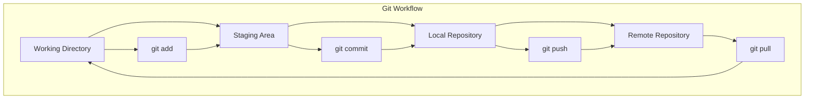

## Why Source Control for Infrastructure?

### Infrastructure as Code Needs Version Control
Just like application code, infrastructure code requires:
- **Change tracking**: Who changed what, when, and why
- **Collaboration**: Multiple team members working on infrastructure
- **Rollback capability**: Ability to revert problematic changes
- **Branching**: Parallel development of features
- **Audit trail**: Compliance and governance requirements

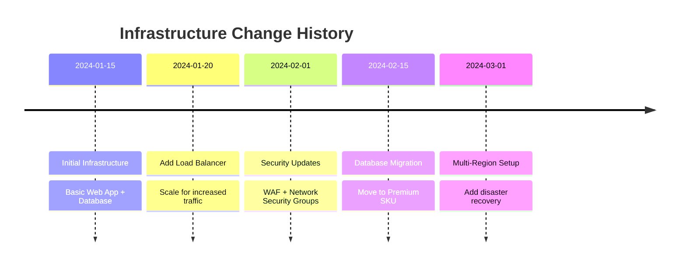

## Git Fundamentals for Infrastructure Teams

### Core Git Concepts

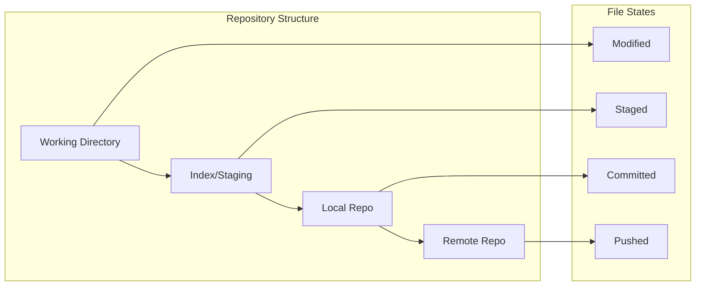

### Essential Git Commands for IaC

| Command | Purpose | Example |
|---------|---------|---------|
| `git init` | Initialize repository | `git init terraform-project` |
| `git add` | Stage changes | `git add main.tf` |
| `git commit` | Save changes | `git commit -m "Add web app resource"` |
| `git push` | Upload to remote | `git push origin main` |
| `git pull` | Download from remote | `git pull origin main` |
| `git branch` | Create/list branches | `git branch feature/add-database` |
| `git merge` | Combine branches | `git merge feature/add-database` |

## Branching Strategies for Infrastructure

### GitFlow for Infrastructure Teams

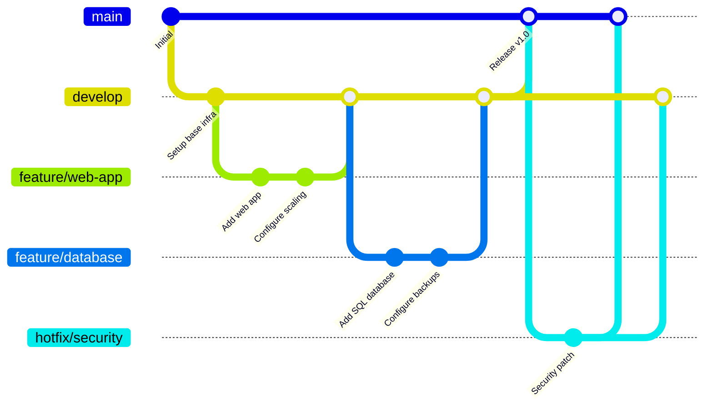

### Environment-Based Branching

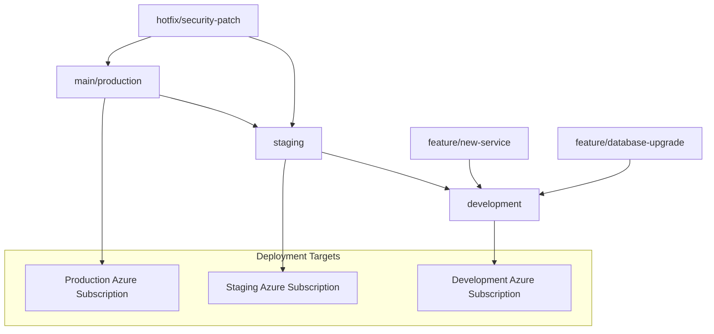

## Pull Request (PR) Workflow

### The PR Process for Infrastructure Changes

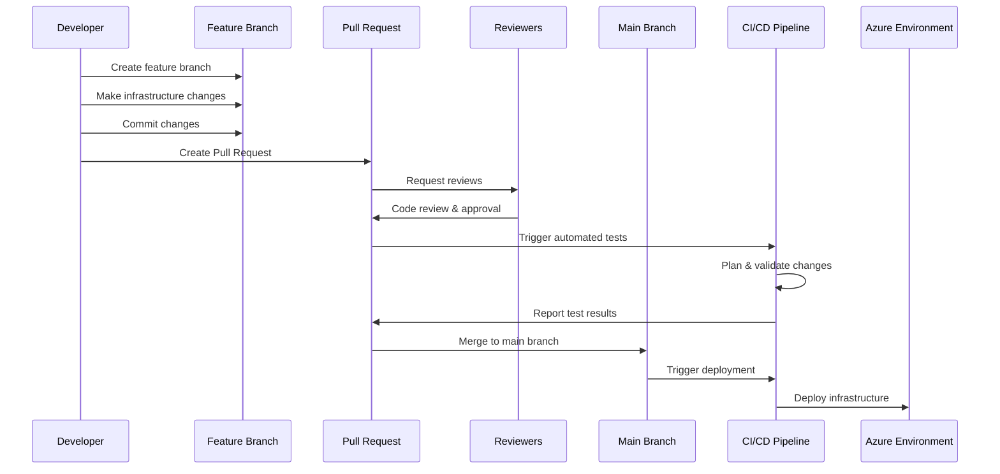

### PR Review Checklist for Infrastructure

#### Security & Compliance
- [ ] No hardcoded secrets or sensitive data
- [ ] Proper access controls and permissions
- [ ] Network security groups configured appropriately
- [ ] Encryption enabled where required

#### Best Practices
- [ ] Resources follow naming conventions
- [ ] Tags applied consistently
- [ ] Resource groups organized logically
- [ ] Cost optimization considerations

#### Technical Quality
- [ ] Code follows DRY principles
- [ ] Variables and outputs properly defined
- [ ] Documentation updated
- [ ] Terraform plan output reviewed

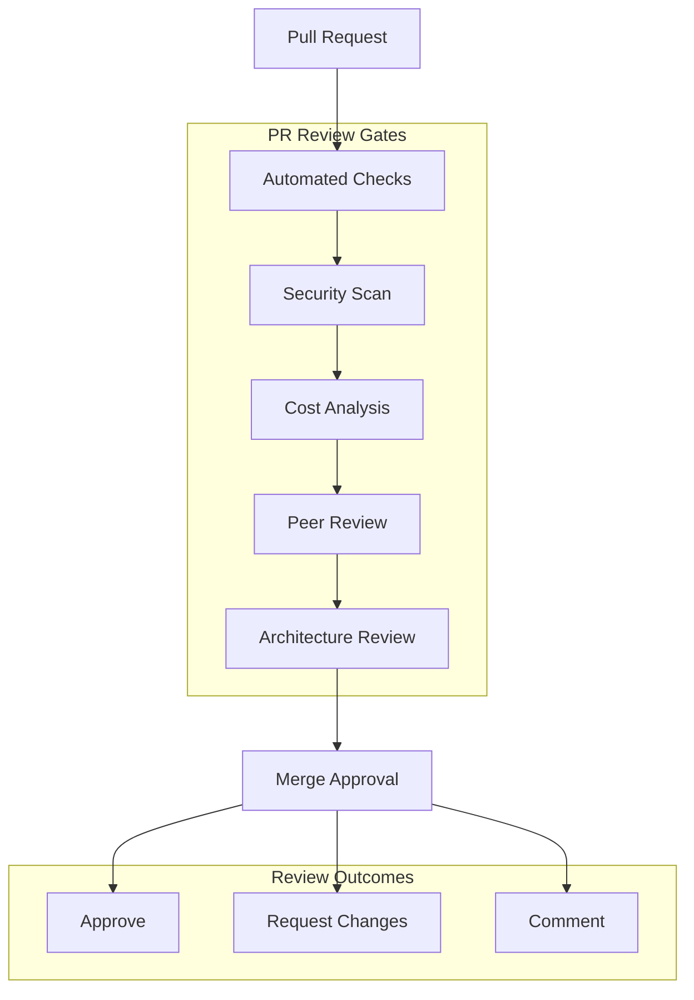

## Azure DevOps Integration

### Azure Repos with Infrastructure Code

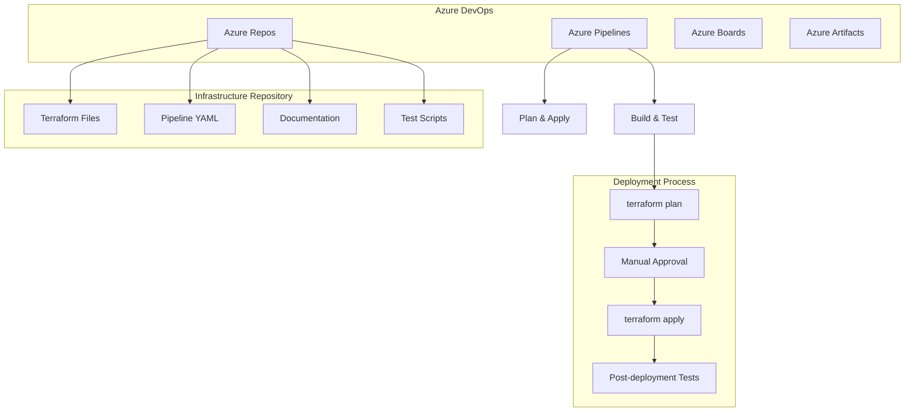

### Branch Policies for Infrastructure

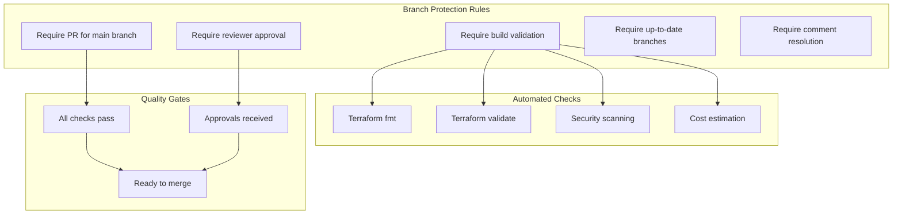

## Git Best Practices for Infrastructure

### Repository Structure
```
terraform-azure-infrastructure/
├── environments/
│   ├── dev/
│   ├── staging/
│   └── prod/
├── modules/
│   ├── web-app/
│   ├── database/
│   └── networking/
├── policies/
├── scripts/
├── .gitignore
├── README.md
└── CONTRIBUTING.md
```

### Commit Message Guidelines

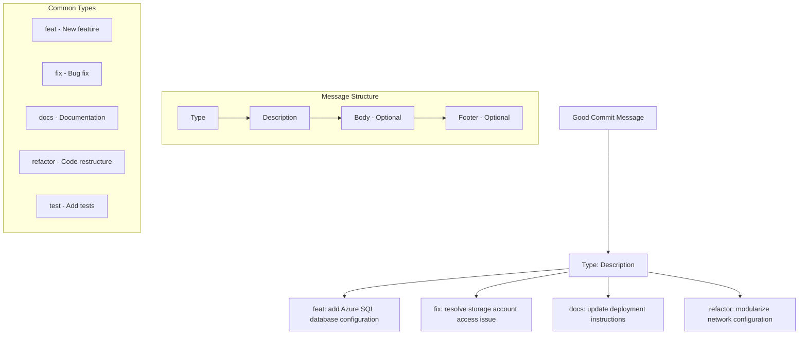

## GitHub vs Azure DevOps Comparison

| Feature | GitHub | Azure DevOps |
|---------|---------|---------------|
| **Repository Hosting** | Excellent | Excellent |
| **Pull Requests** | GitHub PR | Azure DevOps PR |
| **CI/CD Integration** | GitHub Actions | Azure Pipelines |
| **Project Management** | GitHub Issues/Projects | Azure Boards |
| **Package Management** | GitHub Packages | Azure Artifacts |
| **Enterprise Integration** | GitHub Enterprise | Native Azure integration |
| **Cost** | Free for public repos | Free tier available |

## Exercise: Git Workflow Simulation

### Scenario Setup (15 minutes)
You're working on adding a new Azure SQL Database to your infrastructure:

1. **Create a feature branch**
   ```bash
   git checkout -b feature/add-sql-database
   ```

2. **Make changes to infrastructure code**
   - Add database configuration
   - Update variables
   - Modify outputs

3. **Stage and commit changes**
   ```bash
   git add .
   git commit -m "feat: add Azure SQL database with backup configuration"
   ```

4. **Push branch and create PR**
   ```bash
   git push origin feature/add-sql-database
   ```

### PR Review Simulation

#### Review Checklist Activity
Work in pairs to review this sample Terraform code:

```terraform
resource "azurerm_sql_server" "example" {
  name                = "sqlserver${random_id.server.hex}"
  resource_group_name = azurerm_resource_group.example.name
  location            = azurerm_resource_group.example.location
  version             = "12.0"
  administrator_login = "admin123"
  administrator_login_password = "P@ssw0rd123!"
}
```

**Questions to Consider:**
- What security issues do you see?
- How could this be improved?
- What's missing for production readiness?

## Common Git Mistakes and Solutions

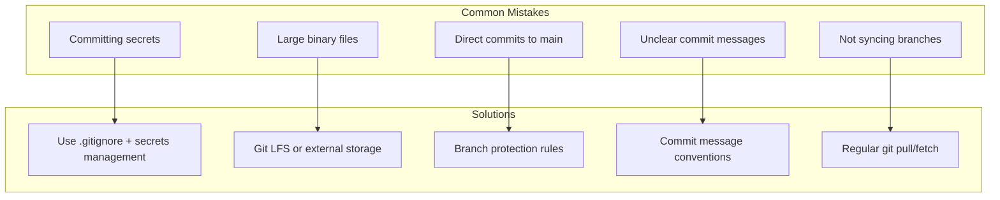

## Discussion Questions

1. **For Managers**: How can proper Git workflows improve compliance and audit capabilities?

2. **For Technical Teams**: What challenges have you faced with infrastructure change management?

3. **For Everyone**: How do you balance speed of delivery with proper review processes?

## Key Takeaways

✅ **Version control is essential for infrastructure code**  
✅ **Branching strategies enable parallel development**  
✅ **Pull requests provide quality gates**  
✅ **Automated checks reduce manual review burden**  
✅ **Proper commit messages create valuable history**  
✅ **Branch protection prevents direct production changes**

## Security Considerations

🔒 **Never commit secrets to version control**  
🔒 **Use branch protection rules**  
🔒 **Implement automated security scanning**  
🔒 **Require code reviews for sensitive changes**  
🔒 **Audit access to infrastructure repositories**

## Next Steps
- Set up repository with proper structure
- Configure branch protection rules
- Create PR templates for infrastructure changes
- Implement automated validation checks
- Train team on Git best practices

---

*Continue to: [What is Terraform?](./04-terraform-basics.md)*
