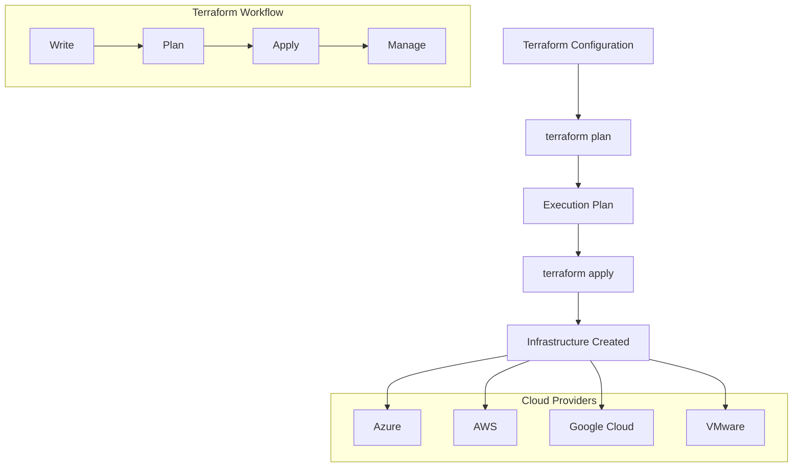
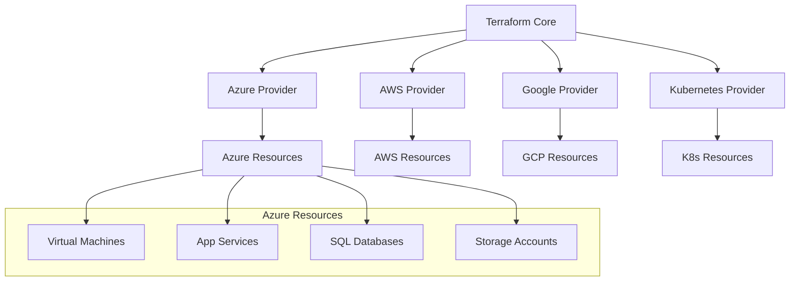
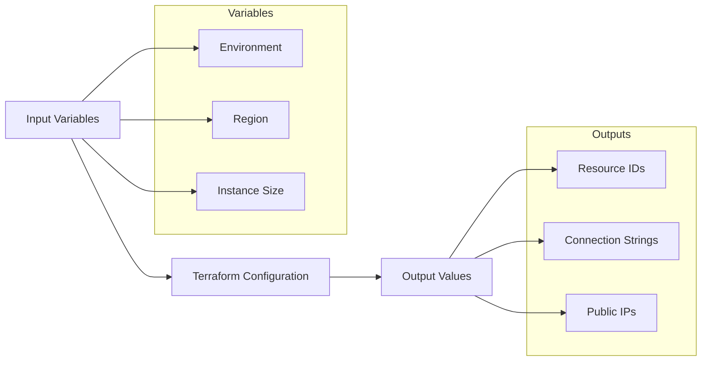
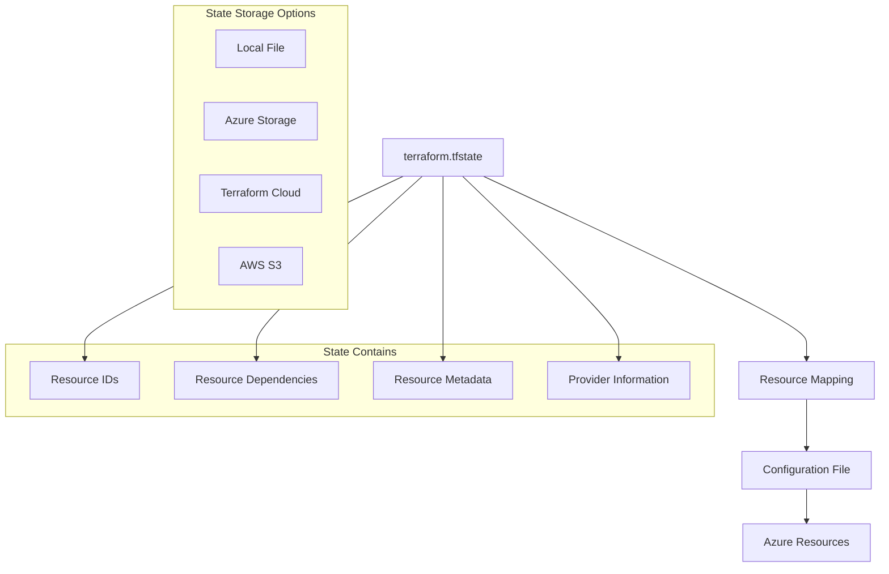
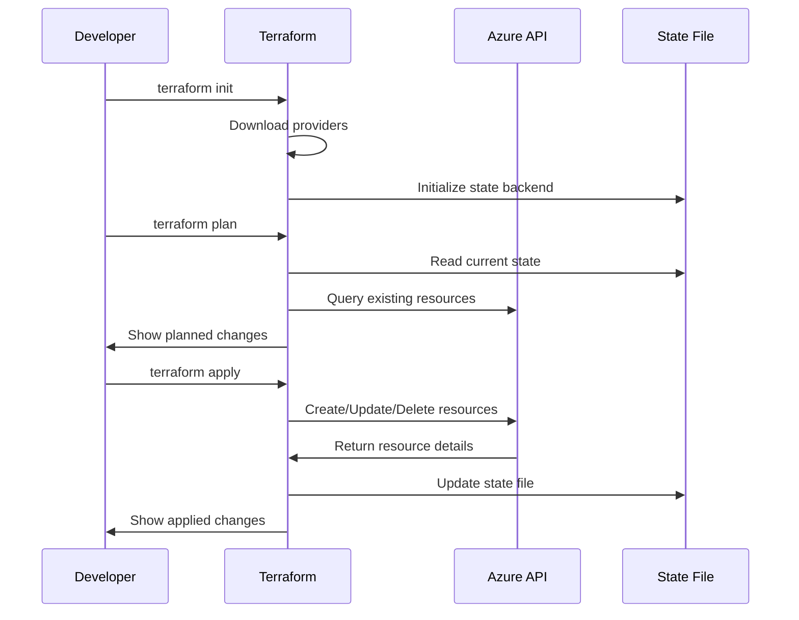
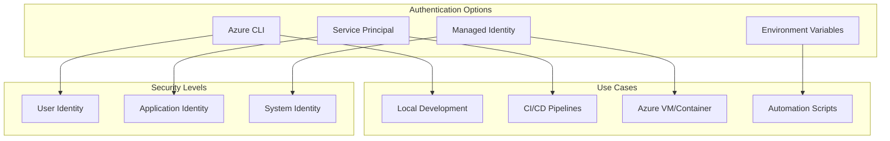
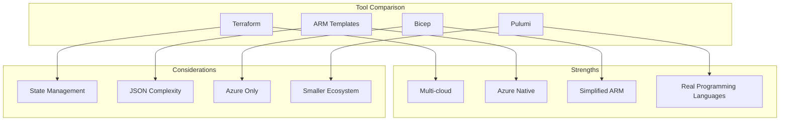
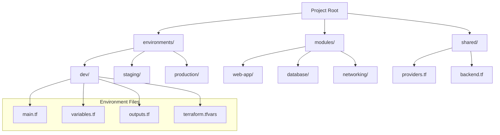
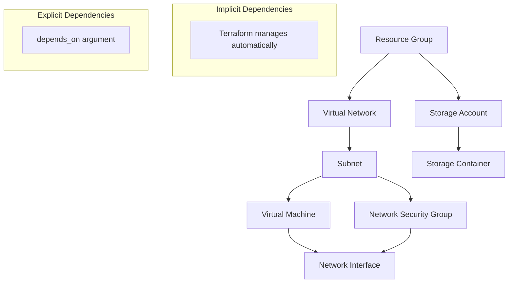
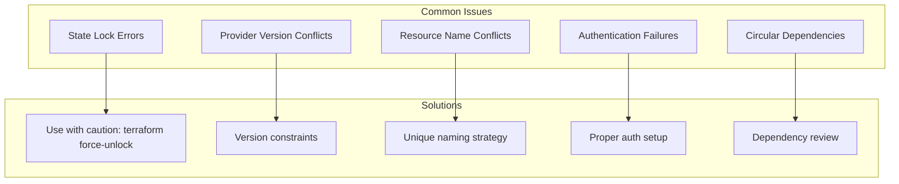

# What is Terraform?

## Introduction to Terraform

Terraform is an open-source Infrastructure as Code (IaC) tool created by HashiCorp that allows you to define and provision infrastructure using a declarative configuration language called HCL (HashiCorp Configuration Language).



## Core Terraform Concepts

### 1. Providers
Providers are plugins that enable Terraform to interact with cloud platforms, SaaS providers, and other APIs.



### 2. Resources
Resources are the most important element in Terraform. They describe infrastructure objects like virtual machines, networks, or higher-level components.

```terraform
# Example Azure Resource
resource "azurerm_resource_group" "example" {
  name     = "rg-terraform-demo"
  location = "East US"
  
  tags = {
    environment = "development"
    project     = "terraform-workshop"
  }
}
```

### 3. Data Sources
Data sources allow Terraform to fetch information from existing infrastructure or external systems.

```terraform
# Fetch existing resource group information
data "azurerm_resource_group" "existing" {
  name = "existing-rg"
}

# Use the data in another resource
resource "azurerm_storage_account" "example" {
  name                     = "terraformstorage"
  resource_group_name      = data.azurerm_resource_group.existing.name
  location                 = data.azurerm_resource_group.existing.location
  account_tier             = "Standard"
  account_replication_type = "LRS"
}
```

### 4. Variables and Outputs
Variables make configurations reusable, while outputs extract information from resources.



## Terraform State Management

### Understanding State
Terraform maintains a state file that maps real-world resources to your configuration and tracks metadata.



### Remote State Configuration
For team collaboration, store state remotely:

```terraform
terraform {
  backend "azurerm" {
    resource_group_name  = "rg-terraform-state"
    storage_account_name = "terraformstateaccount"
    container_name       = "tfstate"
    key                  = "terraform.tfstate"
  }
}
```

## Terraform Workflow in Detail

### The Three-Step Process



### Terraform Commands

| Command | Purpose | Example |
|---------|---------|---------|
| `terraform init` | Initialize working directory | `terraform init` |
| `terraform plan` | Create execution plan | `terraform plan -out=tfplan` |
| `terraform apply` | Apply changes | `terraform apply tfplan` |
| `terraform destroy` | Destroy infrastructure | `terraform destroy` |
| `terraform validate` | Validate configuration | `terraform validate` |
| `terraform fmt` | Format configuration | `terraform fmt` |
| `terraform state` | State management | `terraform state list` |

## Azure Provider Configuration

### Basic Provider Setup

```terraform
terraform {
  required_providers {
    azurerm = {
      source  = "hashicorp/azurerm"
      version = "~> 3.0"
    }
    random = {
      source  = "hashicorp/random"
      version = "~> 3.1"
    }
  }
  required_version = ">= 1.0"
}

provider "azurerm" {
  features {}
  
  # Optional: specify subscription
  subscription_id = var.subscription_id
}
```

### Authentication Methods



## Sample Terraform Configuration

### Complete Web Application Infrastructure

```terraform
# Variables
variable "environment" {
  description = "Environment name"
  type        = string
  default     = "dev"
}

variable "location" {
  description = "Azure region"
  type        = string
  default     = "East US"
}

# Resource Group
resource "azurerm_resource_group" "webapp" {
  name     = "rg-webapp-${var.environment}"
  location = var.location
  
  tags = {
    Environment = var.environment
    ManagedBy   = "Terraform"
  }
}

# App Service Plan
resource "azurerm_service_plan" "webapp" {
  name                = "plan-webapp-${var.environment}"
  resource_group_name = azurerm_resource_group.webapp.name
  location            = azurerm_resource_group.webapp.location
  
  os_type  = "Linux"
  sku_name = "B1"
}

# Web App
resource "azurerm_linux_web_app" "webapp" {
  name                = "app-webapp-${var.environment}-${random_id.suffix.hex}"
  resource_group_name = azurerm_resource_group.webapp.name
  location            = azurerm_service_plan.webapp.location
  service_plan_id     = azurerm_service_plan.webapp.id
  
  site_config {
    application_stack {
      node_version = "18-lts"
    }
  }
}

# Random suffix for unique naming
resource "random_id" "suffix" {
  byte_length = 4
}

# Outputs
output "web_app_url" {
  description = "The URL of the web application"
  value       = "https://${azurerm_linux_web_app.webapp.default_hostname}"
}

output "resource_group_name" {
  description = "Name of the resource group"
  value       = azurerm_resource_group.webapp.name
}
```

## Terraform vs Other IaC Tools



## Terraform Directory Structure

### Recommended Project Layout

```
terraform-azure-project/
├── environments/
│   ├── dev/
│   │   ├── main.tf
│   │   ├── variables.tf
│   │   ├── outputs.tf
│   │   └── terraform.tfvars
│   ├── staging/
│   └── production/
├── modules/
│   ├── web-app/
│   │   ├── main.tf
│   │   ├── variables.tf
│   │   └── outputs.tf
│   └── database/
├── shared/
│   ├── backend.tf
│   └── providers.tf
├── .gitignore
└── README.md
```



## Terraform Best Practices

### 1. Resource Naming Conventions
```terraform
locals {
  naming_prefix = "${var.project}-${var.environment}"
  
  common_tags = {
    Project     = var.project
    Environment = var.environment
    ManagedBy   = "Terraform"
    CostCenter  = var.cost_center
  }
}

resource "azurerm_resource_group" "main" {
  name     = "rg-${local.naming_prefix}"
  location = var.location
  tags     = local.common_tags
}
```

### 2. Variable Validation
```terraform
variable "environment" {
  description = "Environment name"
  type        = string
  
  validation {
    condition = contains([
      "dev", "staging", "production"
    ], var.environment)
    error_message = "Environment must be dev, staging, or production."
  }
}
```

### 3. Resource Dependencies



## Discussion Questions

1. **For Managers**: How does Terraform's multi-cloud capability align with your organization's cloud strategy?

2. **For Technical Teams**: What are your concerns about managing Terraform state in a team environment?

3. **For Everyone**: How would you approach migrating existing manually-created infrastructure to Terraform?

## Exercise: First Terraform Configuration

### Hands-On Activity (15 minutes)

#### Step 1: Create Basic Configuration
Create a simple Terraform configuration to deploy:
- Resource Group
- Storage Account
- App Service Plan
- Web App

#### Step 2: Plan and Review
```bash
terraform init
terraform plan
```

#### Step 3: Discussion Points
- Review the planned changes
- Identify dependencies between resources
- Discuss naming conventions
- Consider tagging strategy

#### Sample Configuration Template
```terraform
# TODO: Add provider configuration
# TODO: Add resource group
# TODO: Add storage account
# TODO: Add app service plan  
# TODO: Add web app
# TODO: Add outputs
```

### Group Exercise: Infrastructure Design

**Scenario**: Design Terraform configuration for a simple e-commerce application requiring:
- Web application hosting
- Database storage
- File storage for images
- Load balancing capability

**Questions to Address**:
1. What Azure resources are needed?
2. How should they be organized?
3. What variables should be configurable?
4. What outputs would be useful?

## Common Terraform Errors and Solutions



## Key Takeaways

✅ **Terraform uses declarative configuration**  
✅ **State management is crucial for teams**  
✅ **Plan before apply - always review changes**  
✅ **Use variables for reusability**  
✅ **Organize code with modules and environments**  
✅ **Follow naming conventions and tagging**  
✅ **Version control your configurations**

## Security Considerations

🔒 **Never hardcode secrets in configuration files**  
🔒 **Use Azure Key Vault for sensitive data**  
🔒 **Secure your state files**  
🔒 **Implement proper authentication**  
🔒 **Use least privilege access principles**  
🔒 **Enable audit logging**

## Next Steps
- Install Terraform and Azure CLI
- Practice with simple configurations
- Learn about modules for reusability
- Explore remote state backends
- Implement CI/CD with Terraform

---

*Continue to: [Reusable Modules & Azure Verified Modules](./05-terraform-modules-avm.md)*
