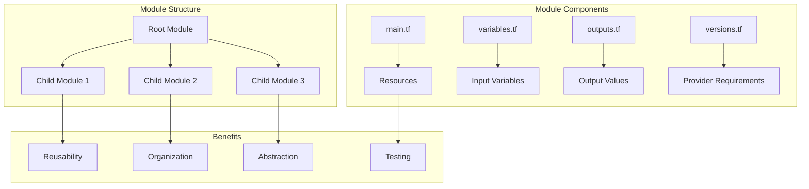
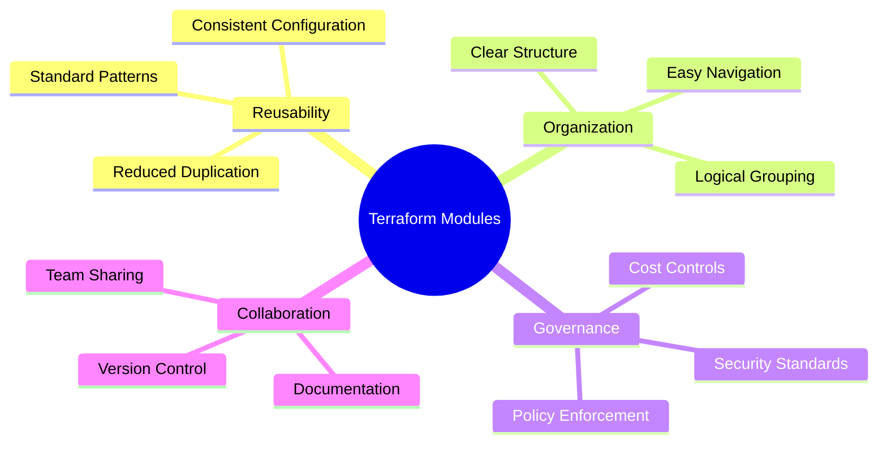
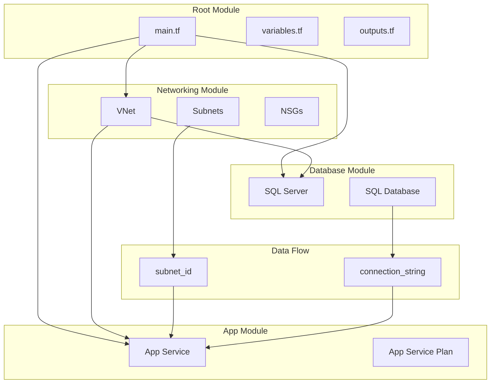
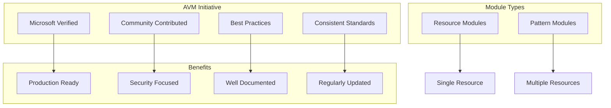
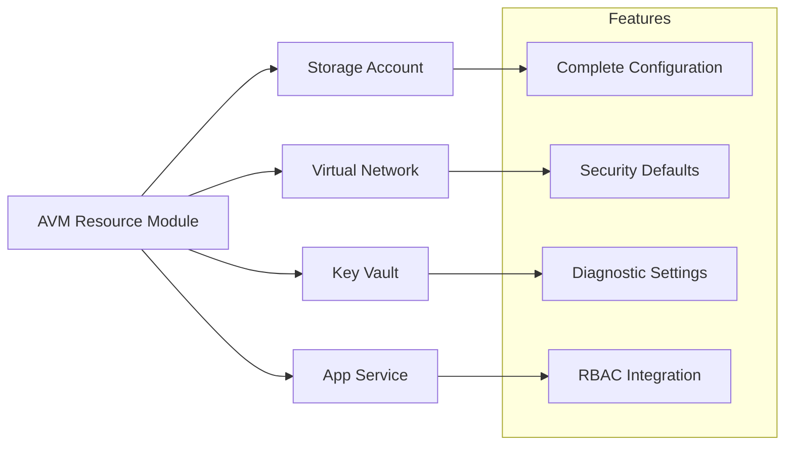
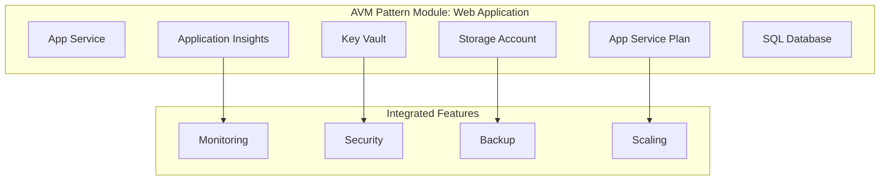
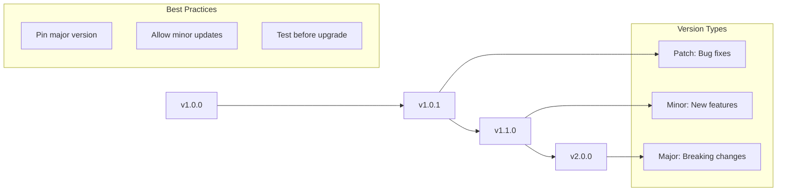
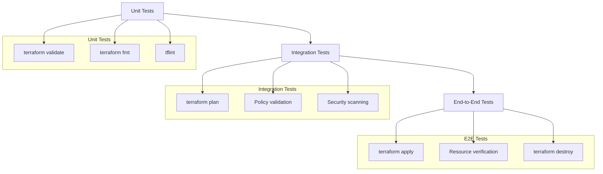
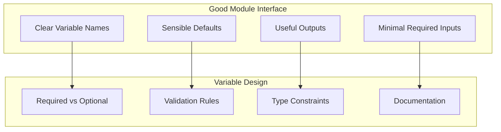

# Reusable Modules & Azure Verified Modules (AVM)

## Introduction to Terraform Modules

Terraform modules are containers for multiple resources that are used together. They allow you to create reusable components and organize your infrastructure code efficiently.



## Module Benefits and Use Cases

### Why Use Modules?

1. **DRY Principle**: Don't Repeat Yourself
2. **Standardization**: Consistent infrastructure patterns
3. **Abstraction**: Hide complexity behind simple interfaces
4. **Testing**: Isolated testing of infrastructure components
5. **Governance**: Enforce organizational policies and standards



## Creating a Basic Module

### Module Directory Structure
```
modules/
└── web-application/
    ├── main.tf          # Primary resources
    ├── variables.tf     # Input variables
    ├── outputs.tf       # Output values
    ├── versions.tf      # Provider requirements
    └── README.md        # Documentation
```

### Sample Web Application Module

```terraform
# modules/web-application/variables.tf
variable "name" {
  description = "Name of the web application"
  type        = string
}

variable "resource_group_name" {
  description = "Resource group name"
  type        = string
}

variable "location" {
  description = "Azure region"
  type        = string
}

variable "sku_name" {
  description = "App Service Plan SKU"
  type        = string
  default     = "B1"
}

variable "tags" {
  description = "Tags to apply to resources"
  type        = map(string)
  default     = {}
}

# modules/web-application/main.tf
resource "azurerm_service_plan" "main" {
  name                = "plan-${var.name}"
  resource_group_name = var.resource_group_name
  location            = var.location
  os_type             = "Linux"
  sku_name            = var.sku_name
  tags                = var.tags
}

resource "azurerm_linux_web_app" "main" {
  name                = "app-${var.name}"
  resource_group_name = var.resource_group_name
  location            = var.location
  service_plan_id     = azurerm_service_plan.main.id
  tags                = var.tags

  site_config {
    application_stack {
      node_version = "18-lts"
    }
  }
}

# modules/web-application/outputs.tf
output "web_app_name" {
  description = "Name of the web application"
  value       = azurerm_linux_web_app.main.name
}

output "web_app_url" {
  description = "URL of the web application"
  value       = "https://${azurerm_linux_web_app.main.default_hostname}"
}

output "app_service_plan_id" {
  description = "ID of the App Service Plan"
  value       = azurerm_service_plan.main.id
}
```

### Using the Module

```terraform
# main.tf
module "web_app_dev" {
  source = "./modules/web-application"
  
  name                = "myapp-dev"
  resource_group_name = azurerm_resource_group.main.name
  location           = azurerm_resource_group.main.location
  sku_name           = "B1"
  
  tags = {
    Environment = "development"
    Project     = "my-project"
  }
}

module "web_app_prod" {
  source = "./modules/web-application"
  
  name                = "myapp-prod"
  resource_group_name = azurerm_resource_group.main.name
  location           = azurerm_resource_group.main.location
  sku_name           = "P2v2"
  
  tags = {
    Environment = "production"
    Project     = "my-project"
  }
}
```

## Module Communication and Dependencies



## Azure Verified Modules (AVM) - Overview

Azure Verified Modules (AVM) is a Microsoft initiative to provide high-quality, Microsoft-verified Terraform modules for Azure resources.



### AVM Module Categories

#### 1. Resource Modules
Focus on a single Azure resource with comprehensive configuration options.



#### 2. Pattern Modules
Combine multiple resources to implement common architectural patterns.



## Using Azure Verified Modules

### Finding AVM Modules
- **Terraform Registry**: `registry.terraform.io/namespaces/Azure`
- **GitHub**: `github.com/Azure/terraform-azurerm-*`
- **Documentation**: Microsoft Learn and Azure docs

### Example: AVM Storage Account Module

```terraform
# Using AVM Storage Account module
module "storage_account" {
  source  = "Azure/avm-res-storage-storageaccount/azurerm"
  version = "~> 0.1"
  
  # Required parameters
  name                = "mystorageaccount${random_id.suffix.hex}"
  resource_group_name = azurerm_resource_group.main.name
  location           = azurerm_resource_group.main.location
  
  # Optional parameters with secure defaults
  account_tier             = "Standard"
  account_replication_type = "LRS"
  
  # Security features enabled by default
  public_network_access_enabled = false
  
  # Networking configuration
  network_rules = {
    default_action = "Deny"
    ip_rules       = ["203.0.113.0/24"]
    virtual_network_subnet_ids = [
      azurerm_subnet.private.id
    ]
  }
  
  # Diagnostic settings
  diagnostic_settings = {
    default = {
      name                       = "diag-storage"
      log_analytics_workspace_id = azurerm_log_analytics_workspace.main.id
    }
  }
  
  # Tags
  tags = {
    Environment = "production"
    Project     = "my-project"
  }
}
```

### Example: AVM Pattern Module for Web App

```terraform
# Using AVM Web Application pattern
module "web_application" {
  source  = "Azure/avm-ptn-webapp-basic/azurerm"
  version = "~> 1.0"
  
  # Application configuration
  name                = "my-web-app"
  resource_group_name = azurerm_resource_group.main.name
  location           = azurerm_resource_group.main.location
  
  # App Service configuration
  app_service_plan_sku = "P2v2"
  
  # Database configuration
  database = {
    enabled = true
    sku     = "S1"
    collation = "SQL_Latin1_General_CP1_CI_AS"
  }
  
  # Monitoring configuration
  application_insights = {
    enabled = true
    retention_in_days = 90
  }
  
  # Security configuration
  key_vault = {
    enabled = true
    purge_protection_enabled = true
  }
  
  # Networking
  virtual_network = {
    enabled = true
    address_space = ["10.0.0.0/16"]
  }
  
  tags = local.common_tags
}
```

## Module Versioning and Management

### Semantic Versioning for Modules



### Module Version Constraints

```terraform
# Recommended versioning approaches

# Pin to exact version (most restrictive)
module "example1" {
  source  = "Azure/avm-res-storage-storageaccount/azurerm"
  version = "0.1.0"
}

# Allow patch updates (recommended)
module "example2" {
  source  = "Azure/avm-res-storage-storageaccount/azurerm"
  version = "~> 0.1.0"  # Allows 0.1.x
}

# Allow minor updates (more flexible)
module "example3" {
  source  = "Azure/avm-res-storage-storageaccount/azurerm"
  version = "~> 0.1"    # Allows 0.x
}
```

## Module Testing and Validation

### Testing Pyramid for Modules



### Example Test Structure

```terraform
# tests/complete/main.tf
module "test" {
  source = "../../"
  
  name                = "test-${random_id.test.hex}"
  resource_group_name = azurerm_resource_group.test.name
  location           = azurerm_resource_group.test.location
  
  # Test all features
  enable_backup = true
  enable_monitoring = true
  
  tags = {
    Environment = "test"
    Purpose     = "module-validation"
  }
}

resource "random_id" "test" {
  byte_length = 4
}

# Verify outputs
output "test_web_app_url" {
  value = module.test.web_app_url
}
```

## Module Best Practices

### 1. Interface Design


### 2. Security Considerations
```terraform
# Good: Secure defaults
variable "public_network_access_enabled" {
  description = "Enable public network access"
  type        = bool
  default     = false  # Secure by default
}

# Good: Input validation
variable "environment" {
  description = "Environment name"
  type        = string
  
  validation {
    condition = contains([
      "dev", "staging", "prod"
    ], var.environment)
    error_message = "Environment must be dev, staging, or prod."
  }
}
```

### 3. Documentation Standards

```markdown
# Web Application Module

This module creates a production-ready web application infrastructure on Azure.

## Features

- App Service with custom domain support
- Application Insights monitoring
- Key Vault integration for secrets
- Virtual Network integration
- Automatic scaling configuration

## Usage

```terraform
module "web_app" {
  source = "./modules/web-application"
  
  name                = "my-app"
  resource_group_name = "rg-my-app"
  location           = "East US"
}
```

## Requirements

| Name | Version |
|------|---------|
| azurerm | ~> 3.0 |

## Inputs

| Name | Description | Type | Default | Required |
|------|-------------|------|---------|:--------:|
| name | Application name | `string` | n/a | yes |
| location | Azure region | `string` | n/a | yes |

## Outputs

| Name | Description |
|------|-------------|
| web_app_url | URL of the web application |
```

## Exercise: Create and Use a Module

### Hands-On Activity (20 minutes)

#### Part 1: Create a Database Module (10 minutes)

Create a module in `modules/database/` with the following structure:
```
modules/database/
├── main.tf
├── variables.tf
├── outputs.tf
└── README.md
```

**Requirements:**
- Create Azure SQL Server and Database
- Include variables for: name, resource_group_name, location, sku
- Output: connection_string, server_name, database_name
- Add proper tags and security configurations

#### Part 2: Use the Module (5 minutes)
Create a root configuration that uses your database module to create:
- Development database (Basic SKU)
- Production database (Standard SKU)

#### Part 3: Explore AVM (5 minutes)
Browse the Terraform Registry and find:
1. An AVM resource module for Key Vault
2. An AVM pattern module for a complete application
3. Compare the interface and features

### Group Discussion Questions
1. What challenges did you face creating the module?
2. How would you improve the module interface?
3. What additional features would make it production-ready?
4. How do AVM modules compare to custom modules?

## AVM vs Custom Modules Decision Matrix

| Factor | Custom Module | AVM Module |
|--------|---------------|------------|
| **Development Time** | High | Low |
| **Customization** | Complete control | Limited to exposed variables |
| **Maintenance** | Your responsibility | Microsoft maintained |
| **Security** | Your implementation | Microsoft best practices |
| **Documentation** | Create yourself | Comprehensive and maintained |
| **Testing** | Your responsibility | Extensively tested |
| **Community Support** | Limited | Large community |

## Discussion Questions

1. **For Managers**: How can standardized modules improve governance and reduce risks in your infrastructure?

2. **For Technical Teams**: What factors would influence your decision between custom modules and AVM?

3. **For Everyone**: How would you approach migrating from custom modules to AVM modules?

## Key Takeaways

✅ **Modules promote reusability and consistency**  
✅ **AVM provides production-ready, Microsoft-verified modules**  
✅ **Proper versioning prevents breaking changes**  
✅ **Testing modules is crucial for reliability**  
✅ **Documentation makes modules usable by others**  
✅ **Security defaults should be built into modules**  
✅ **Module interfaces should be intuitive and minimal**

## Common Module Anti-Patterns

❌ **Overly complex module interfaces**  
❌ **Hardcoded values instead of variables**  
❌ **Missing or poor documentation**  
❌ **No input validation**  
❌ **Insecure default configurations**  
❌ **Tight coupling between modules**  
❌ **No versioning strategy**

## Next Steps After the Workshop

### Immediate Actions (Next Week)
1. Explore AVM modules in Terraform Registry
2. Identify reusable patterns in your current infrastructure
3. Create your first custom module for a common resource
4. Set up module testing framework

### Medium-term Goals (Next Month)
1. Migrate existing resources to use modules
2. Establish module versioning and release process
3. Create organization-specific module library
4. Implement module testing in CI/CD pipeline

### Long-term Strategy (Next Quarter)
1. Adopt AVM modules where appropriate
2. Contribute back to community modules
3. Establish module governance and standards
4. Create comprehensive module documentation

---

## Workshop Conclusion

🎉 **Congratulations!** You've completed the Modern DevOps & IaC Essentials Workshop!

### What We've Covered
- DevOps principles and business value
- Infrastructure as Code fundamentals
- Source control and Git workflows
- Terraform basics and Azure integration
- Reusable modules and Azure Verified Modules

### Resources for Continued Learning
- [Azure Verified Modules](https://aka.ms/avm)
- [Terraform Azure Provider Documentation](https://registry.terraform.io/providers/hashicorp/azurerm/latest/docs)
- [Microsoft Learn - Terraform on Azure](https://docs.microsoft.com/learn/paths/terraform-fundamentals/)
- [HashiCorp Learn - Terraform](https://learn.hashicorp.com/terraform)

### Community and Support
- Azure DevOps Community
- Terraform Community Forums
- Microsoft Tech Community
- Local Azure User Groups

**Thank you for participating! Questions?** 🤔
