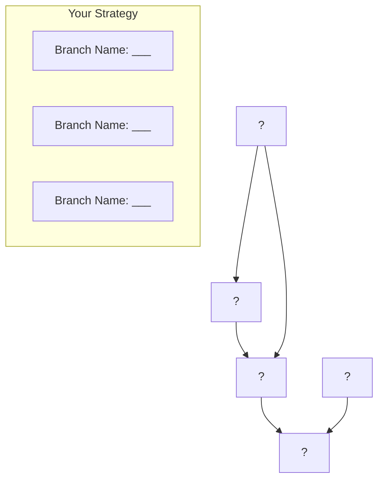
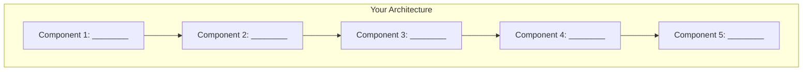

# Workshop Exercises and Activities

## Exercise Collection for Modern DevOps & IaC Essentials Workshop

This document contains all the hands-on exercises, activities, and practical examples referenced throughout the workshop materials.

---

## Exercise 1: DevOps Maturity Assessment
**Duration**: 10 minutes  
**Session**: DevOps Principles & Value

### Instructions
Rate your organization on a scale of 1-5 for each area:

| Assessment Area | Score (1-5) | Current State Notes | Improvement Ideas |
|----------------|-------------|---------------------|-------------------|
| **Collaboration between Dev/Ops** | ___ | | |
| **Automation Level** | ___ | | |
| **Deployment Frequency** | ___ | | |
| **Monitoring & Feedback** | ___ | | |
| **Recovery Time (MTTR)** | ___ | | |
| **Change Failure Rate** | ___ | | |

### Scoring Guide
- **1**: No implementation or awareness
- **2**: Some awareness, no formal process
- **3**: Basic implementation, inconsistent
- **4**: Good implementation, mostly consistent
- **5**: Excellent implementation, fully integrated

### Discussion Points
1. What areas scored lowest? Why do you think this is?
2. What quick wins could improve your scores in the next 30 days?
3. What would success look like for your organization in 6 months?
4. What are the biggest barriers to improvement?

### Follow-Up Actions
- Identify one area for immediate improvement
- Define success metrics for that area
- Create a 90-day improvement plan

---

## Exercise 2: IaC Benefits Analysis
**Duration**: 15 minutes  
**Session**: Introduction to Infrastructure as Code

### Scenario
Your organization needs to:
- Set up identical environments for 3 different projects
- Ensure compliance with security policies across all environments
- Scale up infrastructure for a major product launch
- Maintain cost visibility and control
- Provide disaster recovery capabilities

### Task: Compare Approaches

Fill in the comparison table:

| Requirement | Manual Approach | IaC Approach |
|-------------|-----------------|---------------|
| **Time to provision 3 environments** | ___ hours/days | ___ minutes/hours |
| **Error probability** | High/Medium/Low | High/Medium/Low |
| **Consistency guarantee** | Yes/No/Maybe | Yes/No/Maybe |
| **Cost tracking capability** | Easy/Hard/Impossible | Easy/Hard/Impossible |
| **Compliance validation** | Manual/Automated/None | Manual/Automated/None |
| **Disaster recovery setup** | ___ effort level | ___ effort level |
| **Documentation accuracy** | High/Medium/Low | High/Medium/Low |
| **Audit trail availability** | Yes/No/Limited | Yes/No/Limited |

### Group Discussion Questions
1. Which approach better serves your business needs? Why?
2. What are the main obstacles to adopting IaC in your organization?
3. How would you measure the success of an IaC implementation?
4. What would be a good starting point for IaC adoption?

### Real-World Examples
Share examples from your experience:
- Manual provisioning challenges you've faced
- Times when environment inconsistency caused issues
- Situations where rapid scaling was needed

---

## Exercise 3: Git Workflow Simulation
**Duration**: 20 minutes  
**Session**: Source Control & Git Workflows

### Part A: Branch Strategy Design (10 minutes)

#### Scenario
Your team is developing infrastructure for a web application with:
- Development environment for testing
- Staging environment for user acceptance testing  
- Production environment for live users
- Need for hotfixes and emergency patches
- Multiple developers working simultaneously

#### Task: Design Your Branching Strategy



Fill in your branching strategy:

| Branch Name | Purpose | Deploys To | Merge Rules |
|-------------|---------|------------|-------------|
| ____________ | _______ | __________ | ___________ |
| ____________ | _______ | __________ | ___________ |
| ____________ | _______ | __________ | ___________ |

### Part B: PR Review Simulation (10 minutes)

#### Code Review Exercise
Review this Terraform code and identify issues:

```terraform
resource "azurerm_sql_server" "example" {
  name                = "sqlserver123"
  resource_group_name = "rg-prod"
  location            = "East US"
  version             = "12.0"
  administrator_login = "admin123"
  administrator_login_password = "P@ssw0rd123!"
  
  tags = {
    environment = "prod"
  }
}

resource "azurerm_storage_account" "example" {
  name                     = "storageaccount123"
  resource_group_name      = "rg-prod"
  location                 = "West US"
  account_tier            = "Standard"
  account_replication_type = "LRS"
  
  public_network_access_enabled = true
}
```

#### Review Checklist
Mark each item as ✅ Pass, ❌ Fail, or ⚠️ Needs Improvement:

- [ ] **Security**: No hardcoded secrets
- [ ] **Security**: Proper access controls
- [ ] **Naming**: Follows conventions
- [ ] **Location**: Consistent across resources
- [ ] **Variables**: Properly parameterized
- [ ] **Tags**: Complete and consistent
- [ ] **Best Practices**: Follows Terraform guidelines

#### Issues Identified:
1. _________________________________
2. _________________________________
3. _________________________________
4. _________________________________
5. _________________________________

#### Suggested Improvements:
1. _________________________________
2. _________________________________
3. _________________________________

---

## Exercise 4: First Terraform Configuration
**Duration**: 25 minutes  
**Session**: What is Terraform?

### Part A: Basic Configuration Creation (15 minutes)

#### Task: Create Infrastructure for Simple Web App

Create Terraform configuration files for:
1. Azure Resource Group
2. Azure Storage Account
3. Azure App Service Plan  
4. Azure Web App

#### Starter Template

```terraform
# main.tf
terraform {
  required_providers {
    azurerm = {
      source  = "hashicorp/azurerm"
      version = "~> 3.0"
    }
  }
}

provider "azurerm" {
  features {}
}

# TODO: Add variables
variable "project_name" {
  description = "Name of the project"
  type        = string
  default     = "workshop"
}

variable "environment" {
  description = "Environment (dev, staging, prod)"
  type        = string
  default     = "dev"
}

variable "location" {
  description = "Azure region"
  type        = string
  default     = "East US"
}

# TODO: Add Resource Group
resource "azurerm_resource_group" "main" {
  # Complete this resource
}

# TODO: Add Storage Account
resource "azurerm_storage_account" "main" {
  # Complete this resource
}

# TODO: Add App Service Plan
resource "azurerm_service_plan" "main" {
  # Complete this resource
}

# TODO: Add Web App
resource "azurerm_linux_web_app" "main" {
  # Complete this resource
}

# TODO: Add outputs
output "resource_group_name" {
  # Complete this output
}

output "web_app_url" {
  # Complete this output
}
```

#### Completion Checklist
- [ ] All resources have proper names using variables
- [ ] Resources reference each other correctly
- [ ] Tags are applied consistently
- [ ] Outputs provide useful information
- [ ] Configuration validates successfully

### Part B: Plan and Review (10 minutes)

#### Commands to Run
```bash
# Initialize Terraform
terraform init

# Validate configuration
terraform validate

# Format code
terraform fmt

# Create execution plan
terraform plan
```

#### Review Questions
1. How many resources will be created?
2. What dependencies exist between resources?
3. Are the resource names appropriate?
4. What would happen if you ran this twice?

#### Plan Output Analysis
For each planned resource, note:

| Resource Type | Resource Name | Key Properties | Dependencies |
|---------------|---------------|----------------|--------------|
| azurerm_resource_group | | | |
| azurerm_storage_account | | | |
| azurerm_service_plan | | | |
| azurerm_linux_web_app | | | |

---

## Exercise 5: Infrastructure Design Challenge
**Duration**: 20 minutes  
**Session**: What is Terraform?

### Scenario: E-commerce Application Infrastructure

Design Terraform configuration for an e-commerce application with these requirements:

#### Business Requirements
- **Web Application**: Customer-facing website
- **API Backend**: REST API for mobile app
- **Database**: Customer and product data storage
- **File Storage**: Product images and documents
- **Load Balancing**: Handle traffic spikes during sales
- **Monitoring**: Application performance monitoring
- **Security**: Secure communication and data protection

#### Technical Requirements
- **Environment**: Production-ready
- **Region**: East US
- **Scalability**: Auto-scaling capability
- **Backup**: Automated backups
- **SSL/TLS**: HTTPS enforcement

### Task 1: Architecture Design (10 minutes)

Draw or describe your architecture:



### Task 2: Resource Mapping (10 minutes)

Map requirements to Azure resources:

| Business Need | Azure Resource | Configuration Notes |
|---------------|----------------|---------------------|
| Web Application | | |
| API Backend | | |
| Database Storage | | |
| File Storage | | |
| Load Balancing | | |
| Monitoring | | |
| SSL/TLS Security | | |

### Task 3: Variables and Configuration

Identify what should be configurable:

| Variable Name | Type | Default Value | Description |
|---------------|------|---------------|-------------|
| | | | |
| | | | |
| | | | |
| | | | |

### Discussion Points
1. What Azure resources would you choose and why?
2. How would you organize the Terraform code?
3. What variables should be configurable?
4. What outputs would be valuable?
5. How would you handle secrets and sensitive data?

---

## Exercise 6: Module Creation and Usage
**Duration**: 25 minutes  
**Session**: Reusable Modules & Azure Verified Modules

### Part A: Create a Database Module (15 minutes)

#### Task: Build a Reusable Database Module

Create a module structure in `modules/database/`:

```
modules/database/
├── main.tf
├── variables.tf
├── outputs.tf
├── versions.tf
└── README.md
```

#### Module Specification

**Resources to Create:**
- Azure SQL Server
- Azure SQL Database
- Firewall rules for Azure services

**Required Variables:**
- `name` - Database name prefix
- `resource_group_name` - Target resource group
- `location` - Azure region
- `admin_username` - SQL admin username

**Optional Variables:**
- `database_sku` - Database SKU (default: "Basic")
- `server_version` - SQL Server version (default: "12.0")
- `tags` - Resource tags

**Outputs:**
- `server_name` - SQL Server name
- `database_name` - Database name
- `connection_string` - Connection string (sensitive)

#### Starter Code Template

```terraform
# modules/database/variables.tf
variable "name" {
  description = "Database name prefix"
  type        = string
}

# TODO: Add remaining variables

# modules/database/main.tf
resource "azurerm_mssql_server" "main" {
  # TODO: Complete configuration
}

resource "azurerm_mssql_database" "main" {
  # TODO: Complete configuration
}

resource "azurerm_mssql_firewall_rule" "azure_services" {
  # TODO: Add firewall rule for Azure services
}

# modules/database/outputs.tf
output "server_name" {
  # TODO: Complete output
}

# TODO: Add remaining outputs
```

### Part B: Use the Module (10 minutes)

#### Task: Create Multiple Database Instances

Create a root configuration that uses your database module:

```terraform
# main.tf
module "database_dev" {
  source = "./modules/database"
  
  # TODO: Configure for development environment
}

module "database_prod" {
  source = "./modules/database"
  
  # TODO: Configure for production environment
}

# TODO: Add outputs to display connection information
```

#### Requirements
- Create development database with Basic SKU
- Create production database with Standard SKU
- Use different naming conventions
- Apply appropriate tags
- Output connection strings (mark as sensitive)

### Part C: AVM Exploration (5 minutes)

#### Task: Compare with Azure Verified Modules

1. **Browse Terraform Registry**: Go to `registry.terraform.io`
2. **Search for**: "Azure/avm" modules
3. **Find**: A database-related AVM module
4. **Compare**: Your module vs AVM module

#### Comparison Table

| Feature | Your Module | AVM Module |
|---------|-------------|------------|
| **Lines of code** | | |
| **Configuration options** | | |
| **Security features** | | |
| **Documentation quality** | | |
| **Testing included** | | |
| **Maintenance** | | |

#### Discussion Questions
1. What features does the AVM module have that yours doesn't?
2. What would you need to add to make your module production-ready?
3. When would you choose a custom module over AVM?
4. How could you contribute improvements back to AVM?

---

## Workshop Wrap-Up Activities

### Activity 1: Action Planning (15 minutes)

#### Individual Planning
Complete your personal action plan:

| Timeframe | Actions | Success Metrics | Potential Obstacles |
|-----------|---------|-----------------|-------------------|
| **Next Week** | | | |
| **Next Month** | | | |
| **Next Quarter** | | | |

#### Team Planning (if applicable)
| Role | Responsibilities | Timeline | Dependencies |
|------|------------------|----------|--------------|
| **Management** | | | |
| **Technical Lead** | | | |
| **Developers** | | | |
| **Operations** | | | |

### Activity 2: Resource Bookmarking

#### Essential Resources to Bookmark
- [ ] [Azure Verified Modules](https://aka.ms/avm)
- [ ] [Terraform Azure Provider Docs](https://registry.terraform.io/providers/hashicorp/azurerm/latest/docs)
- [ ] [Microsoft Learn - Terraform](https://docs.microsoft.com/learn/paths/terraform-fundamentals/)
- [ ] [HashiCorp Learn](https://learn.hashicorp.com/terraform)
- [ ] [Azure Architecture Center](https://docs.microsoft.com/azure/architecture/)

#### Community Resources
- [ ] [Azure DevOps Community](https://dev.azure.com/mseng/AzureDevOpsRoadmap)
- [ ] [Terraform Community](https://discuss.hashicorp.com/c/terraform-core)
- [ ] [Microsoft Tech Community](https://techcommunity.microsoft.com)

### Activity 3: Knowledge Check

#### Quick Assessment
Rate your confidence (1-10) in these areas after the workshop:

| Topic | Before Workshop | After Workshop | Next Steps |
|-------|-----------------|----------------|------------|
| DevOps Principles | | | |
| Infrastructure as Code | | | |
| Git Workflows | | | |
| Terraform Basics | | | |
| Terraform Modules | | | |
| Azure Verified Modules | | | |

#### Key Concepts Quiz
1. What are the four key DevOps metrics?
2. What is the difference between imperative and declarative IaC?
3. What is the purpose of a Terraform state file?
4. When should you use a custom module vs. an AVM module?
5. What are the three main components of a Terraform module?

---

## Extended Learning Exercises

### Challenge 1: Complete Application Stack
**Difficulty**: Intermediate  
**Time**: 2-4 hours

Build a complete infrastructure stack for a web application including:
- Virtual Network with subnets
- Application Gateway for load balancing
- App Services for frontend and API
- Azure SQL Database
- Key Vault for secrets
- Application Insights for monitoring
- Storage Account for static files

### Challenge 2: Multi-Environment Pipeline
**Difficulty**: Advanced  
**Time**: 4-8 hours

Create a complete CI/CD pipeline that:
- Uses GitHub Actions or Azure DevOps
- Implements GitFlow branching strategy
- Deploys to dev, staging, and production
- Includes automated testing
- Implements approval gates
- Uses Terraform state management

### Challenge 3: AVM Contribution
**Difficulty**: Advanced  
**Time**: Variable

Contribute to the Azure Verified Modules project:
- Identify a missing module or improvement
- Fork the relevant AVM repository
- Implement the enhancement
- Write tests and documentation
- Submit a pull request

---

## Troubleshooting Guide

### Common Issues and Solutions

#### Issue: Terraform State Locked
**Symptoms**: "Error: Error locking state"
**Solution**: 
```bash
terraform force-unlock <lock-id>
```

#### Issue: Provider Authentication Failed
**Symptoms**: "Error: building AzureRM Client"
**Solutions**:
```bash
# Login to Azure CLI
az login

# Verify subscription
az account show

# Set subscription if needed
az account set --subscription <subscription-id>
```

#### Issue: Resource Already Exists
**Symptoms**: "A resource with the ID already exists"
**Solutions**:
1. Import existing resource: `terraform import <resource_type>.<name> <azure_id>`
2. Rename resource in configuration
3. Delete existing resource (if safe)

#### Issue: Module Not Found
**Symptoms**: "Module not installed"
**Solution**:
```bash
terraform init
```

### Best Practices Checklist

#### Before Running Terraform
- [ ] Run `terraform validate`
- [ ] Run `terraform fmt`
- [ ] Review `terraform plan` output carefully
- [ ] Ensure you're in the correct directory
- [ ] Verify Azure subscription and authentication

#### Security Checklist
- [ ] No hardcoded secrets in code
- [ ] Sensitive outputs marked as sensitive
- [ ] Proper access controls configured
- [ ] State files stored securely
- [ ] Regular security scanning enabled

---

**End of Exercises Document**

*This completes the comprehensive exercise collection for the Modern DevOps & IaC Essentials Workshop. Each exercise builds upon previous concepts and provides practical, hands-on experience with the topics covered in the workshop sessions.*
