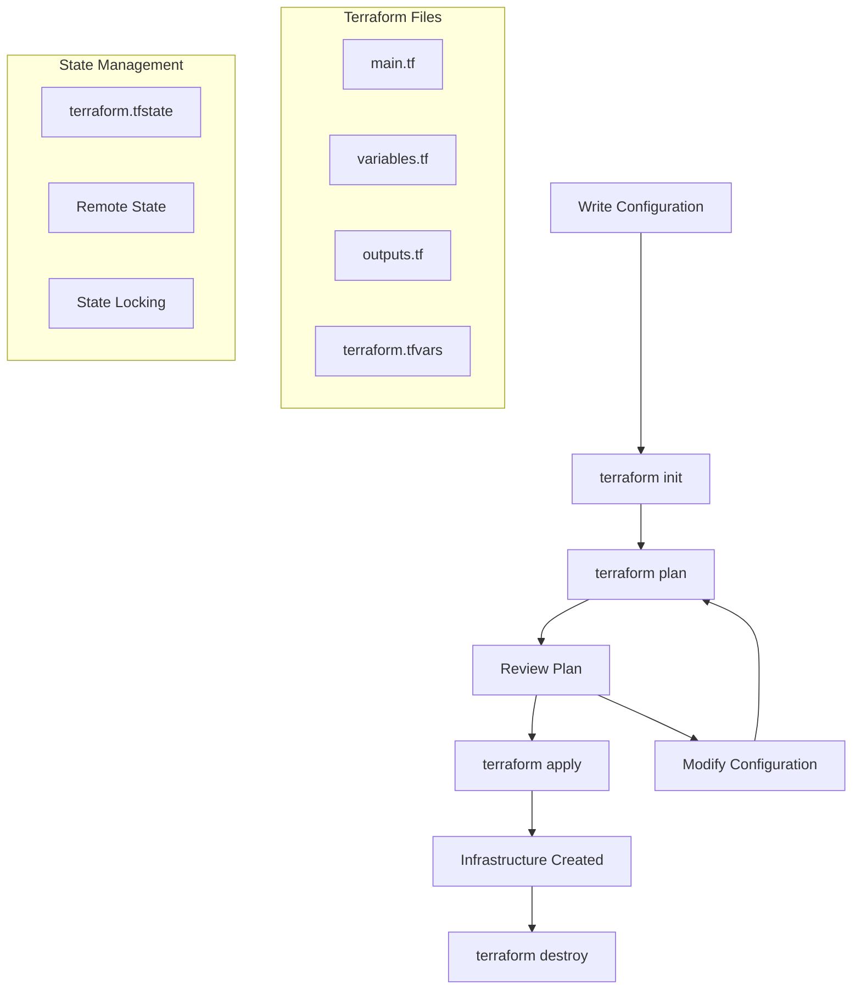

# Terraform Fundamentals for Azure

## Overview
This module covers the core concepts and practical skills needed to build Azure infrastructure using Terraform. You'll learn the Terraform workflow, understand key concepts like state management, and build real Azure resources from scratch.

## Learning Objectives
- Understand the Terraform workflow and core concepts
- Build Azure infrastructure using Terraform configuration files
- Manage Terraform state effectively and securely
- Implement variables, outputs, and data sources
- Apply Terraform best practices for Azure deployments

---

## Core Terraform Concepts

### 1. Declarative Infrastructure Definition

**Imperative vs Declarative**:

```bash
# Imperative (procedural) - HOW to do it
az group create --name "my-rg" --location "eastus"
az storage account create --name "mystorageaccount" --resource-group "my-rg" --location "eastus" --sku "Standard_LRS"
az webapp create --name "myapp" --resource-group "my-rg" --plan "myplan"
```

```terraform
# Declarative - WHAT you want
resource "azurerm_resource_group" "main" {
  name     = "my-rg"
  location = "East US"
}

resource "azurerm_storage_account" "main" {
  name                     = "mystorageaccount"
  resource_group_name      = azurerm_resource_group.main.name
  location                 = azurerm_resource_group.main.location
  account_tier            = "Standard"
  account_replication_type = "LRS"
}
```

**Benefits of Declarative Approach**:
- **Idempotent**: Running multiple times produces same result
- **Predictable**: Clear understanding of desired end state
- **Version Controlled**: Infrastructure changes tracked in Git
- **Reviewable**: Changes can be reviewed before application

### 2. Terraform Workflow



**Core Commands Deep Dive**:

1. **`terraform init`** - Initialize working directory
   - Downloads required providers
   - Sets up backend for state storage
   - Installs modules
   - Creates `.terraform` directory

2. **`terraform plan`** - Create execution plan
   - Compares current state with desired state
   - Shows what will be created, modified, or destroyed
   - Validates configuration
   - No changes are made

3. **`terraform apply`** - Apply changes
   - Executes the plan
   - Creates, updates, or destroys resources
   - Updates state file
   - Shows progress and results

4. **`terraform destroy`** - Destroy infrastructure
   - Plans destruction of all managed resources
   - Requires confirmation (unless `-auto-approve`)
   - Updates state file

### 3. Terraform Configuration Structure

**Basic File Organization**:

```terraform
# versions.tf - Provider requirements and versions
terraform {
  required_version = ">= 1.0"
  required_providers {
    azurerm = {
      source  = "hashicorp/azurerm"
      version = "~> 3.0"
    }
    random = {
      source  = "hashicorp/random"
      version = "~> 3.1"
    }
  }
}

provider "azurerm" {
  features {}
}

# variables.tf - Input variables
variable "environment" {
  description = "Environment name (dev, staging, prod)"
  type        = string
  default     = "dev"
  
  validation {
    condition     = contains(["dev", "staging", "prod"], var.environment)
    error_message = "Environment must be dev, staging, or prod."
  }
}

variable "location" {
  description = "Azure region for resources"
  type        = string
  default     = "East US"
}

variable "project_name" {
  description = "Name of the project"
  type        = string
  
  validation {
    condition     = can(regex("^[a-z0-9-]+$", var.project_name))
    error_message = "Project name must contain only lowercase letters, numbers, and hyphens."
  }
}

# locals.tf - Local values and computed expressions
locals {
  common_tags = {
    Environment = var.environment
    Project     = var.project_name
    ManagedBy   = "Terraform"
    CreatedDate = timestamp()
  }
  
  resource_prefix = "${var.project_name}-${var.environment}"
  
  # Generate unique suffix for globally unique resources
  unique_suffix = random_id.unique.hex
}

# main.tf - Resource definitions
resource "random_id" "unique" {
  byte_length = 4
}

resource "azurerm_resource_group" "main" {
  name     = "rg-${local.resource_prefix}"
  location = var.location
  tags     = local.common_tags
}

resource "azurerm_storage_account" "main" {
  name                     = "st${replace(local.resource_prefix, "-", "")}${local.unique_suffix}"
  resource_group_name      = azurerm_resource_group.main.name
  location                 = azurerm_resource_group.main.location
  account_tier            = "Standard"
  account_replication_type = "LRS"
  
  tags = local.common_tags
}

# data.tf - Data sources
data "azurerm_client_config" "current" {}

data "azurerm_subscription" "current" {}

# outputs.tf - Output values
output "resource_group_name" {
  description = "Name of the created resource group"
  value       = azurerm_resource_group.main.name
}

output "storage_account_name" {
  description = "Name of the created storage account"
  value       = azurerm_storage_account.main.name
}

output "storage_account_primary_access_key" {
  description = "Primary access key for the storage account"
  value       = azurerm_storage_account.main.primary_access_key
  sensitive   = true
}
```

---

## Building Azure Infrastructure

### 1. Resource Group - Foundation

Every Azure deployment starts with a Resource Group:

```terraform
resource "azurerm_resource_group" "main" {
  name     = "rg-${var.project_name}-${var.environment}"
  location = var.location
  
  tags = {
    Environment = var.environment
    Project     = var.project_name
    ManagedBy   = "Terraform"
  }
}
```

**Key Concepts**:
- **Naming Convention**: Consistent, descriptive names
- **Location**: Azure region where resources will be deployed
- **Tags**: Metadata for organization, billing, and governance

### 2. Storage Account - Data Storage

```terraform
resource "azurerm_storage_account" "main" {
  name                     = "st${var.project_name}${var.environment}${random_id.unique.hex}"
  resource_group_name      = azurerm_resource_group.main.name
  location                 = azurerm_resource_group.main.location
  account_tier            = "Standard"
  account_replication_type = var.environment == "prod" ? "GRS" : "LRS"
  
  # Security settings
  public_network_access_enabled   = false
  allow_nested_items_to_be_public = false
  
  # Enable blob versioning
  blob_properties {
    versioning_enabled = true
    
    delete_retention_policy {
      days = var.environment == "prod" ? 30 : 7
    }
  }
  
  tags = local.common_tags
}
```

**Key Concepts**:
- **Global Uniqueness**: Storage account names must be globally unique
- **Replication**: Different replication strategies based on environment
- **Security**: Disable public access, enable security features
- **Lifecycle**: Different retention policies per environment

### 3. Application Insights - Monitoring

```terraform
resource "azurerm_log_analytics_workspace" "main" {
  name                = "log-${local.resource_prefix}"
  location            = azurerm_resource_group.main.location
  resource_group_name = azurerm_resource_group.main.name
  sku                = "PerGB2018"
  retention_in_days   = var.environment == "prod" ? 90 : 30
  
  tags = local.common_tags
}

resource "azurerm_application_insights" "main" {
  name                = "appi-${local.resource_prefix}"
  location            = azurerm_resource_group.main.location
  resource_group_name = azurerm_resource_group.main.name
  workspace_id        = azurerm_log_analytics_workspace.main.id
  application_type    = "web"
  
  tags = local.common_tags
}
```

### 4. App Service Plan and Web App

```terraform
resource "azurerm_service_plan" "main" {
  name                = "asp-${local.resource_prefix}"
  resource_group_name = azurerm_resource_group.main.name
  location            = azurerm_resource_group.main.location
  os_type            = "Linux"
  sku_name           = var.environment == "prod" ? "P1v3" : "B1"
  
  tags = local.common_tags
}

resource "azurerm_linux_web_app" "main" {
  name                = "app-${local.resource_prefix}-${random_id.unique.hex}"
  resource_group_name = azurerm_resource_group.main.name
  location            = azurerm_service_plan.main.location
  service_plan_id     = azurerm_service_plan.main.id
  
  site_config {
    always_on = var.environment == "prod"
    
    application_stack {
      node_version = "18-lts"
    }
  }
  
  app_settings = {
    ENVIRONMENT                = var.environment
    STORAGE_ACCOUNT_CONNECTION = azurerm_storage_account.main.primary_connection_string
    APPINSIGHTS_INSTRUMENTATIONKEY = azurerm_application_insights.main.instrumentation_key
  }
  
  tags = local.common_tags
}
```

---

## State Management

### 1. Local State vs Remote State

**Local State** (Development):
```terraform
# terraform.tfstate stored locally
# Good for: Learning, experimentation, single developer
# Issues: Not shareable, no locking, no backup
```

**Remote State** (Production):
```terraform
terraform {
  backend "azurerm" {
    resource_group_name  = "rg-terraform-state"
    storage_account_name = "sttfstateunique"
    container_name       = "tfstate"
    key                 = "terraform.tfstate"
  }
}
```

### 2. Setting Up Remote State

**Step 1: Create State Storage Infrastructure**
```bash
# Create resource group for state
az group create --name "rg-terraform-state" --location "eastus"

# Create storage account
# Note: The `$(date +%s)` command is for Bash. In PowerShell, you can use `$(Get-Date -UFormat %s)`
az storage account create \
  --name "sttfstateunique$(date +%s)" \
  --resource-group "rg-terraform-state" \
  --location "eastus" \
  --sku "Standard_LRS" \
  --encryption-services blob

# Create storage container
# Note: The `$(date +%s)` command is for Bash. In PowerShell, you can use `$(Get-Date -UFormat %s)`
az storage container create \
  --name "tfstate" \
  --account-name "sttfstateunique$(date +%s)"
```

**Step 2: Configure Backend**
```terraform
# backend.tf
terraform {
  backend "azurerm" {
    resource_group_name  = "rg-terraform-state"
    storage_account_name = "sttfstateunique"
    container_name       = "tfstate"
    key                 = "dev/terraform.tfstate"
  }
}
```

**Step 3: Initialize with Backend**
```bash
terraform init
```

### 3. State File Security

**Best Practices**:
- ✅ Store state in secure, encrypted storage
- ✅ Enable state locking
- ✅ Restrict access to state files
- ✅ Use different state files for different environments
- ❌ Never commit state files to Git
- ❌ Don't manually edit state files

**State File Structure**:
```json
{
  "version": 4,
  "terraform_version": "1.5.7",
  "serial": 123,
  "lineage": "uuid-here",
  "outputs": {},
  "resources": [
    {
      "mode": "managed",
      "type": "azurerm_resource_group",
      "name": "main",
      "provider": "provider[\"registry.terraform.io/hashicorp/azurerm\"]",
      "instances": [
        {
          "schema_version": 0,
          "attributes": {
            "id": "/subscriptions/sub-id/resourceGroups/rg-name",
            "location": "eastus",
            "name": "rg-name"
          }
        }
      ]
    }
  ]
}
```

---

## Variables and Data Sources

### 1. Input Variables

**Variable Types**:
```terraform
# String variable
variable "environment" {
  description = "Environment name"
  type        = string
  default     = "dev"
}

# Number variable
variable "instance_count" {
  description = "Number of instances"
  type        = number
  default     = 1
  
  validation {
    condition     = var.instance_count > 0 && var.instance_count <= 10
    error_message = "Instance count must be between 1 and 10."
  }
}

# Boolean variable
variable "enable_monitoring" {
  description = "Enable monitoring"
  type        = bool
  default     = true
}

# List variable
variable "allowed_ips" {
  description = "List of allowed IP addresses"
  type        = list(string)
  default     = ["10.0.0.0/8", "192.168.0.0/16"]
}

# Map variable
variable "tags" {
  description = "Resource tags"
  type        = map(string)
  default = {
    Environment = "dev"
    Project     = "workshop"
  }
}

# Object variable
variable "database_config" {
  description = "Database configuration"
  type = object({
    sku_name                     = string
    max_size_gb                  = number
    backup_retention_days        = number
    geo_redundant_backup_enabled = bool
  })
  default = {
    sku_name                     = "Basic"
    max_size_gb                  = 2
    backup_retention_days        = 7
    geo_redundant_backup_enabled = false
  }
}
```

**Variable Files**:
```terraform
# terraform.tfvars
environment    = "dev"
project_name   = "workshop"
location       = "East US"
instance_count = 2

tags = {
  Environment = "dev"
  Project     = "workshop"
  Owner       = "team@company.com"
}

database_config = {
  sku_name                     = "S0"
  max_size_gb                  = 10
  backup_retention_days        = 14
  geo_redundant_backup_enabled = false
}
```

### 2. Data Sources

**Fetching Existing Resources**:
```terraform
# Current Azure client configuration
data "azurerm_client_config" "current" {}

# Existing resource group
data "azurerm_resource_group" "existing" {
  name = "rg-existing-infrastructure"
}

# Existing virtual network
data "azurerm_virtual_network" "existing" {
  name                = "vnet-existing"
  resource_group_name = data.azurerm_resource_group.existing.name
}

# Key Vault secrets
data "azurerm_key_vault" "existing" {
  name                = "kv-existing"
  resource_group_name = data.azurerm_resource_group.existing.name
}

data "azurerm_key_vault_secret" "database_password" {
  name         = "database-password"
  key_vault_id = data.azurerm_key_vault.existing.id
}
```

**Using Data Sources in Resources**:
```terraform
resource "azurerm_linux_web_app" "main" {
  name                = "app-${var.project_name}"
  resource_group_name = azurerm_resource_group.main.name
  location            = azurerm_resource_group.main.location
  service_plan_id     = azurerm_service_plan.main.id
  
  site_config {
    application_stack {
      node_version = "18-lts"
    }
  }
  
  app_settings = {
    # Using data source
    DATABASE_PASSWORD    = data.azurerm_key_vault_secret.database_password.value
    CURRENT_TENANT_ID   = data.azurerm_client_config.current.tenant_id
    CURRENT_OBJECT_ID   = data.azurerm_client_config.current.object_id
  }
}
```

### 3. Output Values

```terraform
# Basic outputs
output "resource_group_name" {
  description = "Name of the resource group"
  value       = azurerm_resource_group.main.name
}

output "web_app_url" {
  description = "URL of the web application"
  value       = "https://${azurerm_linux_web_app.main.default_hostname}"
}

# Sensitive outputs
output "storage_connection_string" {
  description = "Storage account connection string"
  value       = azurerm_storage_account.main.primary_connection_string
  sensitive   = true
}

# Complex outputs
output "application_info" {
  description = "Application information"
  value = {
    name         = azurerm_linux_web_app.main.name
    url         = "https://${azurerm_linux_web_app.main.default_hostname}"
    location    = azurerm_linux_web_app.main.location
    environment = var.environment
  }
}
```

---

## Terraform Best Practices

### 1. File Organization

**Small Projects**:
```
project/
├── main.tf
├── variables.tf
├── outputs.tf
├── terraform.tfvars
└── versions.tf
```

**Medium Projects**:
```
project/
├── main.tf
├── variables.tf
├── outputs.tf
├── locals.tf
├── data.tf
├── versions.tf
├── terraform.tfvars
└── terraform.tfvars.example
```

**Large Projects**:
```
project/
├── environments/
│   ├── dev/
│   ├── staging/
│   └── prod/
├── modules/
│   ├── networking/
│   ├── compute/
│   └── database/
├── shared/
│   ├── data.tf
│   └── locals.tf
└── scripts/
```

### 2. Naming Conventions

**Resource Naming**:
```terraform
# Azure naming conventions
resource "azurerm_resource_group" "main" {
  name = "rg-${var.project_name}-${var.environment}"
}

resource "azurerm_storage_account" "main" {
  name = "st${var.project_name}${var.environment}${random_id.suffix.hex}"
}

resource "azurerm_key_vault" "main" {
  name = "kv-${var.project_name}-${var.environment}-${random_id.suffix.hex}"
}
```

**Terraform Resource Names**:
```terraform
# Use descriptive, consistent naming
resource "azurerm_linux_web_app" "api" {
  # API web app
}

resource "azurerm_linux_web_app" "frontend" {
  # Frontend web app
}

resource "azurerm_mssql_database" "main" {
  # Main application database
}

resource "azurerm_mssql_database" "analytics" {
  # Analytics database
}
```

### 3. Security Practices

**Never Hardcode Secrets**:
```terraform
# ❌ BAD - Never do this
resource "azurerm_mssql_server" "main" {
  administrator_login_password = "SuperSecretPassword123!"
}

# ✅ GOOD - Use variables or data sources
resource "azurerm_mssql_server" "main" {
  administrator_login_password = var.database_admin_password
}

# ✅ BETTER - Use Key Vault
resource "azurerm_mssql_server" "main" {
  administrator_login_password = data.azurerm_key_vault_secret.db_password.value
}
```

**Least Privilege Access**:
```terraform
resource "azurerm_storage_account" "main" {
  name                        = "st${var.project_name}${var.environment}"
  public_network_access_enabled = false
  allow_nested_items_to_be_public = false
  
  network_rules {
    default_action = "Deny"
    ip_rules      = var.allowed_ips
  }
}
```

### 4. Resource Dependencies

**Implicit Dependencies**:
```terraform
resource "azurerm_resource_group" "main" {
  name     = "rg-${var.project_name}"
  location = var.location
}

resource "azurerm_storage_account" "main" {
  name                = "st${var.project_name}"
  resource_group_name = azurerm_resource_group.main.name  # Implicit dependency
  location            = azurerm_resource_group.main.location
}
```

**Explicit Dependencies**:
```terraform
resource "azurerm_linux_web_app" "main" {
  name                = "app-${var.project_name}"
  resource_group_name = azurerm_resource_group.main.name
  location            = azurerm_resource_group.main.location
  service_plan_id     = azurerm_service_plan.main.id
  
  # Explicit dependency - wait for storage account
  depends_on = [azurerm_storage_account.main]
}
```

---

## Practical Exercise: Build a Complete Web Application Stack

### Objective
Build a production-ready web application infrastructure including:
- Resource Group
- Storage Account for static files
- App Service Plan and Web App
- SQL Database for data storage
- Application Insights for monitoring
- Key Vault for secrets

### Step-by-Step Implementation

**Step 1: Project Setup**
```bash
mkdir terraform-webapp
cd terraform-webapp

# Create basic file structure
touch versions.tf variables.tf locals.tf main.tf data.tf outputs.tf
touch terraform.tfvars.example
touch .gitignore
```

**Step 2: Configure Providers and Variables**
```terraform
# versions.tf
terraform {
  required_version = ">= 1.0"
  required_providers {
    azurerm = {
      source  = "hashicorp/azurerm"
      version = "~> 3.0"
    }
    random = {
      source  = "hashicorp/random" 
      version = "~> 3.1"
    }
  }
}

provider "azurerm" {
  features {
    key_vault {
      purge_soft_delete_on_destroy = true
    }
  }
}
```

**Step 3: Initialize and Deploy**
```bash
# Initialize Terraform
terraform init

# Validate configuration
terraform validate

# Format code
terraform fmt

# Plan deployment
terraform plan

# Apply changes
terraform apply
```

**Expected Outputs**:
```bash
Apply complete! Resources: 8 added, 0 changed, 0 destroyed.

Outputs:

application_insights_instrumentation_key = <sensitive>
database_connection_string = <sensitive>
resource_group_name = "rg-webapp-dev"
storage_account_name = "stwebappdev1a2b3c4d"
web_app_url = "https://app-webapp-dev-1a2b3c4d.azurewebsites.net"
```

---

## Common Terraform Errors and Solutions

### Error 1: Resource Already Exists
```
Error: A resource with the ID "/subscriptions/.../resourceGroups/rg-name" already exists
```

**Solutions**:
```bash
# Option 1: Import existing resource
terraform import azurerm_resource_group.main /subscriptions/sub-id/resourceGroups/rg-name

# Option 2: Use different name
# Update terraform configuration with new name

# Option 3: Remove existing resource (if safe)
az group delete --name "rg-name" --yes
```

### Error 2: Authentication Issues
```
Error: Error building AzureRM Client: could not configure AzureRM Client
```

**Solutions**:
```bash
# Refresh authentication
az logout
az login

# Verify subscription
az account show

# Set correct subscription
az account set --subscription "subscription-name"
```

### Error 3: State Lock Timeout
```
Error: Error locking state: timeout while waiting for state lock
```

**Solutions**:
```bash
# Check for lock ID in error message
terraform force-unlock <LOCK_ID>

# Verify no other Terraform processes
ps aux | grep terraform
```

---

## Next Steps

After mastering Terraform fundamentals:

1. **Practice More**: Build different types of infrastructure
2. **Learn Modules**: Create reusable components
3. **Explore Providers**: Work with multiple cloud providers
4. **Study State**: Deep dive into state management
5. **Automation**: Integrate with CI/CD pipelines

**Ready for the next session**: [Using Azure Verified Modules](03-azure-verified-modules.md)

---

*This completes the Terraform fundamentals module. You now have the foundation needed to build and manage Azure infrastructure using Infrastructure as Code practices.*
