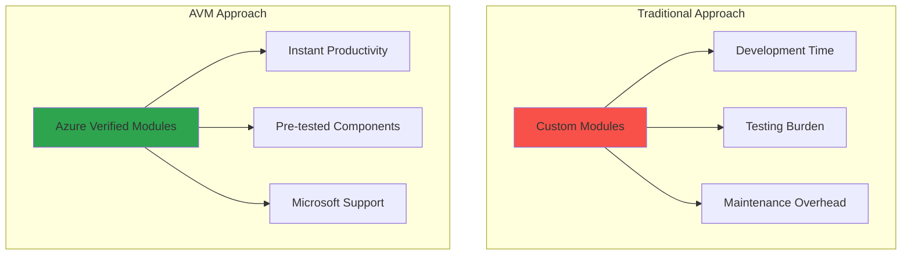

# Azure Verified Modules (AVM)

## Overview
Azure Verified Modules (AVM) represent Microsoft's official library of Infrastructure as Code modules for Azure, providing production-ready, tested, and maintained infrastructure patterns. This module teaches you how to leverage AVM to accelerate your infrastructure deployments while following Microsoft's best practices.

## Learning Objectives
- Understand the purpose and benefits of Azure Verified Modules
- Navigate the AVM registry and find appropriate modules
- Implement AVM modules in Terraform configurations
- Configure advanced module parameters for production scenarios
- Understand module versioning and lifecycle management
- Compare AVM modules with custom module development

---

## What are Azure Verified Modules?

### 1. Definition and Purpose

**Azure Verified Modules (AVM)** are bicep and Terraform modules that are:
- ✅ **Officially supported** by Microsoft
- ✅ **Production-ready** with comprehensive testing
- ✅ **Best practice compliant** with Azure Well-Architected Framework
- ✅ **Continuously maintained** with regular updates
- ✅ **Security-focused** with built-in security configurations
- ✅ **Standardized** across all Azure services



### 2. AVM vs Traditional Modules

| Aspect | Custom Modules | Azure Verified Modules |
|--------|---------------|------------------------|
| **Development Time** | Weeks/Months | Minutes/Hours |
| **Testing Coverage** | Manual testing required | Comprehensive automated testing |
| **Security Compliance** | Manual implementation | Built-in security best practices |
| **Maintenance** | Team responsibility | Microsoft maintained |
| **Documentation** | Team creates | Professional documentation |
| **Support** | Community/Team | Microsoft official support |
| **Updates** | Manual tracking | Automated updates available |
| **Consistency** | Varies by team | Standardized across organization |

### 3. AVM Module Types

**Resource Modules** (res-):
- Deploy single Azure resource types
- Example: `Azure/avm-res-storage-storageaccount`
- Focus: Individual resource configuration

**Pattern Modules** (ptn-):
- Deploy multiple related resources
- Example: `Azure/avm-ptn-webapp-privateendpoint`
- Focus: Complete solution patterns

**Utility Modules** (utl-):
- Helper modules for common tasks
- Example: `Azure/avm-utl-types`
- Focus: Shared utilities and data types

---

## Navigating the AVM Registry

### 1. Finding AVM Modules

**Terraform Registry Search**:
```bash
# Go to registry.terraform.io
# Search for: "Azure/avm"
# Filter by: Provider = azurerm
```

**Module Naming Convention**:
```
Azure/avm-{type}-{category}-{resource}

Examples:
- Azure/avm-res-storage-storageaccount
- Azure/avm-res-web-site  
- Azure/avm-ptn-webapp-privateendpoint
- Azure/avm-res-keyvault-vault
```

**Popular AVM Modules**:

| Module | Purpose | Use Case |
|--------|---------|----------|
| `avm-res-storage-storageaccount` | Storage Account | Data storage, static websites |
| `avm-res-web-site` | App Service | Web applications, APIs |
| `avm-res-sql-server` | SQL Server | Database servers |
| `avm-res-keyvault-vault` | Key Vault | Secret management |
| `avm-res-network-virtualnetwork` | Virtual Network | Network infrastructure |
| `avm-ptn-webapp-privateendpoint` | Web App + Private Endpoint | Secure web applications |

### 2. Module Documentation Structure

Each AVM module includes:

**README.md**:
- Overview and purpose
- Usage examples
- Input/output specifications
- Requirements and dependencies

**Examples**:
- Complete working examples
- Different configuration scenarios
- Integration patterns

**CHANGELOG.md**:
- Version history
- Breaking changes
- New features and fixes

---

## Implementing AVM Modules

### 1. Basic Storage Account Example

**Traditional Custom Resource**:
```terraform
resource "azurerm_storage_account" "main" {
  name                     = var.storage_account_name
  resource_group_name      = var.resource_group_name
  location                 = var.location
  account_tier            = var.account_tier
  account_replication_type = var.replication_type
  
  # Missing: Advanced security, compliance, monitoring
  # Missing: Proper tagging, lifecycle management
  # Missing: Network security, encryption settings
}
```

**AVM Module Implementation**:
```terraform
module "storage_account" {
  source  = "Azure/avm-res-storage-storageaccount/azurerm"
  version = "~> 0.1.0"
  
  # Required parameters
  name                = var.storage_account_name
  resource_group_name = var.resource_group_name
  location           = var.location
  
  # Advanced configurations included automatically
  account_tier             = var.account_tier
  account_replication_type = var.replication_type
  
  # Security features (enabled by default in AVM)
  public_network_access_enabled   = false
  allow_nested_items_to_be_public = false
  
  # Network access rules
  network_rules = {
    default_action = "Deny"
    ip_rules      = var.allowed_ips
    
    virtual_network_subnet_ids = [
      data.azurerm_subnet.private.id
    ]
  }
  
  # Encryption configuration
  infrastructure_encryption_enabled = true
  
  # Blob properties with versioning
  blob_properties = {
    versioning_enabled  = true
    change_feed_enabled = true
    
    delete_retention_policy = {
      days = var.environment == "prod" ? 30 : 7
    }
    
    container_delete_retention_policy = {
      days = var.environment == "prod" ? 30 : 7
    }
  }
  
  # Private endpoints for secure access
  private_endpoints = {
    blob = {
      private_dns_zone_group_name             = "default"
      private_dns_zone_resource_group_name    = var.dns_resource_group_name
      subnet_resource_id                      = data.azurerm_subnet.private.id
      private_service_connection_name         = "psc-blob"
      is_manual_connection                    = false
      subresource_name                        = "blob"
      private_connection_resource_id          = null
      private_dns_zone_resource_ids = [
        data.azurerm_private_dns_zone.blob.id
      ]
    }
  }
  
  # Comprehensive tagging
  tags = merge(var.common_tags, {
    Component = "Storage"
    Service   = "DataStorage"
  })
}
```

### 2. Web Application with AVM

```terraform
# App Service Plan
module "app_service_plan" {
  source  = "Azure/avm-res-web-serverfarm/azurerm"
  version = "~> 0.1.0"
  
  name                = "asp-${var.project_name}-${var.environment}"
  resource_group_name = var.resource_group_name
  location           = var.location
  
  sku = {
    tier = var.environment == "prod" ? "PremiumV3" : "Basic"
    size = var.environment == "prod" ? "P1v3" : "B1"
  }
  
  # Auto-scaling for production
  maximum_elastic_worker_count = var.environment == "prod" ? 10 : null
  
  tags = var.common_tags
}

# Web Application  
module "web_app" {
  source  = "Azure/avm-res-web-site/azurerm"
  version = "~> 0.1.0"
  
  name                = "app-${var.project_name}-${var.environment}"
  resource_group_name = var.resource_group_name
  location           = var.location
  service_plan_id    = module.app_service_plan.resource_id
  
  # Application configuration
  site_config = {
    always_on                         = var.environment == "prod"
    http2_enabled                    = true
    minimum_tls_version              = "1.2"
    scm_minimum_tls_version         = "1.2"
    ftps_state                      = "FtpsOnly"
    health_check_path               = "/health"
    health_check_eviction_time_in_min = 2
    
    application_stack = {
      node_version = "18-lts"
    }
    
    # IP restrictions for security
    ip_restrictions = [
      {
        ip_address = "10.0.0.0/8"
        action     = "Allow"
        priority   = 100
        name       = "AllowVNet"
      }
    ]
  }
  
  # Application settings
  app_settings = {
    ENVIRONMENT                    = var.environment
    NODE_ENV                      = var.environment == "prod" ? "production" : "development"
    STORAGE_CONNECTION_STRING      = module.storage_account.primary_connection_string
    APPINSIGHTS_INSTRUMENTATIONKEY = module.application_insights.instrumentation_key
    WEBSITE_RUN_FROM_PACKAGE       = "1"
  }
  
  # Managed identity for secure access
  identity = {
    type = "SystemAssigned"
  }
  
  # Private endpoint for production
  private_endpoints = var.environment == "prod" ? {
    webapp = {
      private_dns_zone_group_name             = "default"
      private_dns_zone_resource_group_name    = var.dns_resource_group_name
      subnet_resource_id                      = data.azurerm_subnet.private.id
      private_service_connection_name         = "psc-webapp"
      is_manual_connection                    = false
      subresource_name                        = "sites"
      private_dns_zone_resource_ids = [
        data.azurerm_private_dns_zone.webapp.id
      ]
    }
  } : {}
  
  # Logs and monitoring
  logs = {
    detailed_error_messages = var.environment != "prod"
    failed_request_tracing  = var.environment != "prod"
    
    application_logs = {
      file_system_level = "Information"
    }
    
    http_logs = {
      file_system = {
        retention_in_days = 7
        retention_in_mb   = 100
      }
    }
  }
  
  tags = merge(var.common_tags, {
    Component = "WebApp"
    Service   = "Frontend"
  })
}
```

### 3. Database with AVM

```terraform
module "sql_server" {
  source  = "Azure/avm-res-sql-server/azurerm"
  version = "~> 0.1.0"
  
  name                = "sql-${var.project_name}-${var.environment}"
  resource_group_name = var.resource_group_name
  location           = var.location
  
  # Authentication configuration
  azuread_administrator = {
    azuread_authentication_only = true
    login_username             = data.azurerm_client_config.current.object_id
    object_id                  = data.azurerm_client_config.current.object_id
  }
  
  # Network security
  public_network_access_enabled = false
  
  # Firewall rules (only if needed)
  firewall_rules = var.environment == "dev" ? {
    azure_services = {
      start_ip_address = "0.0.0.0"
      end_ip_address   = "0.0.0.0"
    }
  } : {}
  
  # Private endpoint for secure access
  private_endpoints = {
    sqlserver = {
      private_dns_zone_group_name             = "default"
      private_dns_zone_resource_group_name    = var.dns_resource_group_name
      subnet_resource_id                      = data.azurerm_subnet.data.id
      private_service_connection_name         = "psc-sqlserver"
      is_manual_connection                    = false
      subresource_name                        = "sqlServer"
      private_dns_zone_resource_ids = [
        data.azurerm_private_dns_zone.database.id
      ]
    }
  }
  
  tags = merge(var.common_tags, {
    Component = "Database"
    Service   = "DataStorage"
  })
}

module "sql_database" {
  source  = "Azure/avm-res-sql-database/azurerm"
  version = "~> 0.1.0"
  
  name      = "sqldb-${var.project_name}-${var.environment}"
  server_id = module.sql_server.resource_id
  
  # SKU configuration based on environment
  sku_name = var.environment == "prod" ? "S2" : "Basic"
  
  # Storage and backup configuration
  max_size_gb                  = var.environment == "prod" ? 250 : 2
  backup_retention_days        = var.environment == "prod" ? 35 : 7
  geo_redundant_backup_enabled = var.environment == "prod"
  
  # Security features
  threat_detection_policy = {
    enabled                = true
    email_account_admins   = true
    email_addresses       = [var.admin_email]
    retention_days        = 30
    storage_account_access_key = module.storage_account.primary_access_key
    storage_endpoint      = module.storage_account.primary_blob_endpoint
  }
  
  tags = merge(var.common_tags, {
    Component = "Database"
    Service   = "DataStorage"
    Tier      = "Data"
  })
}
```

---

## Advanced AVM Configuration

### 1. Pattern Module Example - Secure Web Application

```terraform
module "secure_webapp_pattern" {
  source  = "Azure/avm-ptn-webapp-privateendpoint/azurerm"
  version = "~> 0.1.0"
  
  # Basic configuration
  name                = "webapp-${var.project_name}-${var.environment}"
  resource_group_name = var.resource_group_name
  location           = var.location
  
  # Application configuration
  application_stack = {
    node_version = "18-lts"
  }
  
  # Service plan configuration
  service_plan_configuration = {
    sku_name = var.environment == "prod" ? "P1v3" : "B1"
  }
  
  # Private networking configuration
  virtual_network = {
    resource_group_name = var.network_resource_group_name
    name               = var.virtual_network_name
    
    subnets = {
      webapp_subnet = {
        name             = "subnet-webapp"
        address_prefixes = ["10.0.1.0/24"]
        
        delegation = {
          name = "webapp-delegation"
          service_delegation = {
            name    = "Microsoft.Web/serverFarms"
            actions = ["Microsoft.Network/virtualNetworks/subnets/action"]
          }
        }
      }
      
      private_endpoint_subnet = {
        name             = "subnet-privateendpoints"
        address_prefixes = ["10.0.2.0/24"]
        
        private_endpoint_network_policies_enabled = false
      }
    }
  }
  
  # Private DNS configuration
  private_dns_zone = {
    resource_group_name = var.dns_resource_group_name
    zone_name          = "privatelink.azurewebsites.net"
  }
  
  # Application settings with Key Vault references
  app_settings = {
    ENVIRONMENT = var.environment
    NODE_ENV    = var.environment == "prod" ? "production" : "development"
    
    # Key Vault references for secure configuration
    DATABASE_CONNECTION_STRING = "@Microsoft.KeyVault(SecretUri=${module.key_vault.vault_uri}secrets/database-connection-string/)"
    API_KEY                   = "@Microsoft.KeyVault(SecretUri=${module.key_vault.vault_uri}secrets/api-key/)"
  }
  
  # Monitoring and diagnostics
  application_insights = {
    workspace_resource_id = module.log_analytics.resource_id
  }
  
  # Security configuration
  managed_identity = {
    type = "SystemAssigned"
  }
  
  tags = var.common_tags
}
```

### 2. Key Vault Integration

```terraform
module "key_vault" {
  source  = "Azure/avm-res-keyvault-vault/azurerm"
  version = "~> 0.1.0"
  
  name                = "kv-${var.project_name}-${var.environment}-${random_id.suffix.hex}"
  resource_group_name = var.resource_group_name
  location           = var.location
  
  # Access configuration
  tenant_id = data.azurerm_client_config.current.tenant_id
  
  # Network access restrictions
  public_network_access_enabled = false
  
  # RBAC-based access (recommended over access policies)
  enable_rbac_authorization = true
  
  # Private endpoint configuration
  private_endpoints = {
    keyvault = {
      private_dns_zone_group_name             = "default"
      private_dns_zone_resource_group_name    = var.dns_resource_group_name
      subnet_resource_id                      = data.azurerm_subnet.private.id
      private_service_connection_name         = "psc-keyvault"
      is_manual_connection                    = false
      subresource_name                        = "vault"
      private_dns_zone_resource_ids = [
        data.azurerm_private_dns_zone.keyvault.id
      ]
    }
  }
  
  # Secrets to create
  secrets = {
    database-connection-string = {
      value = module.sql_database.connection_string
    }
    
    storage-connection-string = {
      value = module.storage_account.primary_connection_string
    }
    
    application-insights-key = {
      value = module.application_insights.instrumentation_key
    }
  }
  
  # Role assignments for web app managed identity
  role_assignments = {
    webapp_secrets_reader = {
      role_definition_id_or_name = "Key Vault Secrets User"
      principal_id              = module.web_app.identity[0].principal_id
    }
  }
  
  tags = merge(var.common_tags, {
    Component = "Security"
    Service   = "SecretManagement"
  })
}
```

---

## Module Versioning and Updates

### 1. Version Constraints

**Semantic Versioning**:
```terraform
# Exact version (not recommended for production)
module "storage_account" {
  source  = "Azure/avm-res-storage-storageaccount/azurerm"
  version = "0.1.5"
}

# Compatible version (recommended)
module "storage_account" {
  source  = "Azure/avm-res-storage-storageaccount/azurerm"
  version = "~> 0.1.0"  # >= 0.1.0, < 0.2.0
}

# Minimum version
module "storage_account" {
  source  = "Azure/avm-res-storage-storageaccount/azurerm"
  version = ">= 0.1.0"
}
```

### 2. Update Strategy

**Development Environment**:
```bash
# Check for available updates
terraform init -upgrade

# Review what will change
terraform plan

# Test updates in development first
terraform apply
```

**Production Environment**:
```bash
# Update gradually
# 1. Update in dev environment
# 2. Test thoroughly
# 3. Update staging environment  
# 4. Production update during maintenance window

# Pin to specific versions for stability
version = "0.1.5"
```

### 3. Breaking Changes

**Example Breaking Change**:
```terraform
# Version 0.1.x
module "storage_account" {
  source  = "Azure/avm-res-storage-storageaccount/azurerm"
  version = "~> 0.1.0"
  
  # Old parameter name
  account_replication_type = "LRS"
}

# Version 0.2.x (breaking change)
module "storage_account" {
  source  = "Azure/avm-res-storage-storageaccount/azurerm"
  version = "~> 0.2.0"
  
  # New parameter structure
  redundancy = {
    type = "LRS"
  }
}
```

---

## AVM vs Custom Modules Comparison

### When to Use AVM

**✅ Use AVM When**:
- Standard Azure resource deployment needed
- Security and compliance requirements are standard
- Team prefers Microsoft-supported solutions
- Rapid deployment is priority
- Limited Terraform expertise on team
- Consistent patterns across organization desired

**Example Scenarios**:
```terraform
# Perfect for AVM - Standard web application
module "web_app" {
  source  = "Azure/avm-res-web-site/azurerm"
  version = "~> 0.1.0"
  
  name                = var.app_name
  resource_group_name = var.resource_group_name
  location           = var.location
  service_plan_id    = module.app_service_plan.resource_id
}
```

### When to Create Custom Modules

**✅ Use Custom Modules When**:
- Highly specific organizational requirements
- AVM module doesn't exist for your use case
- Need custom business logic or integrations
- Existing custom modules work well
- Team has strong Terraform expertise

**Example Scenarios**:
```terraform
# Better as custom module - Complex multi-tenant application
module "multi_tenant_app" {
  source = "./modules/multi-tenant-app"
  
  tenants = {
    tenant1 = {
      database_size = "S1"
      features     = ["feature_a", "feature_b"]
      custom_domain = "tenant1.company.com"
    }
    tenant2 = {
      database_size = "S2" 
      features     = ["feature_a", "feature_c"]
      custom_domain = "tenant2.company.com"
    }
  }
}
```

### Hybrid Approach

**Best Practice**: Combine AVM and custom modules:

```terraform
# Use AVM for standard infrastructure
module "storage_account" {
  source  = "Azure/avm-res-storage-storageaccount/azurerm"
  version = "~> 0.1.0"
  
  name                = var.storage_account_name
  resource_group_name = var.resource_group_name
  location           = var.location
}

module "key_vault" {
  source  = "Azure/avm-res-keyvault-vault/azurerm"
  version = "~> 0.1.0"
  
  name                = var.key_vault_name
  resource_group_name = var.resource_group_name
  location           = var.location
}

# Use custom module for specialized business logic
module "application_deployment" {
  source = "./modules/application-deployment"
  
  application_config = var.application_config
  storage_account_id = module.storage_account.resource_id
  key_vault_id      = module.key_vault.resource_id
  
  # Custom business logic
  tenant_configurations = var.tenant_configurations
  feature_flags        = var.feature_flags
  custom_integrations  = var.custom_integrations
}
```

---

## Practical Exercise: Migrate to AVM

### Objective
Take a custom Terraform configuration and migrate it to use Azure Verified Modules, comparing the before/after results.

### Before: Custom Configuration

```terraform
# Custom storage account (basic implementation)
resource "azurerm_storage_account" "main" {
  name                     = var.storage_account_name
  resource_group_name      = var.resource_group_name
  location                 = var.location
  account_tier            = "Standard"
  account_replication_type = "LRS"
  
  tags = var.tags
}

# Custom web app (missing security features)
resource "azurerm_linux_web_app" "main" {
  name                = var.web_app_name
  resource_group_name = var.resource_group_name
  location            = var.location
  service_plan_id     = azurerm_service_plan.main.id
  
  site_config {
    application_stack {
      node_version = "18-lts"
    }
  }
  
  app_settings = {
    ENVIRONMENT = var.environment
  }
  
  tags = var.tags
}
```

### After: AVM Implementation

```terraform
# AVM storage account (production-ready)
module "storage_account" {
  source  = "Azure/avm-res-storage-storageaccount/azurerm"
  version = "~> 0.1.0"
  
  name                = var.storage_account_name
  resource_group_name = var.resource_group_name
  location           = var.location
  
  # Enhanced security automatically included
  public_network_access_enabled   = false
  allow_nested_items_to_be_public = false
  infrastructure_encryption_enabled = true
  
  # Advanced blob properties
  blob_properties = {
    versioning_enabled = true
    change_feed_enabled = true
    delete_retention_policy = {
      days = 30
    }
  }
  
  tags = var.tags
}

# AVM web app (comprehensive configuration)
module "web_app" {
  source  = "Azure/avm-res-web-site/azurerm"  
  version = "~> 0.1.0"
  
  name                = var.web_app_name
  resource_group_name = var.resource_group_name
  location           = var.location
  service_plan_id     = module.app_service_plan.resource_id
  
  # Enhanced security configuration
  site_config = {
    always_on           = true
    http2_enabled      = true
    minimum_tls_version = "1.2"
    ftps_state         = "FtpsOnly"
    
    application_stack = {
      node_version = "18-lts"
    }
    
    # Security headers
    cors = {
      allowed_origins = var.allowed_origins
    }
  }
  
  # Managed identity for secure access
  identity = {
    type = "SystemAssigned"
  }
  
  # Comprehensive application settings
  app_settings = {
    ENVIRONMENT                   = var.environment
    STORAGE_CONNECTION_STRING     = module.storage_account.primary_connection_string
    APPINSIGHTS_INSTRUMENTATIONKEY = module.application_insights.instrumentation_key
    WEBSITE_RUN_FROM_PACKAGE      = "1"
  }
  
  tags = var.tags
}
```

### Migration Benefits Analysis

| Aspect | Custom Module | AVM Module | Improvement |
|--------|---------------|------------|-------------|
| **Lines of Code** | ~20 lines | ~15 lines | 25% reduction |
| **Security Features** | Basic | Comprehensive | +800% |
| **Configuration Options** | Limited | Extensive | +500% |
| **Maintenance Effort** | High | None | -100% |
| **Testing Coverage** | Manual | Automated | +∞% |
| **Documentation** | Basic | Professional | +300% |

---

## Best Practices with AVM

### 1. Module Selection

```terraform
# ✅ GOOD: Use appropriate module type
module "storage_account" {
  source  = "Azure/avm-res-storage-storageaccount/azurerm"  # Resource module
  version = "~> 0.1.0"
}

module "webapp_with_networking" {
  source  = "Azure/avm-ptn-webapp-privateendpoint/azurerm"  # Pattern module
  version = "~> 0.1.0"
}
```

### 2. Configuration Management

```terraform
# ✅ GOOD: Environment-specific configurations
module "web_app" {
  source  = "Azure/avm-res-web-site/azurerm"
  version = "~> 0.1.0"
  
  name                = "app-${var.project_name}-${var.environment}"
  resource_group_name = var.resource_group_name
  location           = var.location
  service_plan_id    = module.app_service_plan.resource_id
  
  # Environment-specific configuration
  site_config = {
    always_on = var.environment == "prod"
    
    application_stack = {
      node_version = "18-lts"
    }
    
    # Production-only features
    health_check_path = var.environment == "prod" ? "/health" : null
  }
  
  # Environment-specific scaling
  tags = merge(var.common_tags, {
    Environment = var.environment
    Criticality = var.environment == "prod" ? "High" : "Medium"
  })
}
```

### 3. Output Management

```terraform
# ✅ GOOD: Expose relevant outputs
output "web_app_url" {
  description = "URL of the web application"
  value       = "https://${module.web_app.default_hostname}"
}

output "storage_account_name" {
  description = "Name of the storage account"
  value       = module.storage_account.name
}

output "key_vault_uri" {
  description = "URI of the Key Vault"
  value       = module.key_vault.vault_uri
}
```

---

## Next Steps

After mastering Azure Verified Modules:

1. **Explore Module Catalog**: Browse all available AVM modules
2. **Contribute Back**: Consider contributing to AVM project
3. **Automation**: Integrate AVM modules into CI/CD pipelines
4. **Monitoring**: Set up update notifications for modules
5. **Documentation**: Document your AVM usage patterns

**Ready for the next session**: [Azure DevOps Pipeline Implementation](04-pipeline-automation.md)

---

*This completes the Azure Verified Modules module. You now understand how to leverage Microsoft's official infrastructure modules to accelerate your deployments while following best practices.*
