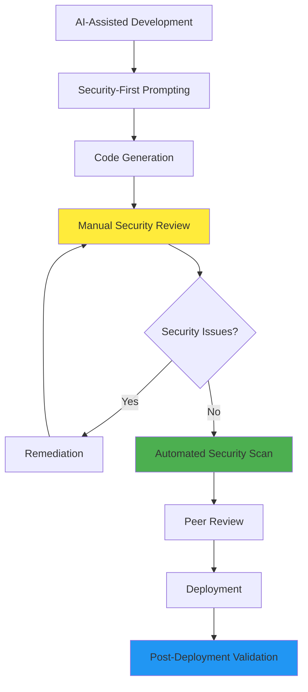

# Session 4: Security, Compliance & Limitations

## Session Overview
**Duration**: 50 minutes  
**Format**: Review + Discussion + Practical Assessment  
**Objective**: Ensure responsible and secure use of AI in infrastructure development while understanding limitations

---

## Learning Objectives

By the end of this session, participants will:
- Understand security implications of AI-generated infrastructure code
- Implement robust compliance review workflows for AI-assisted development
- Recognize common AI limitations and potential pitfalls in IaC
- Establish code quality validation processes for AI-generated configurations
- Develop organizational policies for responsible AI usage in infrastructure teams
- Create security-first AI development workflows

---

## Security Implications of AI-Generated Code

### Understanding AI Security Risks

#### 1. Training Data Contamination

**Risk**: AI models may suggest patterns from insecure code in training data

**Examples of Problematic Suggestions**:
```terraform
# AI might suggest insecure patterns like:
resource "azurerm_storage_account" "example" {
  allow_blob_public_access = true  # Security risk!
  shared_access_key_enabled = true # Outdated practice
  
  network_rules {
    default_action = "Allow"       # Too permissive!
  }
}

# Instead of secure defaults:
resource "azurerm_storage_account" "secure" {
  allow_blob_public_access = false
  shared_access_key_enabled = false
  public_network_access_enabled = false
  
  network_rules {
    default_action = "Deny"
    bypass = "AzureServices"
  }
}
```

#### 2. Context Misinterpretation

**Risk**: AI may not fully understand security context or requirements

**Example Scenarios**:
```terraform
# Scenario 1: AI suggests development-grade security for production
# User prompt: "Create storage account for application data"
# AI might generate:
resource "azurerm_storage_account" "data" {
  account_replication_type = "LRS"  # Not suitable for prod
  min_tls_version = "TLS1_0"        # Insecure version
}

# Scenario 2: Missing compliance requirements
# AI generates functional code without considering:
# - Data residency requirements
# - Encryption key management
# - Audit logging needs
# - Access control policies
```

#### 3. Incomplete Security Controls

**Risk**: AI focuses on functionality over comprehensive security

**Common Gaps**:
- Missing diagnostic settings for audit trails
- Inadequate network access restrictions
- Insufficient backup and recovery configurations
- Incomplete monitoring and alerting setup
- Missing data classification and handling policies

---

## Compliance Review Workflows

### Security Review Framework

#### 1. Pre-Deployment Security Checklist

**Essential Security Validations**:

```markdown
# Infrastructure Security Review Checklist

## 🔒 Identity and Access Management
- [ ] Managed identities used instead of service principals
- [ ] Least privilege access principles applied
- [ ] Role assignments documented and justified
- [ ] No hardcoded credentials or keys
- [ ] Multi-factor authentication enforced where applicable

## 🌐 Network Security
- [ ] Private endpoints configured for supported services
- [ ] Network security groups properly configured
- [ ] Public access disabled unless explicitly required
- [ ] Traffic flows documented and justified
- [ ] DDoS protection enabled for public services

## 🔐 Data Protection
- [ ] Encryption at rest enabled with appropriate keys
- [ ] Encryption in transit enforced (TLS 1.2+)
- [ ] Customer-managed keys used for sensitive data
- [ ] Data classification and handling documented
- [ ] Backup encryption and retention configured

## 📊 Monitoring and Auditing
- [ ] Diagnostic settings enabled for all resources
- [ ] Security logs forwarded to SIEM/monitoring
- [ ] Activity logging configured appropriately
- [ ] Alert rules defined for security events
- [ ] Log retention meets compliance requirements

## ⚖️ Compliance Controls
- [ ] Data residency requirements met
- [ ] Industry-specific controls implemented
- [ ] Regulatory reporting capabilities configured
- [ ] Privacy controls and data handling documented
- [ ] Third-party integrations assessed
```

#### 2. Automated Security Scanning

**Integration with CI/CD Pipeline**:
```yaml
# .github/workflows/security-scan.yml
name: Infrastructure Security Scan

on:
  pull_request:
    paths: ['terraform/**']

jobs:
  security-scan:
    runs-on: ubuntu-latest
    steps:
      - uses: actions/checkout@v4
      
      - name: Run tfsec security scan
        uses: aquasecurity/tfsec-action@v1.0.0
        with:
          additional_args: --format sarif --out results.sarif
      
      - name: Run Checkov scan
        id: checkov
        uses: bridgecrewio/checkov-action@master
        with:
          directory: terraform/
          framework: terraform
          output_format: sarif
          
      - name: AI-Powered Security Review
        run: |
          # Use Copilot CLI to analyze security findings
          # Generate summary and recommendations
```

#### 3. Manual Review Process

**Security Review Template**:
```markdown
# Security Review Report

**Reviewer**: [Name]  
**Date**: [Date]  
**Terraform Configuration**: [File/Module Path]  

## Security Assessment

### 1. Threat Model Analysis
- **Data Classification**: [Public/Internal/Confidential/Restricted]
- **Attack Surface**: [Description of exposed components]
- **Trust Boundaries**: [Network and identity boundaries identified]
- **Potential Threats**: [Identified security risks]

### 2. Control Assessment
- **Preventive Controls**: [Access controls, encryption, network security]
- **Detective Controls**: [Monitoring, logging, alerting]
- **Corrective Controls**: [Incident response, backup/recovery]

### 3. Compliance Verification
- **Applicable Standards**: [SOC 2, ISO 27001, PCI DSS, HIPAA, etc.]
- **Control Mappings**: [Specific requirements addressed]
- **Gaps Identified**: [Missing or inadequate controls]

### 4. Recommendations
- **Critical Issues**: [Must fix before deployment]
- **High Priority**: [Fix within sprint]
- **Medium Priority**: [Fix within iteration]
- **Enhancements**: [Future improvements]

### 5. Approval Status
- [ ] Approved for deployment
- [ ] Approved with conditions
- [ ] Rejected - requires remediation

**Conditions/Comments**: [Additional notes]
```

---

## Understanding AI Limitations

### Technical Limitations

#### 1. Context Window Constraints

**Limitation**: AI has limited context window for large configurations

**Impact**:
```terraform
# Large Terraform projects may exceed AI context limits
# Resulting in:
# - Incomplete understanding of resource relationships
# - Inconsistent naming patterns across files
# - Missing dependencies between modules
# - Suboptimal resource organization

# Mitigation Strategies:
# 1. Break large configurations into smaller modules
# 2. Provide explicit context in comments
# 3. Use consistent naming and organizational patterns
# 4. Review AI suggestions against overall architecture
```

#### 2. Version and Feature Lag

**Limitation**: AI training data may not include latest features

**Examples**:
```terraform
# AI might suggest deprecated approaches:
resource "azurerm_app_service_plan" "old" {
  # Deprecated resource type
}

# Instead of current best practice:
resource "azurerm_service_plan" "current" {
  # Current resource type with latest features
}

# AI might miss new security features:
resource "azurerm_storage_account" "example" {
  # Missing newer security options like:
  # - infrastructure_encryption_enabled
  # - nfsv3_enabled
  # - sftp_enabled controls
}
```

#### 3. Platform-Specific Nuances

**Limitation**: AI may not understand subtle platform differences

**Azure-Specific Examples**:
```terraform
# AI might not consider Azure-specific constraints:
resource "azurerm_virtual_network" "example" {
  address_space = ["192.168.0.0/16"]  # Might conflict with Azure reserved ranges
}

# Or miss Azure naming constraints:
resource "azurerm_storage_account" "bad_name" {
  name = "my-storage-account-2024"  # Invalid: contains hyphens and too long
}

# Correct Azure storage account naming:
resource "azurerm_storage_account" "valid_name" {
  name = "mystorageacct2024"  # Valid: lowercase, alphanumeric, 3-24 chars
}
```

### Logical and Decision-Making Limitations

#### 1. Business Context Understanding

**Limitation**: AI lacks understanding of business requirements and constraints

**Examples**:
```terraform
# AI might suggest technically correct but business-inappropriate solutions:

# User: "Create database for customer data"
# AI might suggest expensive solution:
resource "azurerm_sql_database" "customers" {
  sku_name = "P15"  # Very expensive for small business
}

# Without understanding:
# - Company size and budget
# - Expected data volume
# - Performance requirements
# - Compliance needs
```

#### 2. Cost Optimization Blind Spots

**Limitation**: AI may prioritize functionality over cost efficiency

**Common Issues**:
```terraform
# AI might suggest over-provisioned resources:
resource "azurerm_app_service_plan" "app" {
  sku {
    tier = "Premium"  # Expensive default choice
    size = "P3v3"     # May be oversized for actual needs
  }
}

# Or miss cost optimization opportunities:
resource "azurerm_virtual_machine" "vm" {
  # Suggests standard VM instead of spot instances
  # Doesn't consider reserved instance pricing
  # May not optimize storage tiers
}
```

#### 3. Architectural Decision Limitations

**Limitation**: AI cannot make complex architectural trade-off decisions

**Scenarios Requiring Human Judgment**:
- Monolith vs. microservices architecture choices
- Multi-region deployment strategies
- Technology stack selection
- Performance vs. cost trade-offs
- Risk vs. convenience balancing

---

## Common AI Pitfalls and Prevention

### Pitfall 1: Over-Permissive Security Settings

**Problem**: AI defaults to permissive settings for functionality

**Prevention Strategy**:
```terraform
# Always review and restrict permissions
# Use security-first prompting:
# "Create secure Azure Key Vault with minimal access permissions"
# "Generate storage account with zero-trust networking"

resource "azurerm_key_vault" "secure" {
  # AI-generated with security prompting
  enabled_for_disk_encryption = false  # Only if needed
  enabled_for_deployment = false       # Only if needed
  enabled_for_template_deployment = false
  
  network_acls {
    default_action = "Deny"
    bypass = "None"  # Most restrictive setting
  }
}
```

### Pitfall 2: Inconsistent Naming and Organization

**Problem**: AI may not maintain consistency across large projects

**Prevention Strategy**:
```terraform
# Establish clear patterns early
# Use consistent prompting:

# Define naming convention in variables
variable "naming_convention" {
  description = "Naming convention: [resource-type]-[project]-[environment]-[region]"
  default = {
    resource_group = "rg-{project}-{environment}-{region}"
    storage_account = "st{project}{environment}{region}{unique}"
    key_vault = "kv-{project}-{environment}-{unique}"
  }
}

# Reference in all prompts:
# "Create resources following the established naming convention in variables.tf"
```

### Pitfall 3: Missing Error Handling and Validation

**Problem**: AI focuses on happy path, may miss error scenarios

**Prevention Strategy**:
```terraform
# Always add validation and error handling
variable "environment" {
  description = "Deployment environment"
  type        = string
  
  validation {
    condition = contains(["dev", "staging", "prod"], var.environment)
    error_message = "Environment must be dev, staging, or prod."
  }
}

# Use lifecycle rules to prevent accidents
resource "azurerm_storage_account" "critical" {
  # ... configuration ...
  
  lifecycle {
    prevent_destroy = true
    ignore_changes = [
      tags["created_date"]
    ]
  }
}
```

### Pitfall 4: Inadequate Documentation

**Problem**: AI-generated code may lack proper documentation

**Prevention Strategy**:
```terraform
# Always request documentation in prompts:
# "Generate Terraform configuration with comprehensive comments explaining:
# - Resource purpose and business context
# - Configuration choices and rationale
# - Dependencies and relationships
# - Security considerations
# - Operational notes"

# Example well-documented AI-generated resource:
/**
 * Production storage account for customer application data
 * 
 * Configuration rationale:
 * - GRS replication for disaster recovery requirements
 * - Private endpoints only for security compliance
 * - Lifecycle management for cost optimization
 * - Diagnostic logging for audit requirements
 * 
 * Dependencies:
 * - Requires private endpoint subnet (snet-storage)
 * - Connects to Log Analytics workspace for diagnostics
 * - Uses customer-managed encryption key from Key Vault
 */
resource "azurerm_storage_account" "customer_data" {
  # Configuration follows...
}
```

---

## Code Quality Validation

### Automated Quality Gates

#### 1. Pre-commit Hooks

```bash
#!/bin/bash
# .git/hooks/pre-commit
# Automated quality checks before commit

echo "Running Terraform quality checks..."

# Format check
terraform fmt -check=true -diff=true -recursive
if [ $? -ne 0 ]; then
    echo "❌ Terraform formatting issues found. Run 'terraform fmt -recursive'"
    exit 1
fi

# Validation check
terraform validate
if [ $? -ne 0 ]; then
    echo "❌ Terraform validation failed"
    exit 1
fi

# Security scan
tfsec . --format json --out tfsec-results.json
if [ $? -ne 0 ]; then
    echo "⚠️  Security issues found. Review tfsec-results.json"
fi

# AI-powered review prompt
echo "📝 Consider running AI review: 'Review this configuration for best practices'"

echo "✅ Quality checks passed"
```

#### 2. Quality Metrics Dashboard

```terraform
# Infrastructure for code quality monitoring
resource "azurerm_application_insights" "code_quality" {
  name                = "appi-terraform-quality"
  resource_group_name = azurerm_resource_group.devops.name
  location           = azurerm_resource_group.devops.location
  application_type   = "other"
  
  tags = {
    Purpose = "Terraform code quality monitoring"
  }
}

# Custom metrics for tracking:
# - AI suggestion acceptance rates
# - Security scan results trends
# - Code review findings
# - Deployment success rates
# - Configuration drift incidents
```

### Quality Assurance Workflow

#### 1. Development Phase Quality Checks

```markdown
# Development Phase Checklist

## Before Committing Code
- [ ] AI-generated code reviewed and understood
- [ ] Security implications assessed
- [ ] Business requirements verified
- [ ] Cost implications estimated
- [ ] Testing strategy defined

## Code Review Phase
- [ ] Peer review completed
- [ ] AI assistance documented in PR
- [ ] Security review (if required)
- [ ] Performance implications assessed
- [ ] Documentation updated

## Pre-Deployment Phase
- [ ] Automated security scans passed
- [ ] Integration tests successful
- [ ] Staging environment validated
- [ ] Rollback procedure confirmed
- [ ] Monitoring and alerting verified
```

#### 2. Post-Deployment Validation

```terraform
# Post-deployment validation resources
resource "azurerm_logic_app_workflow" "deployment_validation" {
  name                = "terraform-deployment-validation"
  resource_group_name = azurerm_resource_group.devops.name
  location           = azurerm_resource_group.devops.location
  
  # Automated checks:
  # 1. Resource health verification
  # 2. Security configuration validation
  # 3. Performance baseline establishment
  # 4. Cost tracking initialization
  # 5. Monitoring setup verification
}
```

---

## Organizational AI Policies

### AI Usage Guidelines

#### 1. Acceptable Use Policy

```markdown
# AI-Assisted Infrastructure Development Policy

## Scope
This policy applies to all team members using AI tools for infrastructure development, including but not limited to GitHub Copilot, ChatGPT, and similar AI coding assistants.

## Acceptable Uses
✅ **Approved Uses:**
- Code completion and boilerplate generation
- Architecture pattern suggestions
- Documentation generation
- Error troubleshooting assistance
- Best practices consultation
- Code review and optimization suggestions

❌ **Prohibited Uses:**
- Generating code for systems you don't understand
- Copying sensitive information to external AI services
- Bypassing security review processes
- Using AI suggestions without validation
- Replacing security and compliance assessments

## Responsibilities

### Developer Responsibilities
- Validate all AI-generated code for correctness and security
- Understand and be able to explain all implemented code
- Follow established security and compliance review processes
- Document AI assistance in code reviews and change logs
- Report potential security issues identified in AI suggestions

### Team Lead Responsibilities
- Ensure team training on AI tool limitations and best practices
- Establish and maintain AI usage guidelines
- Review and approve AI-generated infrastructure changes
- Monitor team adherence to AI usage policies
- Coordinate with security teams on AI-related risks

### Security Team Responsibilities
- Define security requirements for AI-generated code
- Conduct regular security assessments of AI-assisted development
- Provide security training specific to AI-generated code risks
- Establish incident response procedures for AI-related security issues
```

#### 2. Risk Management Framework

```markdown
# AI Risk Assessment Matrix

## Risk Categories

### 1. Security Risks
- **High**: Credentials exposure, excessive permissions
- **Medium**: Suboptimal security configurations
- **Low**: Missing security best practices

### 2. Compliance Risks
- **High**: Violation of regulatory requirements
- **Medium**: Inadequate audit trails or controls
- **Low**: Minor compliance gaps

### 3. Operational Risks
- **High**: Infrastructure instability, data loss potential
- **Medium**: Performance degradation, increased costs
- **Low**: Minor operational inefficiencies

## Risk Mitigation Strategies

### Preventive Measures
- Mandatory security training for AI tool usage
- Automated security scanning in CI/CD pipelines
- Peer review requirements for AI-generated code
- Regular security assessments of AI-assisted projects

### Detective Measures
- Continuous monitoring of deployed infrastructure
- Regular security audits of AI-generated configurations
- Automated compliance checking
- Cost and performance monitoring

### Corrective Measures
- Incident response procedures for AI-related issues
- Rollback procedures for problematic deployments
- Security remediation workflows
- Learning and improvement processes
```

---

## Hands-On Security Assessment

### Security Review Exercise

**Scenario**: Review AI-generated infrastructure for security issues

**Given Configuration**:
```terraform
# AI-generated e-commerce infrastructure
# Review this configuration for security issues

resource "azurerm_storage_account" "ecommerce" {
  name                     = "ecommercestorage2024"
  resource_group_name      = azurerm_resource_group.main.name
  location                = azurerm_resource_group.main.location
  account_tier             = "Standard"
  account_replication_type = "LRS"
  
  # Quick setup for testing
  allow_blob_public_access = true
  shared_access_key_enabled = true
  
  tags = {
    Environment = "Production"
  }
}

resource "azurerm_sql_server" "ecommerce" {
  name                         = "ecommerce-sql-server"
  resource_group_name          = azurerm_resource_group.main.name
  location                    = azurerm_resource_group.main.location
  version                     = "12.0"
  administrator_login          = "sqladmin"
  administrator_login_password = "P@ssw0rd123!"
  
  tags = {
    Environment = "Production"
  }
}

resource "azurerm_sql_database" "ecommerce" {
  name           = "ecommerce-db"
  server_name    = azurerm_sql_server.ecommerce.name
  resource_group_name = azurerm_resource_group.main.name
  
  tags = {
    Environment = "Production"
  }
}
```

**Review Tasks**:
1. Identify security issues
2. Assess compliance implications
3. Recommend specific fixes
4. Estimate risk levels
5. Propose review process improvements

### Security Fix Implementation

**Expected Secure Configuration**:
```terraform
# Define common tags for consistency
locals {
  common_tags = {
    Environment = "Production"
    ManagedBy   = "Terraform"
  }
}

# Generate a unique suffix for globally unique resources
resource "random_string" "unique" {
  length  = 6
  upper   = false
  special = false
}

# Secured version with best practices
resource "azurerm_storage_account" "ecommerce_secure" {
  name                     = "stecommerceprod${random_string.unique.result}"
  resource_group_name      = azurerm_resource_group.main.name
  location                = azurerm_resource_group.main.location
  account_tier             = "Standard"
  account_replication_type = "GRS"  # Geo-redundant for production
  
  # Security hardening
  allow_nested_items_to_be_public = false
  shared_access_key_enabled       = false
  public_network_access_enabled   = false
  https_traffic_only_enabled      = true
  min_tls_version                 = "TLS1_2"
  
  # Encryption
  infrastructure_encryption_enabled = true
  
  # Network access rules
  network_rules {
    default_action = "Deny"
    bypass        = "AzureServices"
  }
  
  # Identity
  identity {
    type = "SystemAssigned"
  }
  
  tags = merge(local.common_tags, {
    Component = "Storage"
    DataClassification = "Confidential"
  })
}

resource "azurerm_mssql_server" "ecommerce_secure" {
  name                         = "sql-ecommerce-prod-${random_string.unique.result}"
  resource_group_name          = azurerm_resource_group.main.name
  location                    = azurerm_resource_group.main.location
  version                     = "12.0"
  administrator_login          = var.sql_admin_username
  administrator_login_password = random_password.sql_admin.result
  
  # Security settings
  public_network_access_enabled = false
  minimum_tls_version           = "1.2"
  
  # Azure AD authentication
  azuread_administrator {
    login_username              = data.azurerm_client_config.current.object_id
    object_id                  = data.azurerm_client_config.current.object_id
    tenant_id                  = data.azurerm_client_config.current.tenant_id
    azuread_authentication_only = false
  }
  
  # Identity
  identity {
    type = "SystemAssigned"
  }
  
  tags = merge(local.common_tags, {
    Component = "Database"
    DataClassification = "Confidential"
  })
}

# Secure password generation
resource "random_password" "sql_admin" {
  length  = 24
  special = true
  
  min_upper   = 2
  min_lower   = 2
  min_numeric = 2
  min_special = 2
}

# Store password in Key Vault
resource "azurerm_key_vault_secret" "sql_password" {
  name         = "sql-admin-password"
  value        = random_password.sql_admin.result
  key_vault_id = azurerm_key_vault.main.id
  
  tags = {
    Purpose = "Database authentication"
  }
}
```

---

## Workshop Wrap-up and Best Practices Summary

### Key Security Principles for AI-Assisted Development

1. **Trust but Verify**: Always validate AI suggestions against security requirements
2. **Security by Design**: Include security context in all AI prompts
3. **Principle of Least Privilege**: Review and restrict all access permissions
4. **Defense in Depth**: Implement multiple layers of security controls
5. **Continuous Monitoring**: Establish ongoing security validation processes

### Recommended Development Workflow



### Action Items for Team Implementation

#### Immediate Actions (Week 1)
- [ ] Establish AI usage policy and guidelines
- [ ] Set up automated security scanning in CI/CD
- [ ] Create security review templates and checklists
- [ ] Conduct team training on AI security considerations

#### Short-term Actions (Month 1)
- [ ] Implement pre-commit security hooks
- [ ] Establish security-first AI prompting standards
- [ ] Create incident response procedures for AI-related issues
- [ ] Set up monitoring and alerting for security compliance

#### Long-term Actions (Quarter 1)
- [ ] Develop comprehensive AI risk management framework
- [ ] Establish security metrics and KPIs for AI-assisted development
- [ ] Create advanced security training programs
- [ ] Implement continuous security improvement processes

### Final Recommendations

1. **Start with Security**: Always include security context in AI prompts
2. **Validate Everything**: Never deploy AI-generated code without review
3. **Document AI Usage**: Track AI assistance for audit and improvement
4. **Stay Updated**: Keep current with AI tool capabilities and limitations
5. **Learn Continuously**: Regular training on AI security best practices

---

## Resources and References

### Security Tools and Resources
- **tfsec**: Terraform static analysis security scanner
- **Checkov**: Infrastructure as code security and compliance scanner
- **Azure Security Center**: Cloud security posture management
- **Azure Policy**: Governance and compliance automation

### Compliance Frameworks
- **NIST Cybersecurity Framework**: Comprehensive security guidelines
- **ISO 27001**: Information security management standards
- **SOC 2**: Security and availability controls
- **GDPR/CCPA**: Data privacy regulations

### AI Security Resources
- **OWASP AI Security**: AI-specific security considerations
- **NIST AI Risk Management**: Framework for AI risk assessment
- **Microsoft Responsible AI**: Guidelines for responsible AI usage

---

**Workshop Complete!** You now have the knowledge and tools to responsibly leverage AI for infrastructure development while maintaining security and compliance standards.

**Continue Learning**: Apply these practices in your daily work and stay updated on evolving AI capabilities and security considerations.
