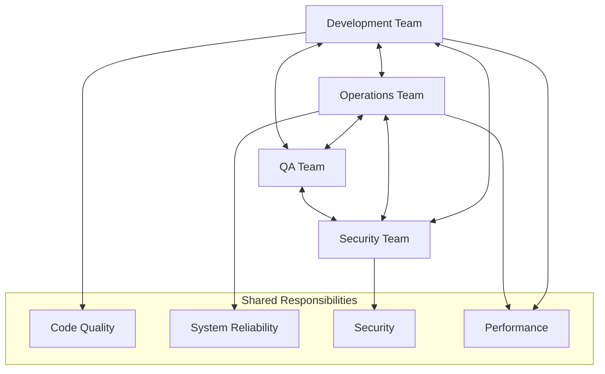
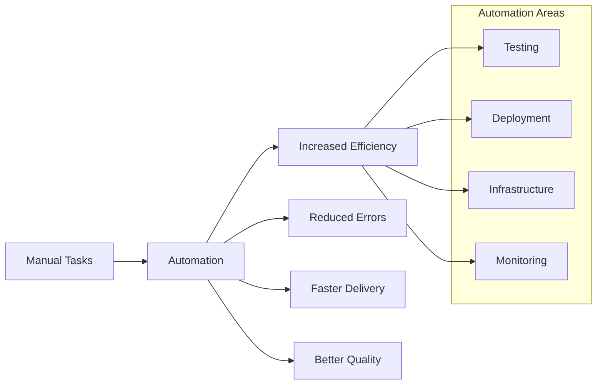
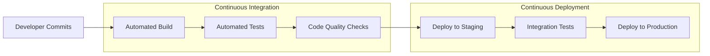
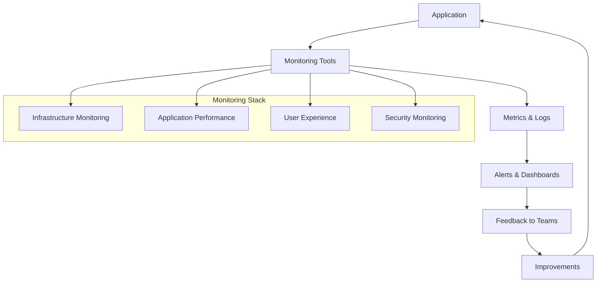
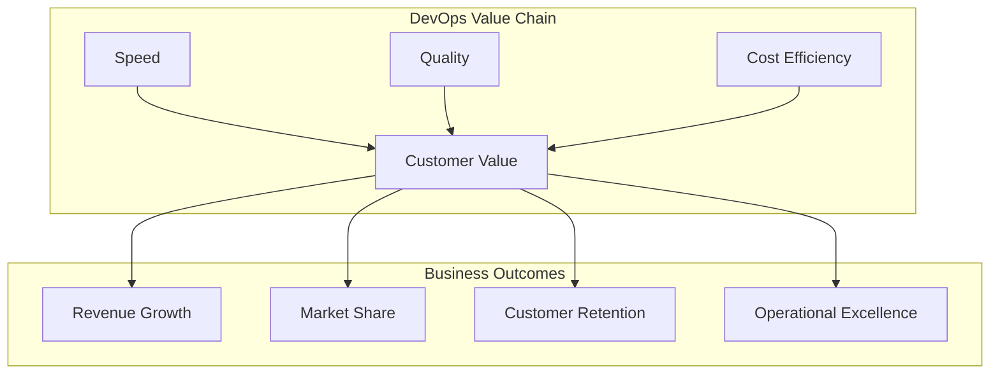

# DevOps Principles & Value

## Overview

DevOps is a cultural philosophy and set of practices that combines software development (Dev) and IT operations (Ops) to shorten the systems development life cycle while delivering features, fixes, and updates frequently in close alignment with business objectives.

## Core DevOps Principles

### 1. Collaboration and Communication

Breaking down silos between development, operations, and other stakeholders.

!!! note "Collaboration and Communication: Breaking Down Silos"

    Let's explore why **collaboration and communication** are so important, especially when it comes to **breaking down silos** between teams such as development, operations, quality assurance, and security.

    In many organizations, these groups often work in isolation. This can result in **communication barriers, delays, and duplicated efforts**—which ultimately slow down progress. By breaking down these silos and encouraging open communication, all teams can work together towards **shared goals**. For example, when development, operations, quality assurance, and security exchange information freely, feedback and concerns are addressed **earlier and more effectively**. This collaborative approach also means responsibilities like **code quality, system reliability, security, and performance are shared**, not just limited to individual teams.

    By working together in this way, everyone becomes **accountable for overall success**. Problems are solved faster, trust builds between teams, and the quality of the final product improves. In short, **strong collaboration and open communication build a foundation for better, more reliable results**.

### 2. Automation

Automating repetitive tasks to reduce human error and increase efficiency.

!!! note "Automation: The Heart of Modern DevOps"

    Let's explore **automation** - the transformative force that makes modern DevOps possible. **Look at this process flow diagram.** Manual processes on the left require perfect human execution every time. Automation on the right delivers **consistent, reliable results at scale**.

    **Real-world impact:** **Netflix deploys over 1,000 times per day** - that's more than once every minute! This incredible pace is only possible through **comprehensive automation** covering testing, deployment, and infrastructure.

    **Critical questions:** What tasks do you repeat manually each week? How quickly do you know when production breaks - **minutes through automation, or hours when customers call?**

### 3. Continuous Integration/Continuous Deployment (CI/CD)

Frequent integration of code changes and automated deployment processes.

!!! note "CI/CD: The Engine of DevOps"

    **CI/CD automation** exemplifies this power.

    - **Continuous Integration** automatically builds and tests code with every change, catching issues **early when they're cheap to fix**.
    - **Continuous Deployment** then automatically releases tested code - **no manual handoffs, no waiting**. Companies with mature CI/CD deploy **30 times more frequently** with **50% fewer failures**.

### 4. Monitoring and Feedback

Continuous monitoring of applications and infrastructure to provide feedback loops.

!!! note "Monitoring and Feedback: Closing the Loop"

    **Monitoring automation** completes the cycle. Modern monitoring automatically tracks **infrastructure health, application performance, and user experience**. When issues occur, automated systems **detect, alert, and even self-heal**. Leading organizations achieve **Mean Time to Recovery under one hour** versus days with manual approaches.

## Business Value of DevOps

### Speed and Agility

- **Faster Time to Market**: Reduce deployment time from weeks to minutes
- **Quick Response to Changes**: Rapidly adapt to market demands
- **Competitive Advantage**: First-to-market with new features

### Quality and Reliability

- **Reduced Failure Rates**: Automated testing catches issues early
- **Faster Recovery**: Quick rollback and fix capabilities
- **Improved Customer Satisfaction**: More stable and reliable services

### Cost Optimization

- **Resource Efficiency**: Better utilization of infrastructure
- **Reduced Manual Labor**: Automation eliminates repetitive tasks
- **Lower Maintenance Costs**: Proactive monitoring prevents costly outages

!!! note "Business Value: The Real Impact of DevOps"

    Let's talk about why **business leaders are investing heavily in DevOps** - the bottom line impact is dramatic and measurable.

    **Look at this value chain diagram.** DevOps transforms how quickly you respond to market opportunities - **deployment time from weeks to minutes**. When your competitor launches a feature, you can **adapt in hours, not months**. This creates **genuine competitive advantage**.

    But **speed without quality is chaos**. Here's the breakthrough: **DevOps improves quality while increasing speed**. **Automated testing catches issues early**, **quick rollback capabilities** mean fast recovery. Result? **Improved customer satisfaction**.

    **Cost impact:** **Better infrastructure utilization**, **automation eliminates repetitive tasks**, **proactive monitoring prevents costly outages** that cost thousands per minute.

    **Critical question:** What would it mean if you could **deploy 30 times more frequently with 50% fewer failures** - proven results from high-performing DevOps organizations?

    **Remember:** DevOps delivers **customer value faster, more reliably, and more cost-effectively** than your competition.

## Common DevOps Metrics

| Metric | Description | Target |
|--------|-------------|---------|
| **Lead Time** | Time from code commit to production | < 1 day |
| **Deployment Frequency** | How often deployments occur | Multiple times per day |
| **Mean Time to Recovery (MTTR)** | Time to recover from failures | < 1 hour |
| **Change Failure Rate** | Percentage of deployments causing failures | < 15% |

## Exercise: DevOps Maturity Assessment

### Instructions (5 minutes)

Rate your organization on a scale of 1-5 for each area:

| Area | Score (1-5) | Notes |
|------|-------------|-------|
| Collaboration between Dev/Ops | ___ | |
| Automation Level | ___ | |
| Deployment Frequency | ___ | |
| Monitoring & Feedback | ___ | |
| Recovery Time | ___ | |

### Discussion Points

- What areas scored lowest? Why?
- What quick wins could improve your scores?
- What would success look like in 6 months?

## Key Takeaways

✅ **DevOps is a culture, not just tools** 
✅ **Automation reduces risk and increases speed** 
✅ **Collaboration breaks down silos** 
✅ **Continuous improvement is essential** 
✅ **Metrics drive decision-making** 

## Next Steps

- Implement one small automation win
- Establish regular cross-team communication
- Define success metrics for your context
- Start measuring current performance

---

*Continue to: [Introduction to Infrastructure as Code](./02-infrastructure-as-code.md)*
