# Introduction to Infrastructure as Code (IaC)

## What is Infrastructure as Code?

Infrastructure as Code (IaC) is the practice of managing and provisioning computing infrastructure through machine-readable definition files, rather than through physical hardware configuration or interactive configuration tools.

!!! note "What is Infrastructure as Code?"

    **Infrastructure as Code transforms how we manage technology infrastructure** - instead of manually clicking through portals or running individual commands, we **define our entire infrastructure in code files**.

    Think of it like **building instructions for LEGO sets**. Traditional approaches are like building without instructions - you might end up with something that works, but it's hard to replicate and prone to mistakes. **IaC provides the detailed blueprint** that anyone can follow to build exactly the same infrastructure, every single time.

    Companies using IaC can **provision complete environments in minutes instead of weeks**. When Netflix needs to scale for a major release, they don't manually configure thousands of servers - **their IaC automatically provisions everything needed**.

    **Key insight:** IaC isn't just about automation - it's about **treating infrastructure like software**, with all the quality practices that brings: testing, version control, peer review, and continuous improvement.

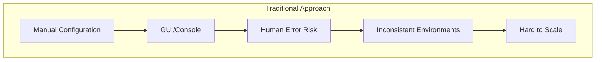

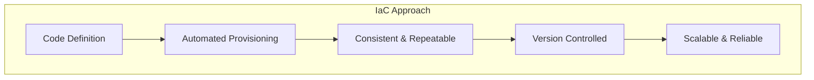

## Core Principles of IaC

### 1. Declarative Configuration

Define **what** you want, not **how** to achieve it.

!!! note "Declarative Configuration: Describing the End State"

    **Declarative configuration means you describe what you want, not how to get there**. Instead of writing step-by-step instructions (imperative), you **define the final state you want** and let the IaC tool figure out how to achieve it.

    **Analogy:** It's like ordering at a restaurant. You don't tell the chef "first heat the pan, then add oil, then crack the eggs..." - you simply say **"I want scrambled eggs"** and trust the chef to know how to make them.

    **Look at this workflow diagram.** The IaC tool **analyzes your desired state, compares it to current reality, identifies gaps, and takes automated actions** to bridge those gaps. If you run it again and nothing has changed, it does nothing - that's the beauty of declarative approaches.

    **Critical advantage:** When requirements change, you just **update your desired state description** and the tool figures out what needs to change, what can stay the same, and what needs to be removed.

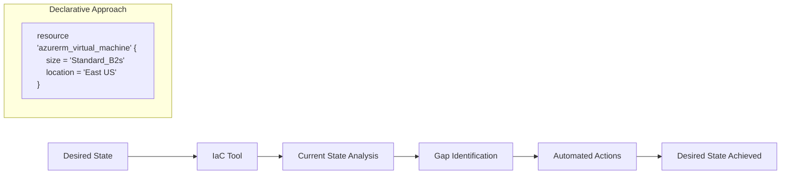

### 2. Version Control

Infrastructure changes are tracked, reviewed, and can be rolled back.

!!! note "Version Control: Infrastructure Change Management"

    **Version control for infrastructure is a game-changer** - every infrastructure change becomes trackable, reviewable, and reversible, just like application code.

    **Look at this git timeline.** Each commit represents **a specific infrastructure change with full context** - who made it, when, why, and exactly what changed. You can **trace any production issue back to the exact change** that caused it, and **roll back instantly** if needed.

    **Best practice:** Every infrastructure change goes through **pull requests with peer review** - catching security issues, cost implications, and design problems before they reach production.

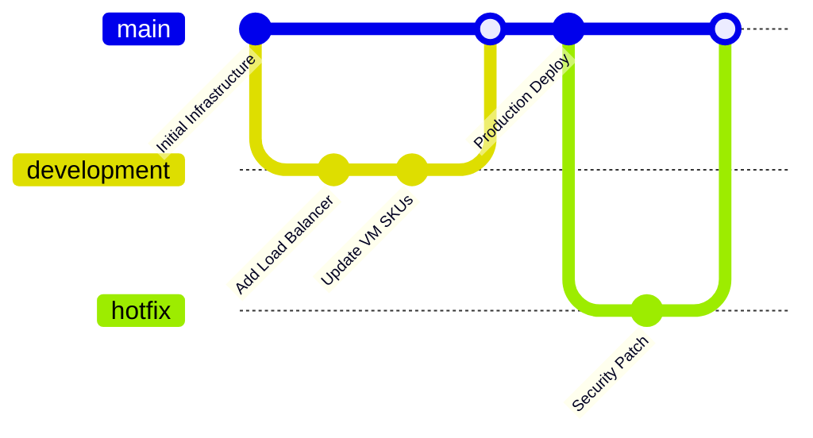

### 3. Idempotency
Running the same configuration multiple times produces the same result.

!!! note "Idempotency: Safe to Run Anytime"

    **Idempotency means you can safely run your IaC scripts multiple times** without causing problems or duplicate resources.

    **Why this matters:** In traditional manual approaches, running the same script twice often breaks things or creates duplicates. With **idempotent IaC, you can run deployments safely** during troubleshooting, after network interruptions, or when you're not sure if the last run completed.

    **Critical insight:** Idempotency enables **confidence in automation** - you're never afraid to run your infrastructure code because you know it will only do what's necessary.

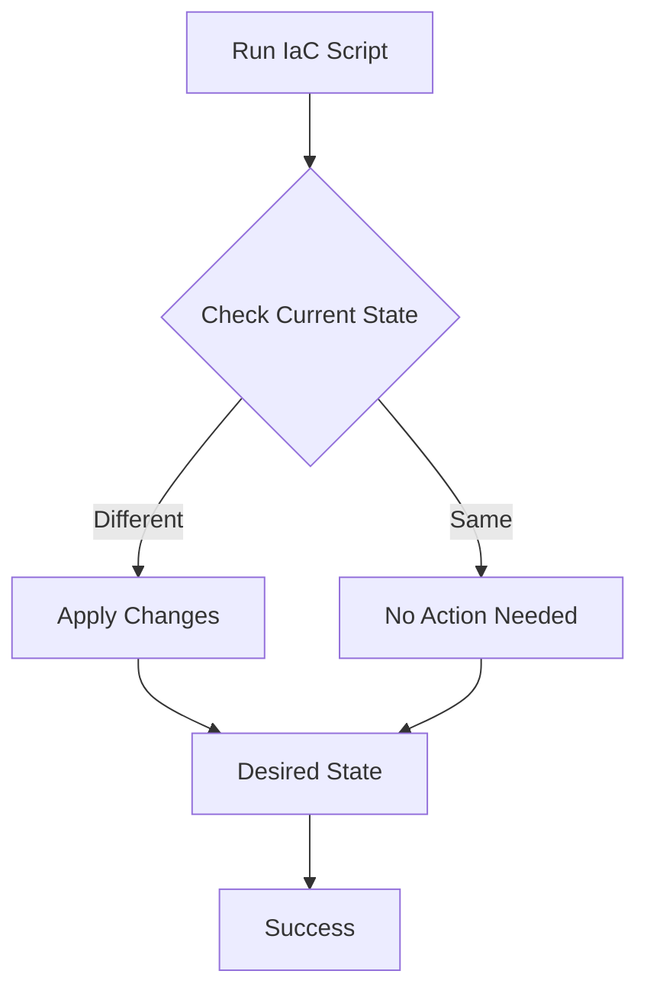

## Benefits of Infrastructure as Code

### For Technical Teams

- **Consistency**: Identical environments every time
- **Speed**: Rapid provisioning and deployment
- **Documentation**: Infrastructure is self-documenting
- **Testing**: Infrastructure can be tested like application code

### For Management

- **Cost Control**: Better resource utilization and tracking
- **Risk Reduction**: Fewer manual errors and outages
- **Compliance**: Auditable infrastructure changes
- **Scalability**: Easy replication across environments

!!! note "Why Organizations Invest in IaC ?"

    Let's explore why **organizations are making IaC a strategic priority** - the benefits span technical efficiency, business agility, and risk management.

    **For Technical Teams:** **Consistency eliminates "works on my machine" problems** - development, staging, and production are guaranteed identical. **Speed increases dramatically** - what took days now takes minutes. **Infrastructure becomes self-documenting** - no more outdated wiki pages or missing configuration details.

    **For Management:** **Cost control improves** through better resource tracking and elimination of unused resources. **Risk decreases** through reduced manual errors and faster recovery capabilities. **Compliance becomes automated** - security policies are enforced through code, not hope.

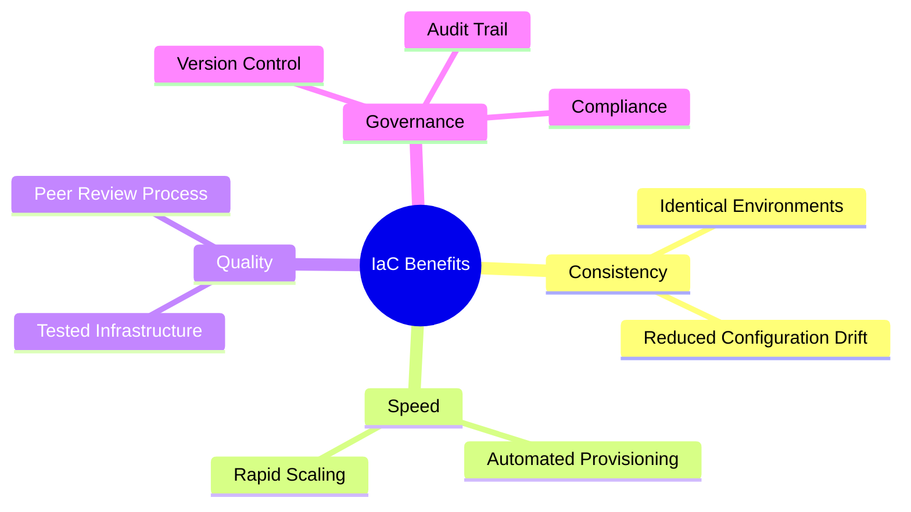

## IaC Tools Landscape

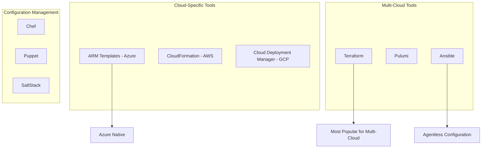

## Azure IaC Options Comparison

| Tool | Pros | Cons | Best For |
|------|------|------|----------|
| **ARM Templates** | Native to Azure, Free | Azure-only, Complex syntax | Azure-pure environments |
| **Bicep** | Simplified ARM, Type-safe | Azure-only, Newer tool | Modern Azure deployments |
| **Terraform** | Multi-cloud, Large ecosystem | Learning curve, State management | Multi-cloud or complex scenarios |
| **Pulumi** | Use familiar languages | Newer tool, Smaller community | Developers preferring code |

## Infrastructure Lifecycle with IaC

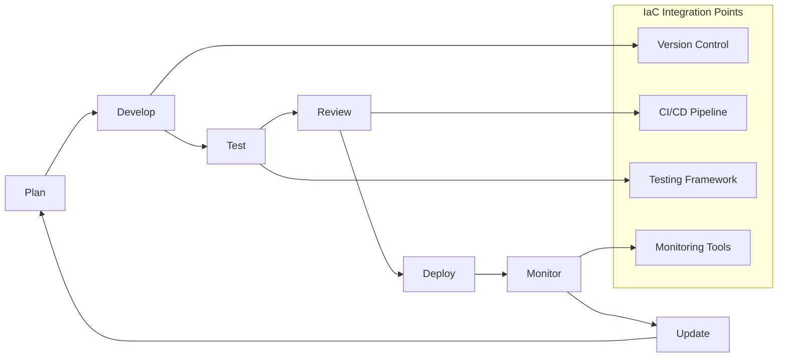

## Common IaC Patterns

### 1. Environment Promotion

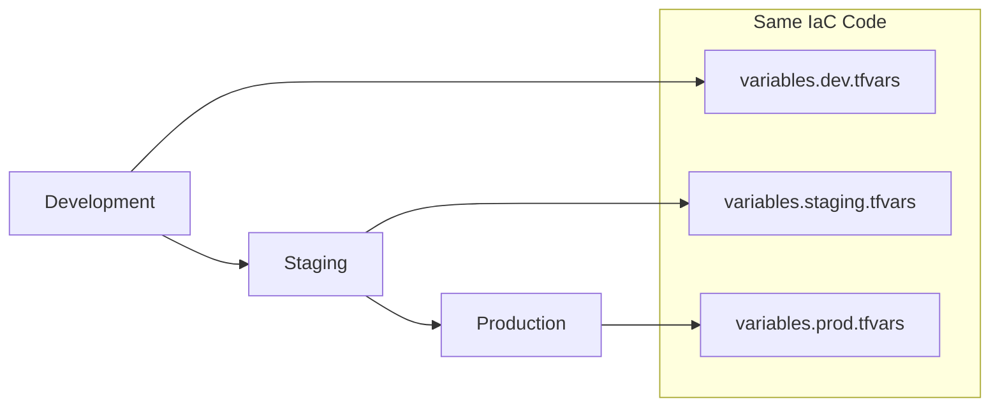

### 2. Blue-Green Deployments
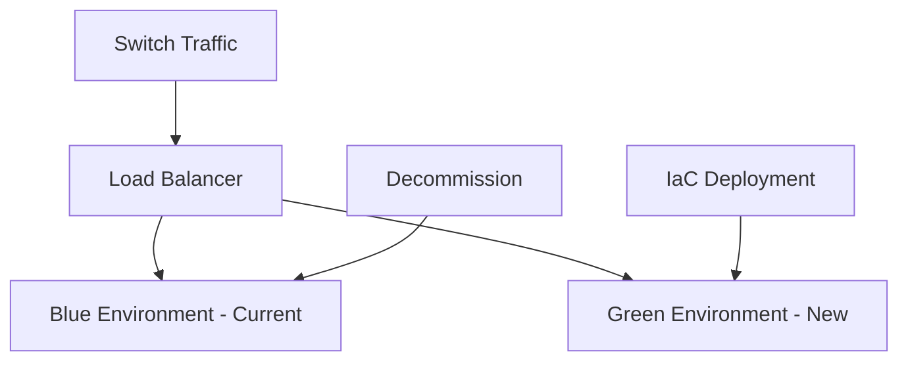

## Azure Resource Hierarchy

Understanding how Azure organizes resources is crucial for effective IaC:

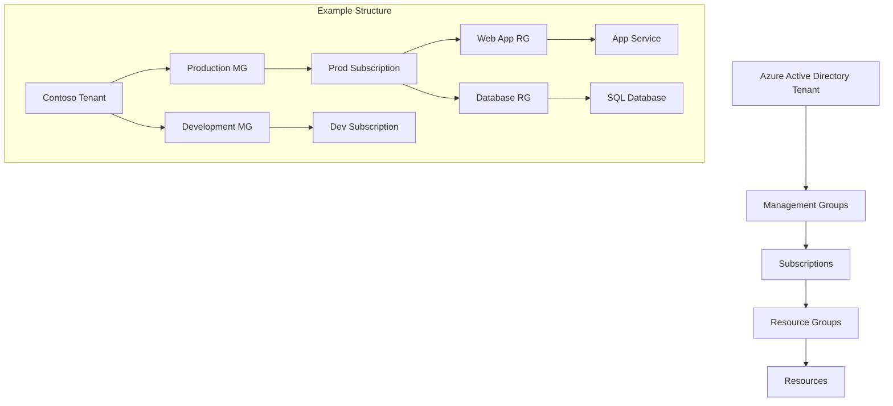

## Security and Compliance in IaC

!!! note "Security: Building Defense into Code"

    **Security in IaC isn't an afterthought - it's built into every layer** of your infrastructure definition and deployment process.

    **Look at this security architecture.** **Policy as Code** ensures consistent security controls across all environments. **Secret Management** keeps sensitive data out of your code repositories. **Access Control** determines who can deploy what and where. **Compliance Scanning** continuously validates your infrastructure against security standards.

    **Azure integration:** **Azure Policy** enforces organizational standards, **Key Vault** manages secrets and certificates, **RBAC** controls access permissions, and **Security Center** provides continuous compliance monitoring.

    **Critical insight:** With **IaC, security becomes repeatable and verifiable**. Every environment gets the same security controls, compliance violations are caught before deployment, and security improvements can be rolled out instantly across all infrastructure.

    **Best practice:** **Never put secrets directly in IaC code** - always use secure secret management services and reference them dynamically during deployment.

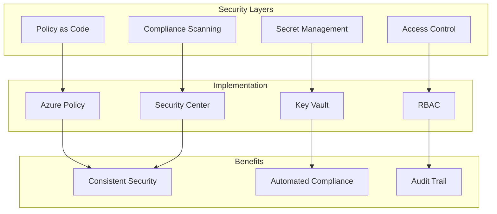

## Discussion Questions

1. **For Managers**: How could IaC help with cost management and resource governance in your organization?
2. **For Technical Teams**: What challenges do you face with manual infrastructure provisioning?
3. **For Everyone**: How do you currently handle environment consistency between development and production?

## Exercise: IaC Benefits Analysis

### Scenario Analysis (10 minutes)

Your organization needs to:

- Set up identical environments for 3 different projects
- Ensure compliance with security policies
- Scale up for a major product launch
- Maintain cost visibility

### Compare Approaches:

| Requirement | Manual Approach | IaC Approach |
|-------------|-----------------|---------------|
| **Time to provision** | ___ hours/days | ___ minutes/hours |
| **Error probability** | High/Medium/Low | High/Medium/Low |
| **Consistency guarantee** | Yes/No | Yes/No |
| **Cost tracking** | Easy/Hard | Easy/Hard |
| **Compliance validation** | Manual/Automated | Manual/Automated |

### Group Discussion

- Which approach better serves business needs?
- What are the main obstacles to adopting IaC?
- How would you measure success?

## Real-World Example: E-commerce Platform

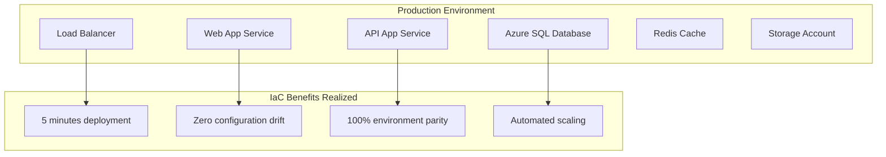

## Key Takeaways

✅ **IaC treats infrastructure like software** 
✅ **Consistency and repeatability are key benefits** 
✅ **Version control provides change management** 
✅ **Automation reduces human error** 
✅ **Multiple tools available for different needs** 
✅ **Security and compliance can be codified** 

## Common Pitfalls to Avoid

⚠️ **Not planning for state management** 
⚠️ **Ignoring secrets and sensitive data handling** 
⚠️ **Mixing manual changes with IaC** 
⚠️ **Not testing infrastructure code** 
⚠️ **Lack of proper access controls** 

## Next Steps

- Choose the right IaC tool for your environment
- Start with simple, non-critical resources
- Establish testing and review processes
- Plan for secrets and state management
- Create reusable modules and patterns

---

*Continue to: [Source Control & Git Workflows](./03-source-control-git.md)*
