# Source Control & Git Workflows

## Introduction to Source Control

Source control (also known as version control) is a system that tracks changes to files over time, allowing multiple developers to collaborate on the same codebase while maintaining a complete history of modifications.

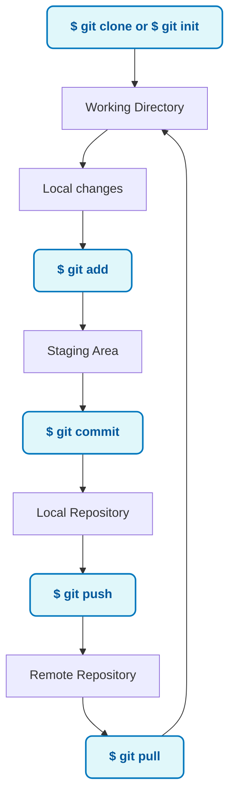

## Why Source Control for Infrastructure?

### Infrastructure as Code Needs Version Control

Just like application code, infrastructure code requires:

- **Change tracking**: Who changed what, when, and why
- **Collaboration**: Multiple team members working on infrastructure
- **Rollback capability**: Ability to revert problematic changes
- **Branching**: Parallel development of features
- **Audit trail**: Compliance and governance requirements

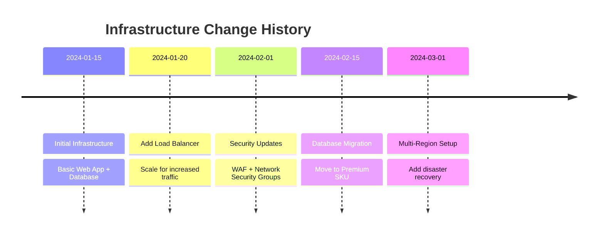

## Git Fundamentals for Infrastructure Teams

### Core Git Concepts

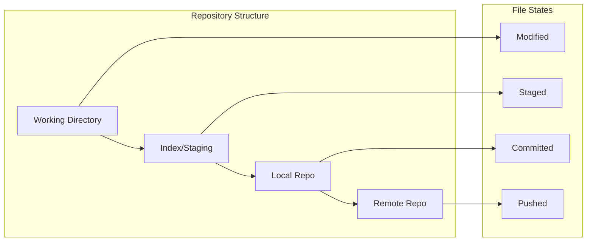

### Essential Git Commands for IaC

| Command | Purpose | Example |
|---------|---------|---------|
| `git init` | Initialize repository | `git init terraform-project` |
| `git add` | Stage changes | `git add main.tf` |
| `git commit` | Save changes | `git commit -m "Add web app resource"` |
| `git push` | Upload to remote | `git push origin main` |
| `git pull` | Download from remote | `git pull origin main` |
| `git branch` | Create/list branches | `git branch feature/add-database` |
| `git merge` | Combine branches | `git merge feature/add-database` |

## Branching Strategies for Infrastructure

### GitFlow for Infrastructure Teams

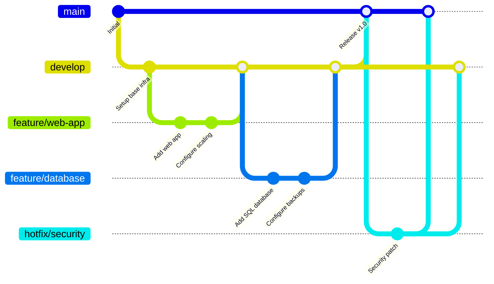

### Environment-Based Branching

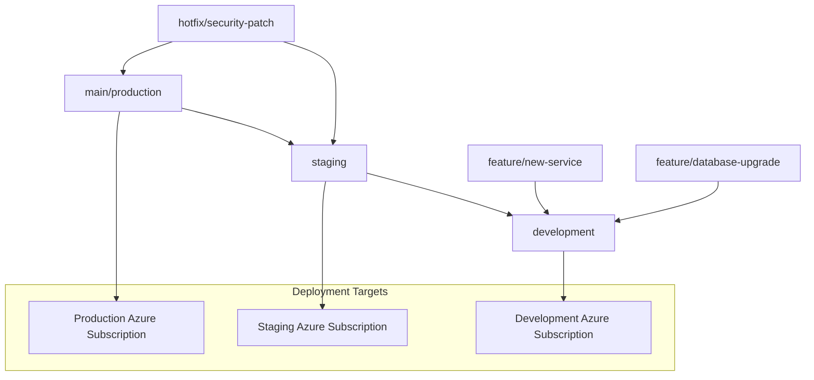

## Pull Request (PR) Workflow

### The PR Process for Infrastructure Changes

```mermaid
sequenceDiagram
    participant Dev as 👤 Developer
    participant BR as Feature Branch
    participant PR as Pull Request
    participant Rev as 👥 Reviewers
    participant Main as Main Branch
    participant CI as CI/CD Pipeline
    participant Azure as Azure Environment

    Dev->>BR: Create feature branch
    Dev->>BR: Make infrastructure changes
    Dev->>BR: Commit changes
    Dev->>PR: Create Pull Request
    PR->>Rev: Request reviews
    Rev->>PR: Code review & approval
    PR->>CI: Trigger automated tests
    CI->>CI: Plan & validate changes
    CI->>PR: Report test results
    PR->>Main: Merge to main branch
    Main->>CI: Trigger deployment
    CI->>Azure: Deploy infrastructure
```

### PR Review Checklist for Infrastructure

#### Security & Compliance

- [ ] No hardcoded secrets or sensitive data
- [ ] Proper access controls and permissions
- [ ] Network security groups configured appropriately
- [ ] Encryption enabled where required

#### Best Practices

- [ ] Resources follow naming conventions
- [ ] Tags applied consistently
- [ ] Resource groups organized logically
- [ ] Cost optimization considerations

#### Technical Quality

- [ ] Code follows DRY principles
- [ ] Variables and outputs properly defined
- [ ] Documentation updated
- [ ] Terraform plan output reviewed

```mermaid
graph TB
    subgraph "PR Review Gates"
        A[Automated Checks]
        B[Security Scan]
        C[Cost Analysis]
        D[👤 Peer Review]
        E[👤 Architecture Review]
    end

    F[Pull Request] --> A
    A --> B
    B --> C
    C --> D
    D --> E
    E --> G[Merge Approval]

    subgraph "Review Outcomes"
        H[Approve]
        I[Request Changes]
        J[Comment]
    end

    G --> H
    G --> I
    G --> J
```

## DevOps Integration

### Azure Repos with Infrastructure Code

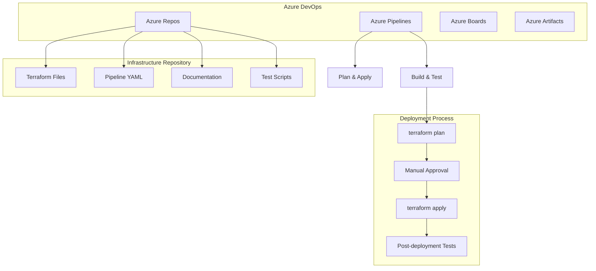

### GitHub Integration for Infrastructure Code

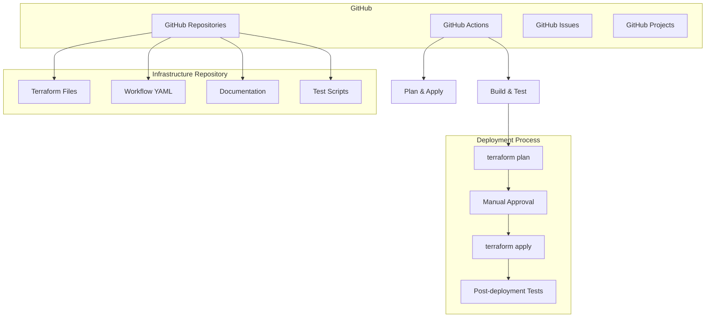

### Branch Policies for Infrastructure

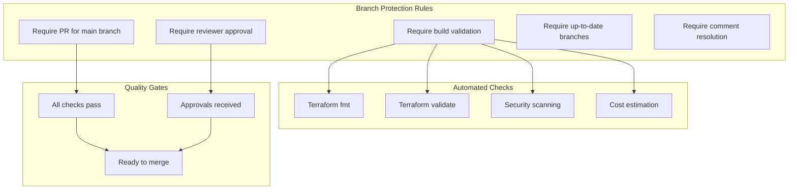

## Git Best Practices for Terraform-ed Infrastructure

### Repository Structure

```
terraform-azure-infrastructure/
├── environments/
│   ├── dev/
│   ├── staging/
│   └── prod/
├── modules/
│   ├── web-app/
│   ├── database/
│   └── networking/
├── policies/
├── scripts/
├── .gitignore
├── README.md
└── CONTRIBUTING.md
```

### Commit Message Guidelines

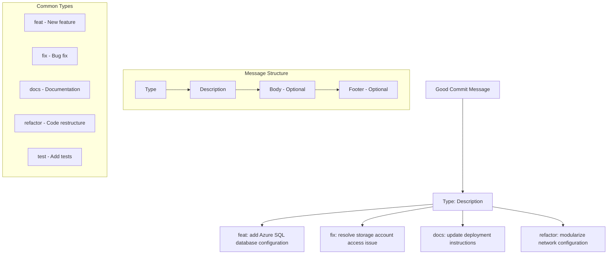

## GitHub vs Azure DevOps Comparison

| Feature | GitHub | Azure DevOps |
|---------|---------|---------------|
| **Repository Hosting** | Excellent | Excellent |
| **Pull Requests** | GitHub PR | Azure DevOps PR |
| **CI/CD Integration** | GitHub Actions | Azure Pipelines |
| **Project Management** | GitHub Issues/Projects | Azure Boards |
| **Package Management** | GitHub Packages | Azure Artifacts |
| **Enterprise Integration** | GitHub Enterprise | Native Azure integration |
| **Cost** | Free for public repos | Free tier available |

## Exercise: Git Workflow Simulation

### Scenario Setup (15 minutes)

You're working on adding a new Azure SQL Database to your infrastructure:

0. **Prepare a fake repository**

```bash
git init terraform-azure-infrastructure
cd terraform-azure-infrastructure
echo "# Terraform Azure Infrastructure" > README.md
git add README.md
git commit -m "chore: initial commit" # chore: updating grunt tasks etc; no production code change
git branch -M main # -M: rename current branch to main
```

If you have a Github account, create a new repo and push:

```bash
git remote add origin <your-github-repo-url>
git push -u origin main
```

1. **Create a feature branch**

```bash
git checkout -b feature/add-sql-database
```

2. **Make changes to infrastructure code**

   - Create a new file `sql_database.tf`
   - Add this sample Terraform code:

```terraform
resource "azurerm_sql_server" "example" {
    name                         = var.sql_server_name
    resource_group_name          = var.resource_group_name_db
    location                     = var.location
    version                      = var.sql_version
    administrator_login          = var.sql_admin_username
    administrator_login_password = var.sql_admin_password
    tags = {
        environment = var.environment
    }
}
```

3. **Stage and commit changes**

```bash
git add sql_database.tf
git commit -m "feat: add Azure SQL database resource"
```

4. **Push branch and create PR**

If you used GitHub earlier, push your branch:

```bash
git push origin feature/add-sql-database
```

- Then, go to GitHub and create a Pull Request from `feature/add-sql-database` to `main`.
- You can simulate a review by adding comments or requesting changes.
- Merge PR after review

If you did not create a GitHub repo, you can simulate the PR process by having a peer review your code locally and merge it into main:

```bash
git checkout main
git merge feature/add-sql-database
```

### PR Review Simulation

#### Review Checklist Activity

Work in pairs to review this sample Terraform code:

```terraform
resource "azurerm_sql_server" "example" {
  name                = "sqlserver123"
  resource_group_name = "rg-prod"
  location            = "East US"
  version             = "12.0"
  administrator_login = "admin123"
  administrator_login_password = "P@ssw0rd123!"

  tags = {
    environment = "prod"
  }
}

resource "azurerm_storage_account" "example" {
  name                     = "storageaccount123"
  resource_group_name      = "rg-prod"
  location                 = "West US"
  account_tier            = "Standard"
  account_replication_type = "LRS"

  public_network_access_enabled = true
}
```

**Questions to Consider:**

- What issues do you see?
- How could this be improved?
- What's missing for production readiness?

## Common Git Mistakes and Solutions

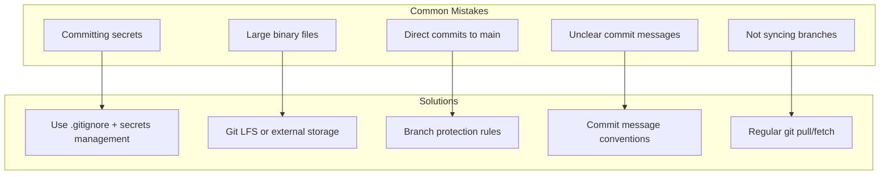

## Discussion Questions

1. **For Managers**: How can proper Git workflows improve compliance and audit capabilities?
2. **For Technical Teams**: What challenges have you faced with infrastructure change management?
3. **For Everyone**: How do you balance speed of delivery with proper review processes?

## Key Takeaways

✅ **Version control is essential for infrastructure code**<br>
✅ **Branching strategies enable parallel development**<br>
✅ **Pull requests provide quality gates**<br>
✅ **Automated checks reduce manual review burden**<br>
✅ **Proper commit messages create valuable history**<br>
✅ **Branch protection prevents direct production changes**<br>

## Security Considerations

🔒 **Never commit secrets to version control**<br>
🔒 **Use branch protection rules**<br>
🔒 **Implement automated security scanning**<br>
🔒 **Require code reviews for sensitive changes**<br>
🔒 **Audit access to infrastructure repositories**<br>

## Next Steps

- Set up repository with proper structure
- Configure branch protection rules
- Create PR templates for infrastructure changes
- Implement automated validation checks
- Train team on Git best practices

---

*Continue to: [What is Terraform?](./04-terraform-basics.md)*
