# What is Terraform?

## Introduction to Terraform

Terraform is an open-source Infrastructure as Code (IaC) tool created by HashiCorp that allows you to define and provision infrastructure using a declarative configuration language called HCL (HashiCorp Configuration Language).

??? tip "Terraform by HashiCorp or OpenTofu?"

    HashiCorp transitioned Terraform from the *Mozilla Public License (MPL)* to the *Business Source License (BSL)* on August 10, 2023. In response, the Open Source community launched [OpenTofu](https://opentofu.org), a fully open-source fork of Terraform that preserves its original licensing model and feature set, ensuring continued freedom and transparency for infrastructure-as-code users.

    The following content focuses on Terraform as a generic concept and most of the information applies to both Terraform and OpenTofu.


## Terraform vs Other IaC Tools

```mermaid
graph TB
    subgraph "Feature Comparison Matrix"
        B["<b>ARM Templates</b><br/>✅ Azure native<br/>✅ No state files<br/>✅ Azure portal integration<br/>⚠️ JSON complexity<br/>❌ Azure only"]

        C["<b>Bicep</b><br/>✅ Azure native<br/>✅ Clean syntax<br/>✅ ARM compatibility<br/>⚠️ Newer tool<br/>❌ Azure only"]

        A["<b>Terraform</b><br/>✅ Multi-cloud<br/>✅ Large ecosystem<br/>✅ Mature tooling<br/>⚠️ State management<br/>⚠️ HCL learning curve"]

        D["<b>Pulumi</b><br/>✅ Multi-cloud<br/>✅ Real programming languages<br/>✅ Rich ecosystem<br/>⚠️ Smaller community<br/>⚠️ Complex for simple tasks"]
    end

    subgraph "Use Case Recommendations"
        E["Multi-cloud Strategy<br/>→ Terraform or Pulumi"]
        F["Azure-only Environment<br/>→ Bicep or ARM"]
        G["Developer-heavy Team<br/>→ Pulumi or Terraform"]
        H["Infrastructure-focused Team<br/>→ Bicep or Terraform"]
    end

    %% Connections with color-coded arrows
    A -.->|Best for| E
    D -.->|Alternative for| E
    B -.->|Traditional choice| F
    C -.->|Modern choice| F
    D -.->|Code-familiar teams| G
    A -.->|Infrastructure teams| G
    C -.->|Azure specialists| H
    A -.->|Multi-cloud teams| H

    %% Color-coded styling for tools
    classDef terraformClass fill:#7c4dff,color:#fff,stroke:#512da8,stroke-width:3px
    classDef armClass fill:#0078d4,color:#fff,stroke:#106ebe,stroke-width:3px
    classDef bicepClass fill:#00bcf2,color:#fff,stroke:#0099cc,stroke-width:3px
    classDef pulumiClass fill:#8a3ffc,color:#fff,stroke:#6929c4,stroke-width:3px
    classDef recClass fill:#e8f5e8,stroke:#4caf50,stroke-width:2px

    %% Apply tool-specific colors
    class A terraformClass
    class B armClass
    class C bicepClass
    class D pulumiClass
    class E,F,G,H recClass

    %% Color the connecting lines to match tools
    linkStyle 0 stroke:#7c4dff,stroke-width:3px
    linkStyle 1 stroke:#8a3ffc,stroke-width:3px
    linkStyle 2 stroke:#0078d4,stroke-width:3px
    linkStyle 3 stroke:#00bcf2,stroke-width:3px
    linkStyle 4 stroke:#8a3ffc,stroke-width:3px
    linkStyle 5 stroke:#7c4dff,stroke-width:3px
    linkStyle 6 stroke:#00bcf2,stroke-width:3px
    linkStyle 7 stroke:#7c4dff,stroke-width:3px
```



## Core Terraform Concepts

### 1. Providers

Providers are plugins that enable Terraform to interact with cloud platforms, SaaS providers, and other APIs.


### 2. Resources

Resources are the most important element in Terraform. They describe infrastructure objects like virtual machines, networks, or higher-level components.


```terraform
  # Example Azure Resource
  resource "azurerm_resource_group" "example" {
    name     = "rg-terraform-demo"
    location = "East US"

    tags = {
      environment = "development"
      project     = "terraform-workshop"
    }
  }
```

### 3. Data Sources

Data sources allow Terraform to fetch information from existing infrastructure or external systems.

```terraform
# Fetch existing resource group information
data "azurerm_resource_group" "existing" {
  name = "existing-rg"
}

# Use the data in another resource
resource "azurerm_storage_account" "example" {
  name                     = "terraformstorage"
  resource_group_name      = data.azurerm_resource_group.existing.name
  location                 = data.azurerm_resource_group.existing.location
  account_tier             = "Standard"
  account_replication_type = "LRS"
}
```

### 4. Variables and Outputs

Variables make configurations reusable, while outputs extract information from resources.


## Terraform State Management

### Understanding State

Terraform maintains a state file that maps real-world resources to your configuration and tracks metadata.


### Remote State Configuration

For team collaboration, store state remotely:

```terraform
terraform {
  backend "azurerm" {
    resource_group_name  = "rg-terraform-state"
    storage_account_name = "terraformstateaccount"
    container_name       = "tfstate"
    key                  = "terraform.tfstate"
  }
}
```

## Terraform Workflow in Detail

### The Three-Step Process

```mermaid
sequenceDiagram
    participant User as 👤 Developer
    participant TF as Terraform
    participant Azure as Azure API
    participant State as State File

    User->>TF: terraform init
    TF->>TF: Download providers
    TF->>State: Initialize state backend

    User->>TF: terraform plan
    TF->>State: Read current state
    TF->>Azure: Query existing resources
    TF->>User: Show planned changes

    User->>TF: terraform apply
    TF->>Azure: Create/Update/Delete resources
    Azure->>TF: Return resource details
    TF->>State: Update state file
    TF->>User: Show applied changes
```



### Terraform Commands

| Command | Purpose | Example |
|---------|---------|---------|
| `terraform init` | Initialize working directory | `terraform init` |
| `terraform plan` | Create execution plan | `terraform plan -out=tfplan` |
| `terraform apply` | Apply changes | `terraform apply tfplan` |
| `terraform destroy` | Destroy infrastructure | `terraform destroy` |
| `terraform validate` | Validate configuration | `terraform validate` |
| `terraform fmt` | Format configuration | `terraform fmt` |
| `terraform state` | State management | `terraform state list` |

## Azure Provider Configuration

### Basic Provider Setup

```terraform
terraform {
  required_providers {
    azurerm = {
      source  = "hashicorp/azurerm"
      version = "~> 4.0" # Use the latest 4.x version
    }
    random = {
      source  = "hashicorp/random"
      version = "~> 3.5" # Use the latest 3.x version
    }
  }
  required_version = ">= 1.0" # Terraform version 1.0 or higher
}

provider "azurerm" {
  features {}

  # Optional: specify subscription
  subscription_id = var.subscription_id
}
```

### Authentication Methods


## Sample Terraform Configuration

### Complete Web Application Infrastructure

```terraform
# Variables
variable "environment" {
  description = "Environment name"
  type        = string
  default     = "dev"
}

variable "location" {
  description = "Azure region"
  type        = string
  default     = "East US"
}

# Resource Group
resource "azurerm_resource_group" "webapp" {
  name     = "rg-webapp-${var.environment}"
  location = var.location

  tags = {
    Environment = var.environment
    ManagedBy   = "Terraform"
  }
}

# App Service Plan
resource "azurerm_service_plan" "webapp" {
  name                = "plan-webapp-${var.environment}"
  resource_group_name = azurerm_resource_group.webapp.name
  location            = azurerm_resource_group.webapp.location

  os_type  = "Linux"
  sku_name = "B1"
}

# Web App
resource "azurerm_linux_web_app" "webapp" {
  name                = "app-webapp-${var.environment}-${random_id.suffix.hex}"
  resource_group_name = azurerm_resource_group.webapp.name
  location            = azurerm_service_plan.webapp.location
  service_plan_id     = azurerm_service_plan.webapp.id

  site_config {
    application_stack {
      node_version = "18-lts"
    }
  }
}

# Random suffix for unique naming
resource "random_id" "suffix" {
  byte_length = 4
}

# Outputs
output "web_app_url" {
  description = "The URL of the web application"
  value       = "https://${azurerm_linux_web_app.webapp.default_hostname}"
}

output "resource_group_name" {
  description = "Name of the resource group"
  value       = azurerm_resource_group.webapp.name
}
```

## Terraform Directory Structure

### Recommended Project Layout

```
terraform-azure-project/
├── environments/
│   ├── dev/
│   │   ├── main.tf
│   │   ├── outputs.tf
│   │   ├── provider.tf
│   │   ├── terraform.tf
│   │   ├── terraform.tfvars
│   │   └── variables.tf
│   ├── staging/
│   └── production/
├── modules/
│   ├── web-app/
│   │   ├── main.tf
│   │   ├── outputs.tf
│   │   └── variables.tf
│   └── database/
├── shared/
│   ├── backend.tf
│   └── providers.tf
├── .gitignore
└── README.md
```


## Terraform Best Practices

### 1. Resource Naming Conventions

```terraform
locals {
  naming_prefix = "${var.project}-${var.environment}"

  common_tags = {
    Project     = var.project
    Environment = var.environment
    ManagedBy   = "Terraform"
    CostCenter  = var.cost_center
  }
}

resource "azurerm_resource_group" "main" {
  name     = "rg-${local.naming_prefix}"
  location = var.location
  tags     = local.common_tags
}
```

### 2. Variable Validation

```terraform
variable "environment" {
  description = "Environment name"
  type        = string

  validation {
    condition = contains([
      "dev", "staging", "production"
    ], var.environment)
    error_message = "Environment must be dev, staging, or production."
  }
}
```

### 3. Resource Dependencies


There are two types of dependencies in Terraform:

* **Implicit dependencies**: Automatically managed by Terraform based on resource references.
    * Example: *A VM referencing a subnet creates an implicit dependency on that subnet.*
* **Explicit dependencies**: Manually defined using the `depends_on` argument.
    * Example: *Forcing a resource to wait for another resource to be created first.*

### 4. Common Terraform Errors and Solutions


## Discussion Questions

1. **For Managers**: How does Terraform's multi-cloud capability align with your organization's cloud strategy?
2. **For Technical Teams**: What are your concerns about managing Terraform state in a team environment?
3. **For Everyone**: How would you approach migrating existing manually-created infrastructure to Terraform?

## Exercise

### Group Exercise: Infrastructure Design

**Scenario**: Design Terraform configuration for a simple e-commerce application requiring:

- Web application hosting
- Database storage
- File storage for images
- Load balancing capability

**Instructions**:

- List the required providers and resources
- Define variables for environment, location, and naming
- Sketch the directory structure

**Questions to Address**:

1. What Azure resources are needed?
2. How should they be organized?
3. What variables should be configurable?
4. What outputs would be useful?


## Key Takeaways

✅ **Terraform uses declarative configuration**<br>
✅ **State management is crucial for teams**<br>
✅ **Plan before apply - always review changes**<br>
✅ **Use variables for reusability**<br>
✅ **Organize code with modules and environments**<br>
✅ **Follow naming conventions and tagging**<br>
✅ **Version control your configurations**<br>

## Security Considerations

🔒 **Never hardcode secrets in configuration files**<br>
🔒 **Use Azure Key Vault for sensitive data**<br>
🔒 **Secure your state files**<br>
🔒 **Implement proper authentication**<br>
🔒 **Use least privilege access principles**<br>
🔒 **Enable audit logging**<br>

## Next Steps

- Install Terraform and Azure CLI
- Practice with simple configurations
- Learn about modules for reusability

---

*Continue to: [Reusable Modules & Azure Verified Modules](./05-terraform-modules-avm.md)*
