# Reusable Modules & Azure Verified Modules (AVM)

## Introduction to Terraform Modules

Terraform modules are containers for multiple resources that are used together. They allow you to create reusable components and organize your infrastructure code efficiently.


## Module Benefits and Use Cases

### Why Use Modules?

1. **DRY Principle**: Don't Repeat Yourself
2. **Standardization**: Consistent infrastructure patterns
3. **Abstraction**: Hide complexity behind simple interfaces
4. **Testing**: Isolated testing of infrastructure components
5. **Governance**: Enforce organizational policies and standards


## Creating a Basic Module

### Module Directory Structure

```
modules/
└── web-application/
    ├── main.tf          # Primary resources
    ├── variables.tf     # Input variables
    ├── outputs.tf       # Output values
    ├── versions.tf      # Provider requirements
    └── README.md        # Documentation
```

### Sample Web Application Module

```terraform
# modules/web-application/variables.tf
variable "name" {
  description = "Name of the web application"
  type        = string
}

variable "resource_group_name" {
  description = "Resource group name"
  type        = string
}

variable "location" {
  description = "Azure region"
  type        = string
}

variable "sku_name" {
  description = "App Service Plan SKU"
  type        = string
  default     = "B1"
}

variable "tags" {
  description = "Tags to apply to resources"
  type        = map(string)
  default     = {}
}

# modules/web-application/main.tf
resource "azurerm_service_plan" "main" {
  name                = "plan-${var.name}"
  resource_group_name = var.resource_group_name
  location            = var.location
  os_type             = "Linux"
  sku_name            = var.sku_name
  tags                = var.tags
}

resource "azurerm_linux_web_app" "main" {
  name                = "app-${var.name}"
  resource_group_name = var.resource_group_name
  location            = var.location
  service_plan_id     = azurerm_service_plan.main.id
  tags                = var.tags

  site_config {
    application_stack {
      node_version = "18-lts"
    }
  }
}

# modules/web-application/outputs.tf
output "web_app_name" {
  description = "Name of the web application"
  value       = azurerm_linux_web_app.main.name
}

output "web_app_url" {
  description = "URL of the web application"
  value       = "https://${azurerm_linux_web_app.main.default_hostname}"
}

output "app_service_plan_id" {
  description = "ID of the App Service Plan"
  value       = azurerm_service_plan.main.id
}
```

### Using the Module

```terraform
# main.tf
module "web_app_dev" {
  source = "./modules/web-application"

  name                = "myapp-dev"
  resource_group_name = azurerm_resource_group.main.name
  location           = azurerm_resource_group.main.location
  sku_name           = "B1"

  tags = {
    Environment = "development"
    Project     = "my-project"
  }
}

module "web_app_prod" {
  source = "./modules/web-application"

  name                = "myapp-prod"
  resource_group_name = azurerm_resource_group.main.name
  location           = azurerm_resource_group.main.location
  sku_name           = "P2v2"

  tags = {
    Environment = "production"
    Project     = "my-project"
  }
}
```

## Module Communication and Dependencies


## Azure Verified Modules (AVM) - Overview

Azure Verified Modules (AVM) is a Microsoft initiative to provide high-quality, Microsoft-verified Terraform modules for Azure resources.

!!! note "What is AVM?"

    **Azure Verified Modules** are pre-built, reusable components designed to simplify and standardize deployment of cloud infrastructure on Microsoft Azure.

    They are part of Microsoft's effort to help organizations accelerate adoption of **Infrastructure as Code (IaC)**, using tools like **Terraform** and **Bicep**.

    These modules are **thoroughly tested and validated by Microsoft** for security, reliability, and best practices.

    Using Azure Verified Modules, teams can deploy common resources like **virtual networks**, **storage accounts**, or **Kubernetes clusters** **confidently and consistently**, following Azure's recommended patterns.

    Their main purpose is to **reduce the time and expertise needed to build infrastructure**. Instead of writing complex scripts from scratch, users integrate these modules into automation workflows.

    This enables **faster and more reliable deployments**, while minimizing errors.

    **Azure Verified Modules** also help organizations **maintain compliance** with internal standards and regulatory requirements.

    They offer value for both **experienced cloud engineers** and those new to Azure.

    Overall, **Azure Verified Modules** make cloud infrastructure deployment **more efficient, secure, and predictable**, while allowing teams to scale best practices across projects and environments.


??? tip "Supportability"

    **Issues that are likely related to an AVM module** should be directly submitted on the module's GitHub repository as an "AVM - Module Issue". To identify the correct code repository, see the AVM module indexes.

    If an **issue is likely related to the Azure platform**, its APIs or configuration, script or programming languages, etc., you need to raise a ticket with Microsoft CSS (Microsoft Customer Services & Support) where your ticket will be triaged for any platform issues. If deemed a platform issue, the ticket will be addressed accordingly. In case it's deemed not a platform but a module issue, you will be redirected to submit a module issue on GitHub.


### AVM Module Categories

#### 1. Resource Modules

Focus on a single Azure resource with comprehensive configuration options.

```mermaid
graph TB
    subgraph "AVM Resource Modules"
        A["🗄️ Storage Account"]
        B["🌐 Virtual Network"]
        C["🔐 Key Vault"]
        D["🌐 App Service"]
    end

    subgraph "Built-in Features"
        E["⚙️ Complete Configuration<br/>All resource properties"]
        F["🛡️ Security Defaults<br/>Best practices enforced"]
        G["📊 Diagnostic Settings<br/>Monitoring enabled"]
        H["👥 RBAC Integration<br/>Role assignments"]
    end

    %% All modules have all features
    A -.-> E
    A -.-> F
    A -.-> G
    A -.-> H

    B -.-> E
    B -.-> F
    B -.-> G
    B -.-> H

    C -.-> E
    C -.-> F
    C -.-> G
    C -.-> H

    D -.-> E
    D -.-> F
    D -.-> G
    D -.-> H

    %% Styling
    classDef moduleClass fill:#e3f2fd,stroke:#1976d2,stroke-width:2px,color:#000
    classDef featureClass fill:#f3e5f5,stroke:#7b1fa2,stroke-width:2px,color:#000

    class A,B,C,D moduleClass
    class E,F,G,H featureClass

```



#### 2. Pattern Modules

Combine multiple resources to implement common architectural patterns.


## Using Azure Verified Modules

### Finding AVM Modules

- **Terraform Registry**: `registry.terraform.io/namespaces/Azure` or lookup for [`avm-` prefix and `Azure` provider](https://registry.terraform.io/search/modules?provider=azure&q=avm)
- **AVM Terraform Module Index**: [https://aka.ms/avm](https://aka.ms/avm)
- **GitHub**: `github.com/Azure/terraform-azurerm-*`
- **Documentation**: Microsoft Learn and Azure docs

### Example: [AVM Storage Account Module](https://registry.terraform.io/modules/Azure/avm-res-storage-storageaccount/azurerm/latest)

```terraform
# Using AVM Storage Account module
module "storage_account" {
  source  = "Azure/avm-res-storage-storageaccount/azurerm"
  version = "~> 0.1"

  # Required parameters
  name                = "mystorageaccount${random_id.suffix.hex}"
  resource_group_name = azurerm_resource_group.main.name
  location            = azurerm_resource_group.main.location

  # Optional parameters with secure defaults
  account_tier             = "Standard"
  account_replication_type = "LRS"

  # Security features enabled by default
  public_network_access_enabled = false

  # Networking configuration
  network_rules = {
    default_action = "Deny"
    ip_rules       = ["203.0.113.0/24"]
    virtual_network_subnet_ids = [
      azurerm_subnet.private.id
    ]
  }

  # Diagnostic settings
  diagnostic_settings = {
    default = {
      name                       = "diag-storage"
      log_analytics_workspace_id = azurerm_log_analytics_workspace.main.id
    }
  }

  # Tags
  tags = {
    Environment = "production"
    Project     = "my-project"
  }
}
```

### Example: [AVM Pattern Module for AKS Enterprise](https://registry.terraform.io/modules/Azure/avm-ptn-aks-enterprise/azurerm/latest)

```terraform
# Using AVM AKS Enterprise pattern
module "aks_enterprise" {
  source  = "Azure/avm-ptn-aks-enterprise/azurerm"
  version = "~> 1.0"

  # AKS Configuration
  name                = "my-aks-cluster"
  resource_group_name = azurerm_resource_group.main.name
  location            = azurerm_resource_group.main.location

  # AKS specifics
  kubernetes_version  = "1.24.6"
  dns_prefix         = "myaks"
  node_pools = [
    {
      name               = "agentpool"
      vm_size           = "Standard_DS2_v2"
      orchestrator_version = "1.24.6"
      min_count         = 1
      max_count         = 3
      os_sku            = "Ubuntu"
      mode              = "System"
      os_disk_size_gb   = 30
      tags              = local.common_tags
      zones             = ["1", "2", "3"]
    }
  ]

  # Monitoring configuration
  enable_telemetry = true

  # Security configuration
  managed_identities = {
    system_assigned = true
  }
  rbac_aad_azure_rbac_enabled = true

  # Networking
  virtual_network_address_space = ["10.0.0.0/16"]
  node_cidr                     = "10.0.1.0/24"

  tags = local.common_tags
}
```

## Module Versioning and Management

### Semantic Versioning for Modules


### Module Version Constraints

```terraform
# Recommended versioning approaches

# Pin to exact version (most restrictive)
module "example1" {
  source  = "Azure/avm-res-storage-storageaccount/azurerm"
  version = "0.1.0"
}

# Allow patch updates (recommended)
module "example2" {
  source  = "Azure/avm-res-storage-storageaccount/azurerm"
  version = "~> 0.1.0"  # Allows 0.1.x
}

# Allow minor updates (more flexible)
module "example3" {
  source  = "Azure/avm-res-storage-storageaccount/azurerm"
  version = "~> 0.1"    # Allows 0.x
}
```

## Module Testing and Validation

### Testing Pyramid for Modules


## Module Best Practices

### 1. Interface Design


### 2. Security Considerations

```terraform
# Good: Secure defaults
variable "public_network_access_enabled" {
  description = "Enable public network access"
  type        = bool
  default     = false  # Secure by default
}

# Good: Input validation
variable "environment" {
  description = "Environment name"
  type        = string

  validation {
    condition = contains([
      "dev", "staging", "prod"
    ], var.environment)
    error_message = "Environment must be dev, staging, or prod."
  }
}
```

### 3. Documentation Standards

```markdown
# Web Application Module

This module creates a production-ready web application infrastructure on Azure.

## Features

- App Service with custom domain support
- Application Insights monitoring
- Key Vault integration for secrets
- Virtual Network integration
- Automatic scaling configuration

## Usage

```terraform
module "web_app" {
  source = "./modules/web-application"

  name                = "my-app"
  resource_group_name = "rg-my-app"
  location           = "East US"
}
` ``

## Requirements

| Name | Version |
|------|---------|
| azurerm | ~> 3.0 |

## Inputs

| Name | Description | Type | Default | Required |
|------|-------------|------|---------|:--------:|
| name | Application name | `string` | n/a | yes |
| location | Azure region | `string` | n/a | yes |

## Outputs

| Name | Description |
|------|-------------|
| web_app_url | URL of the web application |
```


## Exercise: Create and Use a Module

### Hands-On Activity (20 minutes)

#### Part 1: Analyze one of your existing modules (10 minutes)

1. Choose one of your existing Terraform modules.
2. Review its structure, inputs, outputs, and any associated documentation.
3. Identify areas for improvement, such as:
   - Simplifying the interface
   - Adding missing documentation
   - Enhancing security features
4. Take notes on your findings for discussion in the next part.

**Findings to consider:**

- Are variable names clear and consistent?
- Are there sensible defaults for optional variables?
- Are outputs useful and well-defined?
- Is there adequate documentation for users?

#### Part 2: Explore AVM related to the module you selected earlier (5 minutes)

Browse the Terraform Registry and find:

1. An AVM resource module for a similar resource
2. An AVM pattern module for a complete application
3. Compare the interface and features

#### Part 3: Consider the differences and improvements (5 minutes)

1. What are the key differences between your module and the AVM modules you found?
2. Consider the level of effort required to create and maintain your module versus using AVM.
3. Reflect on how adopting AVM could benefit your team and organization.


### Group Discussion Questions

1. What challenges did you face creating the module?
2. How would you improve the module interface?
3. What additional features would make it production-ready?
4. How do AVM modules compare to custom modules?

## AVM vs Custom Modules Decision Matrix

| Factor | Custom Module | AVM Module |
|--------|---------------|------------|
| **Development Time** | High | Low |
| **Customization** | Complete control | Limited to exposed variables |
| **Maintenance** | Your responsibility | Microsoft maintained |
| **Security** | Your implementation | Microsoft best practices |
| **Documentation** | Create yourself | Comprehensive and maintained |
| **Testing** | Your responsibility | Extensively tested |
| **Community Support** | Limited | Large community |

## Discussion Questions

1. **For Managers**: How can standardized modules improve governance and reduce risks in your infrastructure?

2. **For Technical Teams**: What factors would influence your decision between custom modules and AVM?

3. **For Everyone**: How would you approach migrating from custom modules to AVM modules?

## Key Takeaways

✅ **Modules promote reusability and consistency**<br>
✅ **AVM provides production-ready, Microsoft-verified modules**<br>
✅ **Proper versioning prevents breaking changes**<br>
✅ **Testing modules is crucial for reliability**<br>
✅ **Documentation makes modules usable by others**<br>
✅ **Security defaults should be built into modules**<br>
✅ **Module interfaces should be intuitive and minimal**

## Common Module Anti-Patterns

❌ **Overly complex module interfaces** <br>
❌ **Hardcoded values instead of variables** <br>
❌ **Missing or poor documentation** <br>
❌ **No input validation** <br>
❌ **Insecure default configurations** <br>
❌ **Tight coupling between modules** <br>
❌ **No versioning strategy**

---

## Workshop Conclusion

🎉 **Congratulations!** You've completed the Modern DevOps & IaC Essentials Workshop!

### What We've Covered

- DevOps principles and business value
- Infrastructure as Code fundamentals
- Source control and Git workflows
- Terraform basics and Azure integration
- Reusable modules and Azure Verified Modules

### Resources for Continued Learning

- [Azure Verified Modules](https://aka.ms/avm)
- [Terraform Azure Provider Documentation](https://registry.terraform.io/providers/hashicorp/azurerm/latest/docs)
- [Microsoft Learn - Terraform on Azure](https://docs.microsoft.com/learn/paths/terraform-fundamentals/)
- [HashiCorp Learn - Terraform](https://learn.hashicorp.com/terraform)

### Community and Support

- Azure DevOps Community
- Terraform Community Forums
- Microsoft Tech Community
- Local Azure User Groups

**Thank you for participating! Questions?** 🤔
