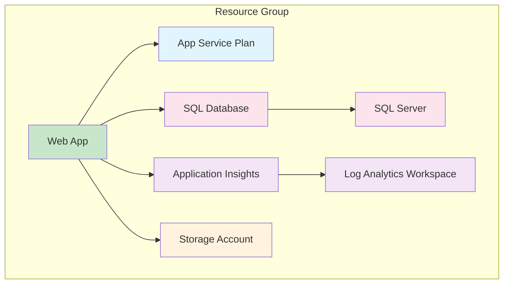

# Lab 2: Building Basic Terraform Configurations

## Lab Overview

This hands-on lab guides you through building real Azure infrastructure using Terraform. You'll create a complete web application stack including resource groups, storage accounts, app services, and databases, while learning Terraform best practices and state management.

## Lab Objectives

- Build a complete web application infrastructure stack
- Implement proper resource dependencies and naming conventions
- Practice Terraform workflow: `init`, `plan`, `apply`, `destroy`
- Understand Terraform state management
- Configure variables and outputs for reusability
- Implement security best practices in Terraform configurations

## Prerequisites

- Completed Lab 1: Environment Setup & Validation
- Terraform development environment configured
- Azure CLI authenticated
- VS Code with Terraform extensions

---

## Part 1: Web Application Infrastructure Planning

### Architecture Overview

We'll build infrastructure for a modern web application with the following components:



### Resource Requirements

| Component | Purpose | Configuration |
|-----------|---------|---------------|
| **Resource Group** | Container for all resources | Standard naming convention |
| **Storage Account** | Static files, backups | Standard LRS, secure config |
| **App Service Plan** | Compute platform | B1 for dev, P1v3 for prod |
| **Web App** | Application hosting | Linux, Node.js runtime |
| **SQL Server** | Database server | Azure AD auth, no public access |
| **SQL Database** | Application data | Basic tier for dev, S2 for prod |
| **Log Analytics** | Monitoring workspace | 30-day retention |
| **Application Insights** | APM and monitoring | Connected to Log Analytics |

---

## Part 2: Project Structure Setup

### Step 1: Create Enhanced Project Structure

```bash
# Navigate to your workshop directory
cd terraform-workshop

# Create enhanced directory structure
mkdir -p terraform/environments/{dev,staging,prod}

# Create shared information files
touch terraform/locals.tf
touch terraform/data.tf

# Create environment-specific variable files
touch terraform/environments/dev/terraform.tfvars
touch terraform/environments/staging/terraform.tfvars
touch terraform/environments/prod/terraform.tfvars

# Show structure
tree terraform/
```

### Step 2: Environment-Specific Variables

**Create dev environment variables**:

```terraform
# terraform/environments/dev/terraform.tfvars
project_name = "webapp"
environment  = "dev"
location     = "East US 2"

# App Service Configuration
app_service_sku = "S1"

# Database Configuration
database_sku = "Basic"
database_max_size_gb = 2
database_backup_retention_days = 7
database_geo_redundant_backup = false

# Storage Configuration
storage_replication_type = "LRS"
storage_blob_retention_days = 7

# Monitoring Configuration
log_retention_days = 30

# Tags
tags = {
  Project     = "WebAppDemo"
  Environment = "Development"
  Owner       = "DevTeam"
  ManagedBy   = "Terraform"
  CostCenter  = "Engineering"
}
```

**Create staging environment variables**:

```terraform
# terraform/environments/staging/terraform.tfvars
project_name = "webapp"
environment  = "staging"
location     = "East US 2"

# App Service Configuration
app_service_sku = "S1"

# Database Configuration
database_sku = "S0"
database_max_size_gb = 10
database_backup_retention_days = 14
database_geo_redundant_backup = false

# Storage Configuration
storage_replication_type = "GRS"
storage_blob_retention_days = 14

# Monitoring Configuration
log_retention_days = 60

# Tags
tags = {
  Project     = "WebAppDemo"
  Environment = "Staging"
  Owner       = "DevTeam"
  ManagedBy   = "Terraform"
  CostCenter  = "Engineering"
}
```

**Create production environment variables**:

```terraform
# terraform/environments/prod/terraform.tfvars
project_name = "webapp"
environment  = "prod"
location     = "East US 2"

# App Service Configuration
app_service_sku = "P1v3"

# Database Configuration
database_sku = "S2"
database_max_size_gb = 50
database_backup_retention_days = 35
database_geo_redundant_backup = true

# Storage Configuration
storage_replication_type = "GRS"
storage_blob_retention_days = 30

# Monitoring Configuration
log_retention_days = 90

# Tags
tags = {
  Project     = "WebAppDemo"
  Environment = "Production"
  Owner       = "DevTeam"
  ManagedBy   = "Terraform"
  CostCenter  = "Engineering"
  Criticality = "High"
}
```

---

## Part 3: Core Infrastructure Configuration

### Step 1: Update Variables Definition

```terraform
# terraform/variables.tf
variable "project_name" {
  description = "Name of the project (used in resource naming)"
  type        = string

  validation {
    condition     = can(regex("^[a-z0-9]+$", var.project_name))
    error_message = "Project name must contain only lowercase letters and numbers."
  }
}

variable "environment" {
  description = "Environment name (dev, staging, prod)"
  type        = string

  validation {
    condition     = contains(["dev", "staging", "prod"], var.environment)
    error_message = "Environment must be one of: dev, staging, prod."
  }
}

variable "location" {
  description = "Azure region for all resources"
  type        = string
  default     = "West US 2"
}

# App Service Variables
variable "app_service_sku" {
  description = "SKU for the App Service Plan"
  type        = string
  default     = "B1"

  validation {
    condition     = contains(["B1", "B2", "B3", "S1", "S2", "S3", "P1v3", "P2v3", "P3v3"], var.app_service_sku)
    error_message = "App Service SKU must be a valid Azure App Service Plan SKU."
  }
}

# Database Variables
variable "database_sku" {
  description = "SKU for the SQL Database"
  type        = string
  default     = "Basic"
}

variable "database_max_size_gb" {
  description = "Maximum size of the database in GB"
  type        = number
  default     = 2

  validation {
    condition     = var.database_max_size_gb >= 1 && var.database_max_size_gb <= 1024
    error_message = "Database size must be between 1 and 1024 GB."
  }
}

variable "database_backup_retention_days" {
  description = "Number of days to retain database backups"
  type        = number
  default     = 7

  validation {
    condition     = var.database_backup_retention_days >= 7 && var.database_backup_retention_days <= 35
    error_message = "Backup retention must be between 7 and 35 days."
  }
}

variable "database_geo_redundant_backup" {
  description = "Enable geo-redundant database backups"
  type        = bool
  default     = false
}

# Storage Variables
variable "storage_replication_type" {
  description = "Storage account replication type"
  type        = string
  default     = "LRS"

  validation {
    condition     = contains(["LRS", "GRS", "RAGRS", "ZRS", "GZRS", "RAGZRS"], var.storage_replication_type)
    error_message = "Storage replication type must be a valid Azure storage replication option."
  }
}

variable "storage_blob_retention_days" {
  description = "Number of days to retain deleted blobs"
  type        = number
  default     = 7
}

# Monitoring Variables
variable "log_retention_days" {
  description = "Number of days to retain logs"
  type        = number
  default     = 30
}

# Tags
variable "tags" {
  description = "Tags to apply to all resources"
  type        = map(string)
  default     = {}
}

# Generated Variables (optional overrides)
variable "admin_username" {
  description = "SQL Server administrator username"
  type        = string
  default     = "sqladmin"
  sensitive   = true
}
```

### Step 2: Shared information

```terraform
# terraform/locals.tf
locals {
  # Generate unique suffix for globally unique resources
  unique_suffix = random_string.unique.result

  # Naming conventions
  resource_prefix = "${var.project_name}-${var.environment}-${local.unique_suffix}"


  # Common tags merged with user-provided tags
  common_tags = merge(var.tags, {
    Environment   = var.environment
    Project      = var.project_name
    ManagedBy    = "Terraform"
    CreatedDate  = formatdate("YYYY-MM-DD", timestamp())
    LastModified = formatdate("YYYY-MM-DD hh:mm:ss ZZZ", timestamp())
  })

  # Environment-specific configurations
  environment_config = {
    is_production = var.environment == "prod"
    is_development = var.environment == "dev"

    # Features enabled by environment
    features = {
      always_on_webapp = var.environment != "dev"
      geo_redundant_backup = var.environment == "prod"
      advanced_monitoring = var.environment == "prod"
    }

    # Security settings
    security = {
      min_tls_version = "1.2"
      https_only = true
      storage_public_access = false
    }
  }
}

# Generate unique identifiers
resource "random_string" "unique" {
  length  = 6
  upper   = false
  special = false
}

resource "random_password" "sql_admin_password" {
  length  = 24
  special = true

  # Ensure password meets Azure SQL requirements
  min_upper   = 2
  min_lower   = 2
  min_numeric = 2
  min_special = 2
}
```

```terraform
# terraform/data.tf
# Current Azure client configuration
data "azurerm_client_config" "current" {}

# Current Azure subscription
data "azurerm_subscription" "current" {}
```

### Step 3: Main Infrastructure Configuration

```terraform
# terraform/main.tf
# Resource Group
resource "azurerm_resource_group" "main" {
  name     = "rg-${local.resource_prefix}"
  location = var.location

  tags = local.common_tags
}

# Storage Account
resource "azurerm_storage_account" "main" {
  name                = "st${replace(local.resource_prefix, "-", "")}"
  resource_group_name = azurerm_resource_group.main.name
  location           = azurerm_resource_group.main.location

  account_tier             = "Standard"
  account_replication_type = var.storage_replication_type
  account_kind            = "StorageV2"

  # Security settings
  public_network_access_enabled   = false
  allow_nested_items_to_be_public = false
  shared_access_key_enabled       = true
  https_traffic_only_enabled      = true
  min_tls_version                 = "TLS1_2"

  # Infrastructure encryption for production
  infrastructure_encryption_enabled = local.environment_config.is_production

  # Blob properties
  blob_properties {
    # Enable versioning
    versioning_enabled = true

    # Change feed for audit trail
    change_feed_enabled = local.environment_config.is_production

    # Retention policy
    delete_retention_policy {
      days = var.storage_blob_retention_days
    }

    # Container retention policy
    container_delete_retention_policy {
      days = var.storage_blob_retention_days
    }
  }

  # Network rules (restrictive by default)
  network_rules {
    default_action = "Deny"
    ip_rules       = [] # Add your IP addresses as needed

    # Allow access from the same virtual network (when implemented)
    virtual_network_subnet_ids = []
  }

  tags = merge(local.common_tags, {
    Component = "Storage"
    Service   = "DataStorage"
  })
}

# Log Analytics Workspace
resource "azurerm_log_analytics_workspace" "main" {
  name               = "log-${local.resource_prefix}"
  location           = azurerm_resource_group.main.location
  resource_group_name = azurerm_resource_group.main.name

  sku               = "PerGB2018"
  retention_in_days = var.log_retention_days

  # Data export and linked services
  daily_quota_gb = local.environment_config.is_development ? 1 : null

  tags = merge(local.common_tags, {
    Component = "Monitoring"
    Service   = "LogAnalytics"
  })
}

# Application Insights
resource "azurerm_application_insights" "main" {
  name                = "appi-${local.resource_prefix}"
  location            = azurerm_resource_group.main.location
  resource_group_name = azurerm_resource_group.main.name
  workspace_id        = azurerm_log_analytics_workspace.main.id

  application_type = "web"

  # Retention and sampling
  retention_in_days    = var.log_retention_days
  daily_data_cap_in_gb = local.environment_config.is_development ? 1 : null

  tags = merge(local.common_tags, {
    Component = "Monitoring"
    Service   = "ApplicationInsights"
  })
}

# App Service Plan
resource "azurerm_service_plan" "main" {
  name                = "asp-${local.resource_prefix}"
  resource_group_name = azurerm_resource_group.main.name
  location            = azurerm_resource_group.main.location

  os_type  = "Linux"
  sku_name = var.app_service_sku

  # Auto-scaling settings for production
  maximum_elastic_worker_count = local.environment_config.is_production ? 10 : null
  worker_count                 = local.environment_config.is_production ? 2 : 1

  tags = merge(local.common_tags, {
    Component = "Compute"
    Service   = "AppServicePlan"
  })
}

# Web App
resource "azurerm_linux_web_app" "main" {
  name                = "app-${local.resource_prefix}"
  resource_group_name = azurerm_resource_group.main.name
  location            = azurerm_service_plan.main.location
  service_plan_id     = azurerm_service_plan.main.id

  # Application configuration
  site_config {
    # Always on for non-development environments
    always_on = local.environment_config.features.always_on_webapp

    # Runtime configuration
    application_stack {
      node_version = "18-lts"
    }

    # Security settings
    http2_enabled                   = true
    minimum_tls_version             = local.environment_config.security.min_tls_version
    scm_minimum_tls_version         = local.environment_config.security.min_tls_version
    ftps_state                      = "FtpsOnly"

    # Health check
    health_check_path                = "/health"
    health_check_eviction_time_in_min = 2

    # CORS settings (configure as needed)
    cors {
      allowed_origins     = ["*"] # Restrict in production
      support_credentials = false
    }
  }

  # HTTPS configuration
  https_only = local.environment_config.security.https_only

  # Application settings
  app_settings = {
    # Runtime environment
    NODE_ENV = var.environment == "prod" ? "production" : "development"
    PORT     = "8080"

    # Application configuration
    ENVIRONMENT                     = var.environment
    WEBSITE_RUN_FROM_PACKAGE        = "1"
    WEBSITE_ENABLE_SYNC_UPDATE_SITE = "true"

    # Storage connection
    STORAGE_CONNECTION_STRING = azurerm_storage_account.main.primary_connection_string

    # Application Insights
    APPINSIGHTS_INSTRUMENTATIONKEY        = azurerm_application_insights.main.instrumentation_key
    APPLICATIONINSIGHTS_CONNECTION_STRING = azurerm_application_insights.main.connection_string

    # Database connection (will be added after SQL resources)
    DATABASE_SERVER = azurerm_mssql_server.main.fully_qualified_domain_name
    DATABASE_NAME   = azurerm_mssql_database.main.name
    DATABASE_USERNAME = var.admin_username
    # The application will fetch the password from Key Vault using its Managed Identity
    KEY_VAULT_URI   = azurerm_key_vault.main.vault_uri
  }

  # Managed identity for secure access
  identity {
    type = "SystemAssigned"
  }

  # Connection strings
  connection_string {
    name  = "DefaultConnection"
    type  = "SQLAzure"
    value = "Server=${azurerm_mssql_server.main.fully_qualified_domain_name};Database=${azurerm_mssql_database.main.name};User ID=${var.admin_username};Password=${random_password.sql_admin_password.result};Encrypt=True;TrustServerCertificate=False;"
  }

  tags = merge(local.common_tags, {
    Component = "Compute"
    Service   = "WebApp"
    Runtime   = "Node.js"
  })
}

# SQL Server
resource "azurerm_mssql_server" "main" {
  name                = "sql-${local.resource_prefix}"
  resource_group_name = azurerm_resource_group.main.name
  location            = azurerm_resource_group.main.location

  version                      = "12.0"
  administrator_login          = var.admin_username
  administrator_login_password = random_password.sql_admin_password.result

  # Security settings
  public_network_access_enabled = true
  minimum_tls_version           = "1.2"

  # Azure AD authentication (recommended)
  azuread_administrator {
    login_username              = data.azurerm_client_config.current.object_id
    object_id                   = data.azurerm_client_config.current.object_id
    tenant_id                   = data.azurerm_client_config.current.tenant_id
    azuread_authentication_only = false # Set to true after setting up Azure AD users
  }

  tags = merge(local.common_tags, {
    Component = "Database"
    Service   = "SQLServer"
  })
}

# SQL Database
resource "azurerm_mssql_database" "main" {
  name      = "sqldb-${local.resource_prefix}"
  server_id = azurerm_mssql_server.main.id

  # SKU configuration
  sku_name = var.database_sku

  # Storage configuration
  max_size_gb = var.database_max_size_gb

  # Backup configuration
  short_term_retention_policy {
    retention_days = var.database_backup_retention_days
  }

  # Maintenance and performance
  auto_pause_delay_in_minutes = local.environment_config.is_development ? 60 : null
  min_capacity               = local.environment_config.is_development ? 0.5 : null

  # Threat detection policy
  threat_detection_policy {
    state                  = "Enabled"
    email_account_admins   = "Enabled"
    email_addresses       = [ ] # Add admin email addresses
    retention_days        = 30
    storage_account_access_key = azurerm_storage_account.main.primary_access_key
    storage_endpoint      = azurerm_storage_account.main.primary_blob_endpoint
  }

  tags = merge(local.common_tags, {
    Component = "Database"
    Service   = "SQLDatabase"
  })
}

# Firewall rule for Azure services (adjust as needed)
resource "azurerm_mssql_firewall_rule" "azure_services" {
  name             = "AllowAzureServices"
  server_id        = azurerm_mssql_server.main.id
  start_ip_address = "0.0.0.0"
  end_ip_address   = "0.0.0.0"
}

# Key Vault for secrets management
resource "azurerm_key_vault" "main" {
  name                = "kv-${local.resource_prefix}"
  location            = azurerm_resource_group.main.location
  resource_group_name = azurerm_resource_group.main.name
  tenant_id           = data.azurerm_client_config.current.tenant_id

  sku_name = "standard"

  # Security settings
  enabled_for_disk_encryption     = true
  enabled_for_deployment          = true
  enabled_for_template_deployment = true
  rbac_authorization_enabled      = true
  public_network_access_enabled   = true # Set to false and configure private endpoints for production

  # Purge protection for production
  purge_protection_enabled = local.environment_config.is_production
  soft_delete_retention_days = local.environment_config.is_production ? 90 : 7

  # Network access rules
  network_acls {
    default_action = "Deny"
    bypass         = "AzureServices"
    ip_rules       = [] # Add your IP addresses
  }

  tags = merge(local.common_tags, {
    Component = "Security"
    Service   = "KeyVault"
  })
}

# Key Vault access policy for current user/service principal
resource "azurerm_key_vault_access_policy" "current_user" {
  key_vault_id = azurerm_key_vault.main.id
  tenant_id    = data.azurerm_client_config.current.tenant_id
  object_id    = data.azurerm_client_config.current.object_id

  secret_permissions = [
    "Get", "List", "Set", "Delete", "Recover", "Backup", "Restore", "Purge"
  ]

  key_permissions = [
    "Get", "List", "Create", "Delete", "Recover", "Backup", "Restore", "Purge"
  ]
}

# Key Vault access policy for Web App managed identity
resource "azurerm_key_vault_access_policy" "webapp" {
  key_vault_id = azurerm_key_vault.main.id
  tenant_id    = azurerm_linux_web_app.main.identity[0].tenant_id
  object_id    = azurerm_linux_web_app.main.identity[0].principal_id

  secret_permissions = [
    "Get", "List"
  ]
}

# Store SQL password in Key Vault
resource "azurerm_key_vault_secret" "sql_password" {
  name         = "sql-admin-password"
  value        = random_password.sql_admin_password.result
  key_vault_id = azurerm_key_vault.main.id

  depends_on = [
    azurerm_key_vault_access_policy.current_user
  ]

  tags = merge(local.common_tags, {
    Component = "Security"
    Service   = "Secret"
  })
}
```

!!! note "Add your IP addresses"

    Ensure to add your current IP address where indicated by the following comment: `# Add your IP addresses`

    Same for `# Add admin email addresses` in the SQL Database threat detection policy.
---

## Part 4: Enhanced Outputs Configuration

### Step 1: Comprehensive Outputs

```terraform
# terraform/outputs.tf
# Infrastructure Information
output "resource_group_name" {
  description = "Name of the created resource group"
  value       = azurerm_resource_group.main.name
}

output "resource_group_id" {
  description = "ID of the created resource group"
  value       = azurerm_resource_group.main.id
}

output "location" {
  description = "Azure region where resources are deployed"
  value       = azurerm_resource_group.main.location
}

# Storage Account Information
output "storage_account_name" {
  description = "Name of the storage account"
  value       = azurerm_storage_account.main.name
}

output "storage_account_primary_endpoint" {
  description = "Primary blob endpoint of the storage account"
  value       = azurerm_storage_account.main.primary_blob_endpoint
  sensitive   = true
}

output "storage_account_connection_string" {
  description = "Connection string for the storage account"
  value       = azurerm_storage_account.main.primary_connection_string
  sensitive   = true
}

# Web Application Information
output "web_app_name" {
  description = "Name of the web application"
  value       = azurerm_linux_web_app.main.name
}

output "web_app_url" {
  description = "URL of the web application"
  value       = "https://${azurerm_linux_web_app.main.default_hostname}"
}

output "web_app_identity_principal_id" {
  description = "Principal ID of the web app's managed identity"
  value       = azurerm_linux_web_app.main.identity[0].principal_id
}

# Database Information
output "sql_server_name" {
  description = "Name of the SQL server"
  value       = azurerm_mssql_server.main.name
}

output "sql_server_fqdn" {
  description = "Fully qualified domain name of the SQL server"
  value       = azurerm_mssql_server.main.fully_qualified_domain_name
}

output "sql_database_name" {
  description = "Name of the SQL database"
  value       = azurerm_mssql_database.main.name
}

output "sql_connection_string" {
  description = "SQL database connection string"
  value       = "Server=${azurerm_mssql_server.main.fully_qualified_domain_name};Database=${azurerm_mssql_database.main.name};User ID=${var.admin_username};Encrypt=True;TrustServerCertificate=False;"
  sensitive   = true
}

# Monitoring Information
output "application_insights_instrumentation_key" {
  description = "Application Insights instrumentation key"
  value       = azurerm_application_insights.main.instrumentation_key
  sensitive   = true
}

output "application_insights_connection_string" {
  description = "Application Insights connection string"
  value       = azurerm_application_insights.main.connection_string
  sensitive   = true
}

output "log_analytics_workspace_id" {
  description = "ID of the Log Analytics workspace"
  value       = azurerm_log_analytics_workspace.main.workspace_id
}

# Security Information
output "key_vault_name" {
  description = "Name of the Key Vault"
  value       = azurerm_key_vault.main.name
}

output "key_vault_uri" {
  description = "URI of the Key Vault"
  value       = azurerm_key_vault.main.vault_uri
}

# Configuration Summary
output "deployment_summary" {
  description = "Summary of the deployed infrastructure"
  value = {
    project_name = var.project_name
    environment  = var.environment
    location     = var.location

    resources = {
      resource_group    = azurerm_resource_group.main.name
      web_app          = azurerm_linux_web_app.main.name
      sql_server       = azurerm_mssql_server.main.name
      storage_account  = azurerm_storage_account.main.name
      key_vault        = azurerm_key_vault.main.name
    }

    endpoints = {
      web_app_url = "https://${azurerm_linux_web_app.main.default_hostname}"
      storage_url = azurerm_storage_account.main.primary_blob_endpoint
    }

    unique_suffix = local.unique_suffix
    tags         = local.common_tags
  }
  sensitive   = true
}
```

---

## Part 5: Development Workflow

### Step 1: Initialize and Validate Development Environment

```bash
# Navigate to terraform directory
cd terraform

# Initialize Terraform
terraform init

# Validate configuration
terraform validate

# Format code
terraform fmt -recursive

# Check formatting
terraform fmt -check=true -diff=true
```

### Step 2: Plan Development Environment

```bash
# Plan with development variables
terraform plan -var-file="environments/dev/terraform.tfvars" -out=dev.tfplan

# Review the plan carefully
# Should show approximately 12-15 resources to be created
```

**Expected Plan Summary**:

```
Plan: 15 to add, 0 to change, 0 to destroy.

Changes to Outputs:
  + deployment_summary               = {
      + environment = "dev"
      + location    = "East US"
      + project_name = "webapp"
      + resources   = {
          + key_vault        = (known after apply)
          + resource_group   = "rg-webapp-dev"
          + sql_server      = (known after apply)
          + storage_account = (known after apply)
          + web_app         = (known after apply)
        }
      + unique_suffix = (known after apply)
    }
  + web_app_url                     = (known after apply)
  # ... additional outputs
```

### Step 3: Deploy Development Environment

```bash
# Apply the development plan
terraform apply dev.tfplan

# This will take approximately 3-5 minutes to complete
```

**Monitor the deployment progress**:

- ✅ Random resources created first
- ✅ Resource group created
- ✅ Storage account and Key Vault created in parallel
- ✅ Log Analytics and Application Insights created
- ✅ App Service Plan created
- ✅ SQL Server and Database created
- ✅ Web App created last (depends on all other resources)

### Step 4: Verify Deployment

```bash
# View all outputs
terraform output

# View specific outputs
terraform output web_app_url
terraform output deployment_summary

# View sensitive outputs
terraform output -raw storage_account_connection_string
terraform output -raw sql_connection_string
```

**Verify in Azure**:

Either by using the Azure Portal or Azure CLI:

```bash
# List all resources in the resource group
az resource list --resource-group "$(terraform output -raw resource_group_name)" --output table

# Check web app status
az webapp show --name "$(terraform output -raw web_app_name)" --resource-group "$(terraform output -raw resource_group_name)" --query "state" --output tsv

# Check SQL server status
az sql server show --name "$(terraform output -raw sql_server_name)" --resource-group "$(terraform output -raw resource_group_name)" --query "state" --output tsv
```

---

## Part 6: Multi-Environment Testing


### Step 1: Compare Environments

```bash
# To compare environments, simply use the appropriate var-file for each plan.
# For example, to see the plan for the staging environment:
terraform plan -var-file="environments/staging/terraform.tfvars" -out=staging.tfplan

# And to see the plan for production:
terraform plan -var-file="environments/prod/terraform.tfvars" -out=prod.tfplan

# You can apply these plans just as you did for the dev environment.
# Note: Each environment will be deployed into a different, isolated resource group
# based on the naming convention "rg-${var.project_name}-${var.environment}".
```

!!! warning "Costs and quotas"
    Deploying (not planning) multiple environments will incur additional costs. Ensure you will delete resources after the lab if not needed.

    There also may be subscription limits on certain SKUs or resource types. If you encounter quota issues, consider using lower-tier SKUs or deleting unused resources.


---

## Part 7: State Management and Best Practices

### Step 1: Understanding Terraform State

```bash
# Examine state file structure
terraform show

# List resources in state
terraform state list

# Show specific resource
terraform state show azurerm_linux_web_app.main

# Show resource dependencies
terraform graph | dot -Tsvg > infrastructure-graph.svg
```

### Step 2: State Operations

```bash
# Refresh state (sync with actual Azure resources)
terraform refresh -var-file="environments/dev/terraform.tfvars"

# Import existing resource (example)
# az group create --name "external-rg" --location "East US"
# terraform import azurerm_resource_group.external /subscriptions/xxx/resourceGroups/external-rg

# Move resource in state
# terraform state mv azurerm_resource_group.main azurerm_resource_group.primary
```

### Step 3: Backup and Recovery

```bash
# Backup current state
cp terraform.tfstate terraform.tfstate.backup

# Show state backup versions
terraform state pull > state-backup.json

# Restore from backup (if needed)
# terraform state push state-backup.json
```

---

## Part 8: Testing and Validation

### Step 1: Security testing

```bash
# Check for security issues (if tfsec is installed)
# Install tfsec: curl -s https://raw.githubusercontent.com/aquasecurity/tfsec/master/scripts/install_linux.sh | bash
tfsec .
```

Analyze the output to consider the security posture of your Terraform code.

---

## Part 9: Troubleshooting Common Issues

### Issue 1: Resource Name Conflicts

**Problem**: "A resource with this name already exists"

**Solution**:

```bash
# Check existing resources
az resource list --name "*webapp*" --output table

# Update unique_suffix or change project_name
# Edit terraform/variables.tf or terraform.tfvars

# Force new unique suffix
terraform apply -replace="random_string.unique"
```

### Issue 2: Authentication Errors

**Problem**: "Error building AzureRM Client"

**Solution**:

```bash
# Re-authenticate
az logout
az login

# Verify subscription
az account show

# Check service principal (if used)
az ad sp show --id $ARM_CLIENT_ID
```

### Issue 3: State Lock Issues

**Problem**: "Error acquiring the state lock"

**Solution**:

```bash
# List lock info (look for lock ID in error message)
terraform force-unlock <LOCK_ID>

# If lock is stuck, verify no other Terraform processes
ps aux | grep terraform

# Clean restart
terraform init -reconfigure
```

### Issue 4: SQL Authentication Issues

**Problem**: Cannot connect to SQL database

**Solution**:

```bash
# Check SQL server firewall rules
az sql server firewall-rule list --server "$(terraform output -raw sql_server_name)" --resource-group "$(terraform output -raw resource_group_name)" --output table

# Add your IP to firewall (temporary)
MY_IP=$(curl -s ifconfig.me)
az sql server firewall-rule create --server "$(terraform output -raw sql_server_name)" --resource-group "$(terraform output -raw resource_group_name)" --name "TempAccess" --start-ip-address "$MY_IP" --end-ip-address "$MY_IP"

# Test connection
sqlcmd -S "$(terraform output -raw sql_server_fqdn)" -d "$(terraform output -raw sql_database_name)" -U "$admin_username" -P "$sql_password"
```

---

## Part 10: Cleanup and Resource Management

### Step 1: Planned Destruction

```bash
# Plan destruction
terraform plan -destroy -var-file="environments/dev/terraform.tfvars" -out=destroy.tfplan

# Review what will be destroyed
terraform show destroy.tfplan

# Apply destruction
terraform apply destroy.tfplan
```

### Step 2: Verify Cleanup

```bash
# Check if resource group still exists (should fail)
az group show --name "$(terraform output -raw resource_group_name)"

# List any remaining resources
az resource list --query "[?resourceGroup=='rg-webapp-dev']" --output table

# Clean up any orphaned resources manually if needed
```

### Step 3: Clean Terraform State

```bash
# Remove state files (if everything is destroyed)
rm -f terraform.tfstate*
rm -f *.tfplan

# Clean .terraform directory
rm -rf .terraform

# Reinitialize for next use
terraform init
```

---

## Lab Completion Checklist

### ✅ Core Infrastructure

- [ ] Resource Group created with proper naming
- [ ] Storage Account with security settings
- [ ] App Service Plan and Web App
- [ ] SQL Server and Database with authentication
- [ ] Key Vault with proper access policies
- [ ] Application Insights and Log Analytics

### ✅ Configuration Management

- [ ] Variables properly defined and validated
- [ ] Environment-specific configurations
- [ ] Outputs provide useful information
- [ ] Tags applied consistently
- [ ] Secrets managed securely

### ✅ Terraform Operations

- [ ] `terraform init` successful
- [ ] `terraform validate` passes
- [ ] `terraform plan` generates correct plan
- [ ] `terraform apply` deploys successfully
- [ ] `terraform destroy` cleans up properly

### ✅ Best Practices

- [ ] Code formatted consistently
- [ ] Resource dependencies properly defined
- [ ] Security settings implemented
- [ ] State management understood
- [ ] Testing and validation performed

### Success Criteria

You have successfully completed Lab 2 if you:

1. ✅ **Built a complete web application stack** with all required components
2. ✅ **Implemented proper Terraform practices** including variables, outputs, and state management
3. ✅ **Deployed to multiple environments** with different configurations
4. ✅ **Validated infrastructure** through testing and Azure CLI commands
5. ✅ **Managed the complete lifecycle** including deployment and destruction

---

## Next Steps

**Immediate Actions**:

- Save your configuration for use in the next lab
- Document any customizations you made
- Note performance observations and improvement ideas

**Next Lab**: [Lab 3: Azure Verified Modules (AVM)](03-azure-verified-modules.md)

!!! abstract "Lab 3 Preview"

    In the next lab, you'll learn how to replace your custom resource configurations with Azure Verified Modules (AVM), dramatically reducing code complexity while improving security and maintainability.
