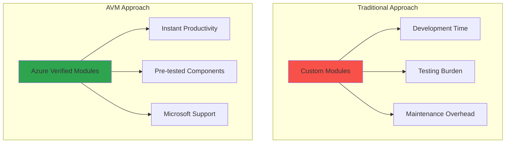

# Lab 3: Azure Verified Modules (AVM)

## Overview

Azure Verified Modules (AVM) represent Microsoft's official library of Infrastructure as Code modules for Azure, providing production-ready, tested, and maintained infrastructure patterns. This module teaches you how to leverage AVM to accelerate your infrastructure deployments while following Microsoft's best practices.

## Learning Objectives

- Understand the purpose and benefits of Azure Verified Modules
- Navigate the AVM registry and find appropriate modules
- Implement AVM modules in Terraform configurations
- Configure advanced module parameters for production scenarios
- Understand module versioning and lifecycle management
- Compare AVM modules with custom module development

---

## What are Azure Verified Modules?

### 1. Definition and Purpose

**Azure Verified Modules (AVM)** are bicep and Terraform modules that are:

- ✅ **Officially supported** by Microsoft
- ✅ **Production-ready** with comprehensive testing
- ✅ **Best practice compliant** with Azure Well-Architected Framework
- ✅ **Continuously maintained** with regular updates
- ✅ **Security-focused** with built-in security configurations
- ✅ **Standardized** across all Azure services



### 2. AVM vs Traditional Modules

| Aspect | Custom Modules | Azure Verified Modules |
|--------|---------------|------------------------|
| **Development Time** | Weeks/Months | Minutes/Hours |
| **Testing Coverage** | Manual testing required | Comprehensive automated testing |
| **Security Compliance** | Manual implementation | Built-in security best practices |
| **Maintenance** | Team responsibility | Microsoft maintained |
| **Documentation** | Team creates | Professional documentation |
| **Support** | Community/Team | Microsoft official support |
| **Updates** | Manual tracking | Automated updates available |
| **Consistency** | Varies by team | Standardized across organization |

### 3. AVM Module Types

**Resource Modules** (res-):

- Deploy single Azure resource types
- Example: `Azure/avm-res-storage-storageaccount`
- Focus: Individual resource configuration

**Pattern Modules** (ptn-):

- Deploy multiple related resources
- Example: `Azure/avm-ptn-webapp-privateendpoint`
- Focus: Complete solution patterns

**Utility Modules** (utl-):

- Helper modules for common tasks
- Example: `Azure/avm-utl-types`
- Focus: Shared utilities and data types

---

## Navigating the AVM Registry

### 1. Finding AVM Modules

**Terraform Registry Search**:

1. Go to [registry.terraform.io](https://registry.terraform.io)
1. Select: *Browse modules*
1. Search for: `Azure/avm`
1. Click on: *See all*
1. Filter by: *Provider = azurerm*

**Module Naming Convention**:

```
Azure/avm-{type}-{category}-{resource}

Examples:
- Azure/avm-res-storage-storageaccount
- Azure/avm-res-web-site
- Azure/avm-ptn-webapp-privateendpoint
- Azure/avm-res-keyvault-vault
```

**Popular AVM Modules**:

| Module | Purpose | Use Case |
|--------|---------|----------|
| `avm-res-storage-storageaccount` | Storage Account | Data storage, static websites |
| `avm-res-web-site` | App Service | Web applications, APIs |
| `avm-res-sql-server` | SQL Server | Database servers |
| `avm-res-keyvault-vault` | Key Vault | Secret management |
| `avm-res-network-virtualnetwork` | Virtual Network | Network infrastructure |
| `avm-ptn-webapp-privateendpoint` | Web App + Private Endpoint | Secure web applications |

### 2. Module Documentation Structure

Each AVM module includes:

**README.md**:

- Overview and purpose
- Usage examples
- Input/output specifications
- Requirements and dependencies

**Examples**:

- Complete working examples
- Different configuration scenarios
- Integration patterns

**CHANGELOG.md**:

- Version history
- Breaking changes
- New features and fixes

---

## Implementing AVM Modules

### 1. Basic Storage Account Example

**Traditional Custom Resource**:

```terraform
resource "azurerm_storage_account" "main" {
  name                     = var.storage_account_name
  resource_group_name      = var.resource_group_name
  location                 = var.location
  account_tier            = var.account_tier
  account_replication_type = var.replication_type

  # Missing: Advanced security, compliance, monitoring
  # Missing: Proper tagging, lifecycle management
  # Missing: Network security, encryption settings
}
```

**AVM Module Implementation**:

```terraform
module "storage_account" {
  source  = "Azure/avm-res-storage-storageaccount/azurerm"
  version = "~> 0.1.0"

  # Required parameters
  name                = var.storage_account_name
  resource_group_name = var.resource_group_name
  location           = var.location

  # Advanced configurations included automatically
  account_tier             = var.account_tier
  account_replication_type = var.replication_type

  # Security features (enabled by default in AVM)
  public_network_access_enabled   = false
  allow_nested_items_to_be_public = false

  # Network access rules
  network_rules = {
    default_action = "Deny"
    ip_rules      = var.allowed_ips

    virtual_network_subnet_ids = [
      data.azurerm_subnet.private.id
    ]
  }

  # Encryption configuration
  infrastructure_encryption_enabled = true

  # Blob properties with versioning
  blob_properties = {
    versioning_enabled  = true
    change_feed_enabled = true

    delete_retention_policy = {
      days = var.environment == "prod" ? 30 : 7
    }

    container_delete_retention_policy = {
      days = var.environment == "prod" ? 30 : 7
    }
  }

  # Private endpoints for secure access
  private_endpoints = {
    blob = {
      private_dns_zone_group_name             = "default"
      private_dns_zone_resource_group_name    = var.dns_resource_group_name
      subnet_resource_id                      = data.azurerm_subnet.private.id
      private_service_connection_name         = "psc-blob"
      is_manual_connection                    = false
      subresource_name                        = "blob"
      private_connection_resource_id          = null
      private_dns_zone_resource_ids = [
        data.azurerm_private_dns_zone.blob.id
      ]
    }
  }

  # Comprehensive tagging
  tags = merge(var.common_tags, {
    Component = "Storage"
    Service   = "DataStorage"
  })
}
```

### 2. Other examples

??? tip "Web Application with AVM"

    ```terraform
    # App Service Plan
    module "app_service_plan" {
      source  = "Azure/avm-res-web-serverfarm/azurerm"
      version = "~> 0.1.0"

      name                = "asp-${var.project_name}-${var.environment}"
      resource_group_name = var.resource_group_name
      location            = var.location

      sku_name = "P1v2"
      os_type  = "Linux"

      # Auto-scaling for production
      maximum_elastic_worker_count = 10

      tags = var.common_tags
    }

    # Web Application
    module "web_app" {
      source  = "Azure/avm-res-web-site/azurerm"
      version = "~> 0.1.0"

      kind                = "webapp"
      name                = "app-${var.project_name}-${var.environment}"
      resource_group_name = var.resource_group_name
      location            = var.location
      service_plan_id     = module.app_service_plan.resource_id
      os_type             = "Linux"

      application_insights = {
        workspace_resource_id = azurerm_log_analytics_workspace.example_production.id
      }

      auth_settings_v2 = {
        default = {
          auth_enabled     = true
          default_provider = "okta"
          custom_oidc_v2 = {
            default = {
              name                          = "example_oidc_provider"
              client_id                     = "your-client-id"
              openid_configuration_endpoint = "<https://test-config-endpoint.com/.well-known/openid-configuration>"
            }
          }
        }
      }

      enable_telemetry = var.enable_telemetry
      site_config = {

      }

      tags = {
        module  = "Azure/avm-res-web-site/azurerm"
        version = "0.17.2"
      }
    }
    ```

??? tip "Database with AVM"

    ```terraform
    locals {
      databases = {
        my_sample_db = {
          name         = "my_sample_db"
          create_mode  = "Default"
          collation    = "SQL_Latin1_General_CP1_CI_AS"
          license_type = "LicenseIncluded"
          max_size_gb  = 50
          sku_name     = "S0"

          short_term_retention_policy = {
            retention_days           = 1
            backup_interval_in_hours = 24
          }

          long_term_retention_policy = {
            weekly_retention  = "P2W1D"
            monthly_retention = "P2M"
            yearly_retention  = "P1Y"
            week_of_year      = 1
          }

          tags = local.tags
        }
      }
      tags = {
        environment = "sample"
        cost_centre = "demo"
      }
    }

    module "sql_server" {
      source  = "Azure/avm-res-sql-server/azurerm"
      version = "~> 0.1.0"

      name                         = "sql-${var.project_name}-${var.environment}"
      location                     = var.location
      resource_group_name          = var.resource_group_name

      server_version               = "12.0"
      administrator_login          = "mysqladmin"
      administrator_login_password = random_password.admin_password.result

      private_endpoints = {
        primary = {
          private_dns_zone_resource_ids = [
            azurerm_private_dns_zone.this.id
          ]
          subnet_resource_id            = azurerm_subnet.this.id
          subresource_name              = "sqlServer"
        }
      }
      public_network_access_enabled = false

      databases                    = local.databases
      enable_telemetry             = var.enable_telemetry
    }
    ```

??? tip "Keyvault and Secrets with AVM"

    ```terraform
    provider "azurerm" {
      features {}
    }

    terraform {
      required_version = ">= 1.9, < 2.0"

      required_providers {
        azurerm = {
          source  = "hashicorp/azurerm"
          version = ">= 3.117"
        }
        http = {
          source  = "hashicorp/http"
          version = "~> 3.4"
        }
        random = {
          source  = "hashicorp/random"
          version = "~> 3.5"
        }
      }
    }

    module "regions" {
      source  = "Azure/avm-utl-regions/azurerm"
      version = "0.3.0"
    }

    # This allows us to randomize the region for the resource group

    resource "random_integer" "region_index" {
      max = length(module.regions.regions) - 1
      min = 0
    }

    # This ensures we have unique CAF compliant names for our resources

    module "naming" {
      source  = "Azure/naming/azurerm"
      version = "0.3.0"
    }

    resource "azurerm_resource_group" "this" {
      location = module.regions.regions[random_integer.region_index.result].name
      name     = module.naming.resource_group.name_unique
    }

    # Get current IP address for use in KV firewall rules

    data "http" "ip" {
      url = "<https://api.ipify.org/>"
      retry {
        attempts     = 5
        max_delay_ms = 1000
        min_delay_ms = 500
      }
    }

    data "azurerm_client_config" "current" {}

    module "key_vault" {
      source = "../../"

      location = azurerm_resource_group.this.location

    # source             = "Azure/avm-res-keyvault-vault/azurerm"

      name                = module.naming.key_vault.name_unique
      resource_group_name = azurerm_resource_group.this.name
      tenant_id           = data.azurerm_client_config.current.tenant_id
      enable_telemetry    = var.enable_telemetry
      network_acls = {
        bypass   = "AzureServices"
        ip_rules = ["${data.http.ip.response_body}/32"]
      }
      public_network_access_enabled = true
      role_assignments = {
        deployment_user_kv_admin = {
          role_definition_id_or_name = "Key Vault Administrator"
          principal_id               = data.azurerm_client_config.current.object_id
        }
      }
      secrets = {
        test_secret = {
          name = "test-secret"
        }
      }
      secrets_value = {
        test_secret = "secret-value"
      }
      wait_for_rbac_before_secret_operations = {
        create = "60s"
      }
    }
    ```

---

## Advanced AVM Configuration

### 1. Pattern Module Example - Azure Landing Zone + Management (Azure Automation Account)

```terraform
provider "alz" {
  library_references = [{
    path = "platform/alz"
    ref  = "2024.10.1"
  }]
}

provider "azurerm" {
  features {}
}


data "azapi_client_config" "current" {}

locals {
  automation_account_name      = "aa-${var.random_suffix}"
  location                     = "swedencentral"
  log_analytics_workspace_name = "law-${var.random_suffix}"
  resource_group_name          = "rg-alz-management-${var.random_suffix}"
  uami_name                    = "uami-ama"
}

module "management" {
  source  = "Azure/avm-ptn-alz-management/azurerm"
  version = "0.6.0"

  automation_account_name      = local.automation_account_name
  location                     = local.location
  log_analytics_workspace_name = local.log_analytics_workspace_name
  resource_group_name          = local.resource_group_name
}

module "alz" {
  source = "Azure/avm-ptn-alz/azurerm"

  architecture_name  = "alz"
  location           = local.location
  parent_resource_id = data.azapi_client_config.current.tenant_id
  dependencies = {
    policy_assignments = [
      module.management.data_collection_rule_ids,
      module.management.resource_id,
      module.management.user_assigned_identity_ids,
    ]
  }
  policy_assignments_to_modify = {
    connectivity = {
      policy_assignments = {
        # As we don't have a DDOS protection plan, we need to disable this policy
        # to prevent a modify action from failing.
        Enable-DDoS-VNET = {
          enforcement_mode = "DoNotEnforce"
        }
      }
    }
  }
  policy_default_values = {
    ama_change_tracking_data_collection_rule_id = jsonencode({ value = provider::azapi::resource_group_resource_id(data.azapi_client_config.current.subscription_id, local.resource_group_name, "Microsoft.Insights/dataCollectionRules", ["dcr-change-tracking"]) })
    ama_mdfc_sql_data_collection_rule_id        = jsonencode({ value = provider::azapi::resource_group_resource_id(data.azapi_client_config.current.subscription_id, local.resource_group_name, "Microsoft.Insights/dataCollectionRules", ["dcr-defender-sql"]) })
    ama_vm_insights_data_collection_rule_id     = jsonencode({ value = provider::azapi::resource_group_resource_id(data.azapi_client_config.current.subscription_id, local.resource_group_name, "Microsoft.Insights/dataCollectionRules", ["dcr-vm-insights"]) })
    ama_user_assigned_managed_identity_id       = jsonencode({ value = provider::azapi::resource_group_resource_id(data.azapi_client_config.current.subscription_id, local.resource_group_name, "Microsoft.ManagedIdentity/userAssignedIdentities", [local.uami_name]) })
    ama_user_assigned_managed_identity_name     = jsonencode({ value = local.uami_name })
    log_analytics_workspace_id                  = jsonencode({ value = provider::azapi::resource_group_resource_id(data.azapi_client_config.current.subscription_id, local.resource_group_name, "Microsoft.OperationalInsights/workspaces", [local.log_analytics_workspace_name]) })
  }
}
```

---

## Module Versioning and Updates

### 1. Version Constraints

**Semantic Versioning**:

```terraform
# Exact version (not recommended for production)
module "storage_account" {
  source  = "Azure/avm-res-storage-storageaccount/azurerm"
  version = "0.1.5"
}

# Compatible version (recommended)
module "storage_account" {
  source  = "Azure/avm-res-storage-storageaccount/azurerm"
  version = "~> 0.1.0"  # >= 0.1.0, < 0.2.0
}

# Minimum version
module "storage_account" {
  source  = "Azure/avm-res-storage-storageaccount/azurerm"
  version = ">= 0.1.0"
}
```

### 2. Update Strategy

**Development Environment**:

```bash
# Update providers and modules
terraform init -upgrade

# Review what will change
terraform plan

# Test updates in development first
terraform apply -var-file="environments/dev/terraform.tfvars"
```

**Production Environment**:

Update gradually:

1. Update in dev environment: `-var-file="environments/dev/terraform.tfvars"`
2. Test thoroughly
3. Update staging environment: `-var-file="environments/staging/terraform.tfvars"`
4. Production update during maintenance window

Pin to specific versions for stability: `version = "0.1.5"`

### 3. Breaking Changes

**Example Breaking Change**:

```terraform
# Version 0.1.x
module "storage_account" {
  source  = "Azure/avm-res-storage-storageaccount/azurerm"
  version = "~> 0.1.0"

  # Old parameter name
  account_replication_type = "LRS"
}

# Version 0.2.x (breaking change)
module "storage_account" {
  source  = "Azure/avm-res-storage-storageaccount/azurerm"
  version = "~> 0.2.0"

  # New parameter structure
  redundancy = {
    type = "LRS"
  }
}
```

---

## AVM vs Custom Modules Comparison

### When to Use AVM

**✅ Use AVM When**:

- Standard Azure resource deployment needed
- Security and compliance requirements are standard
- Team prefers Microsoft-supported solutions
- Rapid deployment is priority
- Limited Terraform expertise on team
- Consistent patterns across organization desired

**Example Scenarios**:

```terraform
# Perfect for AVM - Standard web application
module "web_app" {
  source  = "Azure/avm-res-web-site/azurerm"
  version = "~> 0.1.0"

  name                = var.app_name
  resource_group_name = var.resource_group_name
  location           = var.location
  service_plan_id    = module.app_service_plan.resource_id
}
```

### When to Create Custom Modules

**✅ Use Custom Modules When**:

- Highly specific organizational requirements
- AVM module doesn't exist for your use case
- Need custom business logic or integrations
- Existing custom modules work well
- Team has strong Terraform expertise

**Example Scenarios**:

```terraform
# Better as custom module - Complex multi-tenant application
module "multi_tenant_app" {
  source = "./modules/multi-tenant-app"

  tenants = {
    tenant1 = {
      database_size = "S1"
      features     = ["feature_a", "feature_b"]
      custom_domain = "tenant1.company.com"
    }
    tenant2 = {
      database_size = "S2"
      features     = ["feature_a", "feature_c"]
      custom_domain = "tenant2.company.com"
    }
  }
}
```

### Hybrid Approach

**Best Practice**: Combine AVM and custom modules:

```terraform
# Use AVM for standard infrastructure
module "storage_account" {
  source  = "Azure/avm-res-storage-storageaccount/azurerm"
  version = "~> 0.1.0"

  name                = var.storage_account_name
  resource_group_name = var.resource_group_name
  location           = var.location
}

module "key_vault" {
  source  = "Azure/avm-res-keyvault-vault/azurerm"
  version = "~> 0.1.0"

  name                = var.key_vault_name
  resource_group_name = var.resource_group_name
  location           = var.location
}

# Use custom module for specialized business logic
module "application_deployment" {
  source = "./modules/application-deployment"

  application_config = var.application_config
  storage_account_id = module.storage_account.resource_id
  key_vault_id      = module.key_vault.resource_id

  # Custom business logic
  tenant_configurations = var.tenant_configurations
  feature_flags        = var.feature_flags
  custom_integrations  = var.custom_integrations
}
```

---

## Practical Exercise: Migrate to AVM

### Objective

Take a resource of the previous lab and configure it with AVM instead of `azurerm_<resource>` method.

### Before: Custom Configuration

```terraform
resource "azurerm_storage_account" "main" {
  name                = "st${replace(local.resource_prefix, "-", "")}"
  resource_group_name = azurerm_resource_group.main.name
  location            = azurerm_resource_group.main.location

  account_tier             = "Standard"
  account_replication_type = var.storage_replication_type
  account_kind             = "StorageV2"

  # Security settings
  public_network_access_enabled   = false
  allow_nested_items_to_be_public = false
  shared_access_key_enabled       = true
  https_traffic_only_enabled      = true
  min_tls_version                 = "TLS1_2"

  # Infrastructure encryption for production
  infrastructure_encryption_enabled = local.environment_config.is_production

  # Blob properties
  blob_properties {
    # Enable versioning
    versioning_enabled = true

    # Change feed for audit trail
    change_feed_enabled = local.environment_config.is_production

    # Retention policy
    delete_retention_policy {
      days = var.storage_blob_retention_days
    }

    # Container retention policy
    container_delete_retention_policy {
      days = var.storage_blob_retention_days
    }
  }

  # Network rules (restrictive by default)
  network_rules {
    default_action = "Deny"
    ip_rules       = ["82.65.43.153"] # Add your IP addresses as needed

    # Allow access from the same virtual network (when implemented)
    virtual_network_subnet_ids = []
  }

  tags = merge(local.common_tags, {
    Component = "Storage"
    Service   = "DataStorage"
  })
}
```

??? tip "After: AVM Implementation"

    ```terraform
    module "storage_account_main" {
      source  = "Azure/avm-res-storage-storageaccount/azurerm"
      version = "0.6.4"

      location                 = azurerm_resource_group.main.location
      name                     = "st${replace(local.resource_prefix, "-", "")}"
      resource_group_name      = azurerm_resource_group.main.name
      account_kind             = "StorageV2"
      account_replication_type = var.storage_replication_type
      account_tier             = "Standard"

      # Security settings
      public_network_access_enabled     = false
      # allow_nested_items_to_be_public = false
      shared_access_key_enabled         = true
      https_traffic_only_enabled        = true
      min_tls_version                   = "TLS1_2"

      # Infrastructure encryption for production
      infrastructure_encryption_enabled = local.environment_config.is_production

      # Blob properties
      blob_properties = {
        # Enable versioning
        versioning_enabled = true
        # Change feed for audit trail
        change_feed_enabled = local.environment_config.is_production

        # Retention policy
        delete_retention_policy = {
          days = var.storage_blob_retention_days
        }

        # Container retention policy
        container_delete_retention_policy = {
          days = var.storage_blob_retention_days
        }
      }

      # Network rules (restrictive by default)
      network_rules = {
        bypass                     = ["AzureServices"]
        default_action             = "Deny"
        ip_rules                   = ["82.65.43.153"]
        virtual_network_subnet_ids = []
      }

      tags = merge(local.common_tags, {
        Component = "Storage"
        Service   = "DataStorage"
      })
    }
    ```

### Test and move existing resource

It's time to test your newer implementation. Plan and apply your changes **on the dev environment** to ensure everything works as expected.

You may encounter some warnings or errors like:

* Dependencies to old resource: Update dependencies to rely on the newer module.
* While moving to AVM, some outputs of the previous resource are not available anymore in the module outputs.
    * Consider the `module.xxxxx.resource` as the new entrypoint to look for your output
* Terraform is willing to replace your old resource with a new one that you may want to keep.
    * Consider using `terraform state mv`
    * Ex for a storage account: `terraform state mv azurerm_storage_account.main module.storage_account_main.azurerm_storage_account.this`


### Migration Benefits Analysis

| Aspect | Custom Module | AVM Module |
|--------|---------------|------------|
| **Security Features** | Basic | Comprehensive |
| **Configuration Options** | Limited | Extensive |
| **Maintenance Effort** | High | None |
| **Testing Coverage** | Manual | Automated |
| **Documentation** | Variable | Professional |

---

## Best Practices with AVM

### 1. Module Selection

```terraform
# ✅ GOOD: Use appropriate module type
module "storage_account" {
  source  = "Azure/avm-res-storage-storageaccount/azurerm"  # Resource module
  version = "~> 0.1.0"
}

module "webapp_with_networking" {
  source  = "Azure/avm-ptn-webapp-privateendpoint/azurerm"  # Pattern module
  version = "~> 0.1.0"
}
```

### 2. Configuration Management

```terraform
# ✅ GOOD: Environment-specific configurations
module "web_app" {
  source  = "Azure/avm-res-web-site/azurerm"
  version = "~> 0.1.0"

  name                = "app-${var.project_name}-${var.environment}"
  resource_group_name = var.resource_group_name
  location           = var.location
  service_plan_id    = module.app_service_plan.resource_id

  # Environment-specific configuration
  site_config = {
    always_on = var.environment == "prod"

    application_stack = {
      node_version = "18-lts"
    }

    # Production-only features
    health_check_path = var.environment == "prod" ? "/health" : null
  }

  # Environment-specific scaling
  tags = merge(var.common_tags, {
    Environment = var.environment
    Criticality = var.environment == "prod" ? "High" : "Medium"
  })
}
```

### 3. Output Management

```terraform
# ✅ GOOD: Expose relevant outputs
output "web_app_url" {
  description = "URL of the web application"
  value       = "https://${module.web_app.default_hostname}"
}

output "storage_account_name" {
  description = "Name of the storage account"
  value       = module.storage_account.name
}

output "key_vault_uri" {
  description = "URI of the Key Vault"
  value       = module.key_vault.vault_uri
}
```

---

## Next Steps

After mastering Azure Verified Modules:

1. **Explore Module Catalog**: Browse all available AVM modules
2. **Contribute Back**: Consider contributing to AVM project
3. **Automation**: Integrate AVM modules into CI/CD pipelines
4. **Monitoring**: Set up update notifications for modules
5. **Documentation**: Document your AVM usage patterns

---

*This completes the Azure Verified Modules module. You now understand how to leverage Microsoft's official infrastructure modules to accelerate your deployments while following best practices.*

---

## Workshop Conclusion

🎉 **Congratulations!** You've completed the Practical IaC—Terraform & Azure Modules Workshop!

**Thank you for participating! Questions?** 🤔
