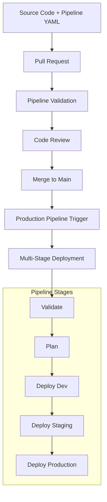
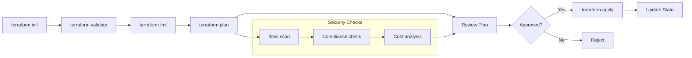

# Pipeline Automation with Azure DevOps

## Overview

This module covers the implementation of automated Infrastructure as Code deployment pipelines using Azure DevOps. You'll learn to create YAML pipelines that automatically deploy Terraform configurations, implement multi-environment workflows, and establish proper security and governance practices for production deployments.

## Learning Objectives

- Build Azure DevOps YAML pipelines for Terraform deployment
- Implement multi-stage deployments with approval gates
- Configure secure authentication using service connections
- Establish state management and locking for team collaboration
- Implement automated testing and validation in pipelines
- Troubleshoot common pipeline issues and deployment failures

---

## Azure DevOps Pipeline Concepts

### 1. Pipeline as Code with YAML

**Benefits of YAML Pipelines**:

- ✅ **Version Controlled**: Pipeline definition stored with code
- ✅ **Reproducible**: Consistent execution across environments
- ✅ **Reviewable**: Changes can be reviewed via pull requests
- ✅ **Branching Support**: Different pipelines per branch
- ✅ **Template Support**: Reusable pipeline components



### 2. Terraform Pipeline Workflow



---

## Setting Up Azure DevOps Project

### 1. Project Creation and Configuration

**Create Azure DevOps Project**:

```bash
# Using Azure CLI (if available)
az devops project create --name "TerraformIaC" --description "Infrastructure as Code with Terraform"

# Or create via web interface
# https://dev.azure.com -> New Project -> TerraformIaC
```

**Repository Setup**:

```bash
# Clone the repository
git clone https://dev.azure.com/your-org/TerraformIaC/_git/TerraformIaC
cd TerraformIaC

# Set up directory structure
mkdir -p terraform/environments/{dev,staging,prod}
mkdir -p terraform/modules
mkdir -p pipelines/templates
mkdir -p tests

# Create initial files
touch terraform/main.tf
touch terraform/variables.tf
touch terraform/outputs.tf
touch pipelines/terraform-pipeline.yml
touch .gitignore
```

### 2. Service Connections

**Azure Resource Manager Service Connection**:


Service Principal creation (Azure CLI)

Run this to create service principal for pipeline authentication:

```bash
# Create service principal
az ad sp create-for-rbac --name "sp-terraform-pipeline" --role "Contributor" --scopes "/subscriptions/<subscription-id>" --sdk-auth

# Output will be JSON - save these values securely:
# {
#   "clientId": "xxx",
#   "clientSecret": "xxx",
#   "subscriptionId": "xxx",
#   "tenantId": "xxx"
# }
```

**Azure DevOps Service Connection Configuration**:

1. Go to Project Settings > Service Connections
1. Create New Service Connection > Azure Resource Manager
1. Choose *App Registration or Managed Identity (manual)*
1. Select *Secret* as credential type
1. Environment: *AzureCloud*
1. Scope level: *Subscription*
1. Enter the service principal details (ensure that you selected *Service Principal Key* as Credential)
1. Name: `azure-terraform-service-connection`
1. Grant access permission to all pipelines

### 3. Terraform task extension

Install the "Terraform" extension from the Azure DevOps marketplace:

```bash
az devops extension install \
  --publisher JasonBJohnson \
  --extension-id azure-pipelines-tasks-terraform \
  --organization "https://dev.azure.com/<your-org-name>"
```

---

## Basic Terraform Pipeline

### 1. Simple Single-Stage Pipeline

Create the following YAML file in `pipelines/basic-terraform-pipeline.yml`:

```yaml
# pipelines/basic-terraform-pipeline.yml
trigger:
  branches:
    include:
    - main
    - develop
  paths:
    include:
    - terraform/*
    - pipelines/*

variables:
  terraformVersion: 'latest'
  azureServiceConnection: 'azure-terraform-service-connection'
  terraformWorkingDirectory: '$(System.DefaultWorkingDirectory)/terraform'

pool:
  vmImage: 'ubuntu-latest'

stages:
- stage: TerraformValidation
  displayName: 'Terraform Validation'
  jobs:
  - job: Validate
    displayName: 'Validate Terraform Configuration'
    steps:

    # Install Terraform
    - task: TerraformInstaller@1
      displayName: 'Install Terraform $(terraformVersion)'
      inputs:
        terraformVersion: $(terraformVersion)

    # Terraform Init
    - task: TerraformCLI@1
      displayName: 'Terraform Init'
      inputs:
        command: 'init'
        workingDirectory: $(terraformWorkingDirectory)
        backendType: azurerm
        backendServiceArm: $(azureServiceConnection)
        backendAzureRmResourceGroupName: 'rg-terraform-state'
        backendAzureRmStorageAccountName: 'sttfstate-$(Build.BuildId)'
        backendAzureRmContainerName: 'tfstate'
        backendAzureRmKey: 'terraform.tfstate'

    # Terraform Validate
    - task: TerraformCLI@1
      displayName: 'Terraform Validate'
      inputs:
        command: 'validate'
        workingDirectory: $(terraformWorkingDirectory)

    # Terraform Format Check
    - task: TerraformCLI@1
      displayName: 'Terraform Format Check'
      inputs:
        command: 'fmt'
        commandOptions: '-check=true -diff=true -recursive'
        workingDirectory: $(terraformWorkingDirectory)

    # Terraform Plan
    - task: TerraformCLI@1
      displayName: 'Terraform Plan'
      inputs:
        command: 'plan'
        workingDirectory: $(terraformWorkingDirectory)
        environmentServiceName: $(azureServiceConnection)
        commandOptions: '-out=tfplan -var="environment=dev"'
        publishPlanResults: 'dev-tf-plan'

    # Publish Plan Artifact
    - task: PublishBuildArtifacts@1
      displayName: 'Publish Terraform Plan'
      inputs:
        PathtoPublish: '$(terraformWorkingDirectory)/tfplan'
        ArtifactName: 'terraform-plan'
        publishLocation: 'Container'
```

Once created, commit and push the changes to your repository.

#### Create and Run the Pipeline

1. Go to Pipelines > New Pipeline
1. Select Azure Repos Git
1. Select your repository
1. Choose "Existing Azure Pipelines YAML file"
1. Select the path to `pipelines/basic-terraform-pipeline.yml`
1. Click "Continue" then "Run" to trigger the pipeline
1. Monitor the pipeline execution and ensure all steps complete successfully

!!! tip "My pipeline failed"

    If your pipeline fails, check the logs for errors. Common issues include:

    - Incorrect service connection permissions or naming
    - Missing backend storage account or container
    - Syntax errors in the YAML file


### 2. Multi-Environment Pipeline with Approval Gates

```yaml
# pipelines/multi-environment-terraform-pipeline.yml
trigger:
  branches:
    include:
    - main
  paths:
    include:
    - terraform/*

variables:
  terraformVersion: '1.5.7'
  azureServiceConnection: 'azure-terraform-service-connection'

pool:
  vmImage: 'ubuntu-latest'

stages:
# Stage 1: Validation and Planning
- stage: Validate
  displayName: 'Validate & Plan'
  jobs:
  - job: ValidateAndPlan
    displayName: 'Validate and Plan Terraform'
    steps:
    - template: templates/terraform-validate.yml
      parameters:
        terraformVersion: $(terraformVersion)
        azureServiceConnection: $(azureServiceConnection)
        environment: 'dev'

# Stage 2: Deploy to Development
- stage: DeployDev
  displayName: 'Deploy to Development'
  dependsOn: Validate
  condition: succeeded()
  variables:
    environment: 'dev'
  jobs:
  - deployment: DeployTerraform
    displayName: 'Deploy Terraform to Dev'
    environment: 'development'
    strategy:
      runOnce:
        deploy:
          steps:
          - template: templates/terraform-deploy.yml
            parameters:
              terraformVersion: $(terraformVersion)
              azureServiceConnection: $(azureServiceConnection)
              environment: $(environment)
              stateKey: 'dev.terraform.tfstate'

# Stage 3: Deploy to Staging (with approval)
- stage: DeployStaging
  displayName: 'Deploy to Staging'
  dependsOn: DeployDev
  condition: succeeded()
  variables:
    environment: 'staging'
  jobs:
  - deployment: DeployTerraform
    displayName: 'Deploy Terraform to Staging'
    environment: 'staging'  # This requires manual approval
    strategy:
      runOnce:
        deploy:
          steps:
          - template: templates/terraform-deploy.yml
            parameters:
              terraformVersion: $(terraformVersion)
              azureServiceConnection: $(azureServiceConnection)
              environment: $(environment)
              stateKey: 'staging.terraform.tfstate'

# Stage 4: Deploy to Production (with approval and additional checks)
- stage: DeployProd
  displayName: 'Deploy to Production'
  dependsOn: DeployStaging
  condition: and(succeeded(), eq(variables['Build.SourceBranch'], 'refs/heads/main'))
  variables:
    environment: 'prod'
  jobs:
  - deployment: DeployTerraform
    displayName: 'Deploy Terraform to Production'
    environment: 'production'  # This requires manual approval
    strategy:
      runOnce:
        deploy:
          steps:
          # Additional production checks
          - script: |
              echo "Performing production readiness checks..."
              # Add custom validation scripts here
            displayName: 'Production Readiness Checks'

          - template: templates/terraform-deploy.yml
            parameters:
              terraformVersion: $(terraformVersion)
              azureServiceConnection: $(azureServiceConnection)
              environment: $(environment)
              stateKey: 'prod.terraform.tfstate'
              additionalValidation: true
```

---

## Pipeline Templates

### 1. Terraform Validation Template

```yaml
# pipelines/templates/terraform-validate.yml
parameters:
- name: terraformVersion
  type: string
  default: '1.5.7'
- name: azureServiceConnection
  type: string
- name: environment
  type: string
  default: 'dev'
- name: terraformWorkingDirectory
  type: string
  default: '$(System.DefaultWorkingDirectory)/terraform'

steps:
# Install Terraform
- task: TerraformInstaller@0
  displayName: 'Install Terraform ${{ parameters.terraformVersion }}'
  inputs:
    terraformVersion: ${{ parameters.terraformVersion }}

# Azure CLI login for additional operations
- task: AzureCLI@2
  displayName: 'Azure CLI Login'
  inputs:
    azureSubscription: ${{ parameters.azureServiceConnection }}
    scriptType: 'bash'
    scriptLocation: 'inlineScript'
    inlineScript: |
      echo "Logged in to Azure"
      az account show

# Terraform Init
- task: TerraformTaskV2@2
  displayName: 'Terraform Init'
  inputs:
    provider: 'azurerm'
    command: 'init'
    workingDirectory: ${{ parameters.terraformWorkingDirectory }}
    backendServiceArm: ${{ parameters.azureServiceConnection }}
    backendAzureRmResourceGroupName: 'rg-terraform-state'
    backendAzureRmStorageAccountName: 'sttfstateunique-$(Build.BuildId)'
    backendAzureRmContainerName: 'tfstate'
    backendAzureRmKey: '${{ parameters.environment }}.terraform.tfstate'

# Security Scanning with tfsec
- script: |
    # Install tfsec
    curl -s https://raw.githubusercontent.com/aquasecurity/tfsec/master/scripts/install_linux.sh | bash

    # Run security scan
    tfsec ${{ parameters.terraformWorkingDirectory }} --format junit --out tfsec-results.xml

    # Display results
    tfsec ${{ parameters.terraformWorkingDirectory }}
  displayName: 'Security Scan with tfsec'
  workingDirectory: ${{ parameters.terraformWorkingDirectory }}
  continueOnError: true

# Publish security scan results
- task: PublishTestResults@2
  displayName: 'Publish Security Scan Results'
  condition: always()
  inputs:
    testResultsFormat: 'JUnit'
    testResultsFiles: '**/tfsec-results.xml'
    failTaskOnFailedTests: false

# Terraform Validate
- task: TerraformTaskV2@2
  displayName: 'Terraform Validate'
  inputs:
    provider: 'azurerm'
    command: 'validate'
    workingDirectory: ${{ parameters.terraformWorkingDirectory }}

# Terraform Format Check
- script: |
    terraform fmt -check=true -diff=true -recursive
  displayName: 'Terraform Format Check'
  workingDirectory: ${{ parameters.terraformWorkingDirectory }}

# Terraform Plan
- task: TerraformTaskV2@2
  displayName: 'Terraform Plan'
  inputs:
    provider: 'azurerm'
    command: 'plan'
    workingDirectory: ${{ parameters.terraformWorkingDirectory }}
    environmentServiceNameAzureRM: ${{ parameters.azureServiceConnection }}
    commandOptions: '-out=tfplan-${{ parameters.environment }} -var="environment=${{ parameters.environment }}" -var-file="environments/${{ parameters.environment }}.tfvars"'

# Save Plan as Artifact
- task: ArchiveFiles@2
  displayName: 'Archive Terraform Plan'
  inputs:
    rootFolderOrFile: '${{ parameters.terraformWorkingDirectory }}/tfplan-${{ parameters.environment }}'
    includeRootFolder: false
    archiveType: 'zip'
    archiveFile: '$(Build.ArtifactStagingDirectory)/tfplan-${{ parameters.environment }}.zip'

- task: PublishBuildArtifacts@1
  displayName: 'Publish Terraform Plan'
  inputs:
    PathtoPublish: '$(Build.ArtifactStagingDirectory)'
    ArtifactName: 'terraform-plans'
    publishLocation: 'Container'

# Generate plan summary
- script: |
    terraform show -no-color tfplan-${{ parameters.environment }} > plan-summary-${{ parameters.environment }}.txt
    echo "## Terraform Plan Summary for ${{ parameters.environment }}" >> $(Build.ArtifactStagingDirectory)/plan-summary.md
    echo "\`\`\`" >> $(Build.ArtifactStagingDirectory)/plan-summary.md
    cat plan-summary-${{ parameters.environment }}.txt >> $(Build.ArtifactStagingDirectory)/plan-summary.md
    echo "\`\`\`" >> $(Build.ArtifactStagingDirectory)/plan-summary.md
  displayName: 'Generate Plan Summary'
  workingDirectory: ${{ parameters.terraformWorkingDirectory }}
```

### 2. Terraform Deployment Template

```yaml
# pipelines/templates/terraform-deploy.yml
parameters:
- name: terraformVersion
  type: string
  default: '1.5.7'
- name: azureServiceConnection
  type: string
- name: environment
  type: string
- name: stateKey
  type: string
- name: additionalValidation
  type: boolean
  default: false
- name: terraformWorkingDirectory
  type: string
  default: '$(System.DefaultWorkingDirectory)/terraform'
- name: additionalVariables
  type: string
  default: ''

steps:
# Download artifacts
- task: DownloadBuildArtifacts@0
  displayName: 'Download Terraform Plan'
  inputs:
    buildType: 'current'
    downloadType: 'single'
    artifactName: 'terraform-plans'
    downloadPath: '$(System.ArtifactsDirectory)'

# Install Terraform
- task: TerraformInstaller@0
  displayName: 'Install Terraform ${{ parameters.terraformVersion }}'
  inputs:
    terraformVersion: ${{ parameters.terraformVersion }}

# Terraform Init
- task: TerraformTaskV2@2
  displayName: 'Terraform Init'
  inputs:
    provider: 'azurerm'
    command: 'init'
    workingDirectory: ${{ parameters.terraformWorkingDirectory }}
    backendServiceArm: ${{ parameters.azureServiceConnection }}
    backendAzureRmResourceGroupName: 'rg-terraform-state'
    backendAzureRmStorageAccountName: 'sttfstateunique-$(Build.BuildId)'
    backendAzureRmContainerName: 'tfstate'
    backendAzureRmKey: ${{ parameters.stateKey }}

# Extract and verify plan
- script: |
    cd $(System.ArtifactsDirectory)/terraform-plans
    unzip tfplan-${{ parameters.environment }}.zip
    cp tfplan-${{ parameters.environment }} ${{ parameters.terraformWorkingDirectory }}/
  displayName: 'Extract Terraform Plan'

# Additional validation for production
- ${{ if eq(parameters.additionalValidation, true) }}:
  - script: |
      echo "Performing additional production validation..."

      # Check for high-impact changes
      terraform show -no-color tfplan-${{ parameters.environment }} > plan-output.txt

      # Check for resource destruction
      if grep -q "destroy" plan-output.txt; then
        echo "##vso[task.logissue type=warning]Production plan contains resource destruction"
        echo "##vso[task.complete result=SucceededWithIssues]"
      fi

      # Check for data-related changes
      if grep -q -E "(azurerm_sql_database|azurerm_cosmosdb)" plan-output.txt; then
        echo "##vso[task.logissue type=warning]Production plan contains database changes"
        echo "Please verify data migration procedures are in place"
      fi

    displayName: 'Production Validation Checks'
    workingDirectory: ${{ parameters.terraformWorkingDirectory }}

# Pre-deployment notification
- script: |
    echo "Starting deployment to ${{ parameters.environment }} environment"
    echo "Timestamp: $(date)"
    echo "Build ID: $(Build.BuildId)"
    echo "Commit: $(Build.SourceVersion)"
  displayName: 'Deployment Start Notification'

# Terraform Apply
- task: TerraformTaskV2@2
  displayName: 'Terraform Apply'
  inputs:
    provider: 'azurerm'
    command: 'apply'
    workingDirectory: ${{ parameters.terraformWorkingDirectory }}
    environmentServiceNameAzureRM: ${{ parameters.azureServiceConnection }}
    commandOptions: 'tfplan-${{ parameters.environment }} ${{ parameters.additionalVariables }}'

# Post-deployment validation
- script: |
    echo "Performing post-deployment validation..."

    # Check if key resources are healthy
    terraform output -json > outputs.json

    # Basic connectivity tests
    if [ "${{ parameters.environment }}" != "prod" ]; then
      echo "Running smoke tests for ${{ parameters.environment }}"
      # Add environment-specific smoke tests here
    fi

  displayName: 'Post-Deployment Validation'
  workingDirectory: ${{ parameters.terraformWorkingDirectory }}

# Capture outputs
- script: |
    echo "Capturing Terraform outputs..."
    terraform output > deployment-outputs-${{ parameters.environment }}.txt
    terraform output -json > deployment-outputs-${{ parameters.environment }}.json
  displayName: 'Capture Deployment Outputs'
  workingDirectory: ${{ parameters.terraformWorkingDirectory }}

# Publish deployment artifacts
- task: PublishBuildArtifacts@1
  displayName: 'Publish Deployment Outputs'
  inputs:
    PathtoPublish: '${{ parameters.terraformWorkingDirectory }}/deployment-outputs-${{ parameters.environment }}.txt'
    ArtifactName: 'deployment-outputs-${{ parameters.environment }}'
    publishLocation: 'Container'
```

---

## Advanced Pipeline Features

### 1. Pipeline with Security and Compliance Checks

```yaml
# pipelines/secure-terraform-pipeline.yml
trigger:
  branches:
    include:
    - main
    - develop
  paths:
    include:
    - terraform/*

variables:
  terraformVersion: '1.5.7'
  azureServiceConnection: 'azure-terraform-service-connection'

stages:
# Security and Compliance Stage
- stage: SecurityCompliance
  displayName: 'Security & Compliance Checks'
  jobs:
  - job: SecurityScan
    displayName: 'Security Scanning'
    pool:
      vmImage: 'ubuntu-latest'
    steps:

    # Install Terraform
    - task: TerraformInstaller@0
      inputs:
        terraformVersion: $(terraformVersion)

    # Initialize for scanning
    - script: |
        terraform init -backend=false
      workingDirectory: '$(System.DefaultWorkingDirectory)/terraform'
      displayName: 'Initialize for Scanning'

    # Run tfsec security scan
    - script: |
        # Install tfsec
        curl -s https://raw.githubusercontent.com/aquasecurity/tfsec/master/scripts/install_linux.sh | bash

        # Run comprehensive security scan
        tfsec . --format json --out tfsec-results.json
        tfsec . --format junit --out tfsec-results.xml
        tfsec . # Display results in console

      workingDirectory: '$(System.DefaultWorkingDirectory)/terraform'
      displayName: 'Run tfsec Security Scan'
      continueOnError: true

    # Run Checkov compliance scan
    - script: |
        # Install Checkov
        pip install checkov

        # Run compliance scan
        checkov -d . --framework terraform --output json --output-file checkov-results.json
        checkov -d . --framework terraform --output junitxml --output-file checkov-results.xml
        checkov -d . --framework terraform

      workingDirectory: '$(System.DefaultWorkingDirectory)/terraform'
      displayName: 'Run Checkov Compliance Scan'
      continueOnError: true

    # Publish security scan results
    - task: PublishTestResults@2
      displayName: 'Publish Security Test Results'
      condition: always()
      inputs:
        testResultsFormat: 'JUnit'
        testResultsFiles: |
          **/tfsec-results.xml
          **/checkov-results.xml
        failTaskOnFailedTests: false
        testRunTitle: 'Security and Compliance Tests'

    # Cost estimation with Infracost
    - script: |
        # Install Infracost
        curl -fsSL https://raw.githubusercontent.com/infracost/infracost/master/scripts/install.sh | sh

        # Generate cost estimate
        infracost breakdown --path . --format json --out-file infracost-base.json
        infracost output --path infracost-base.json --format table

      env:
        INFRACOST_API_KEY: $(INFRACOST_API_KEY)
      workingDirectory: '$(System.DefaultWorkingDirectory)/terraform'
      displayName: 'Generate Cost Estimate'
      continueOnError: true

# Continue with validation and deployment stages...
- stage: Validate
  dependsOn: SecurityCompliance
  # ... rest of validation stage
```

### 2. Multi-Region Deployment Pipeline

```yaml
# pipelines/multi-region-terraform-pipeline.yml
trigger:
  branches:
    include:
    - main

variables:
  terraformVersion: '1.5.7'
  azureServiceConnection: 'azure-terraform-service-connection'

stages:
# Deploy to Primary Region
- stage: DeployPrimary
  displayName: 'Deploy to Primary Region (East US)'
  variables:
    region: 'eastus'
    environment: 'prod'
  jobs:
  - deployment: DeployTerraformPrimary
    displayName: 'Deploy to Primary Region'
    environment: 'production-primary'
    strategy:
      runOnce:
        deploy:
          steps:
          - template: templates/terraform-deploy.yml
            parameters:
              terraformVersion: $(terraformVersion)
              azureServiceConnection: $(azureServiceConnection)
              environment: '$(environment)-$(region)'
              stateKey: '$(environment)-$(region).terraform.tfstate'
              terraformWorkingDirectory: '$(System.DefaultWorkingDirectory)/terraform'
              additionalVariables: '-var="azure_region=$(region)" -var="is_primary_region=true"'

# Deploy to Secondary Region (with delay)
- stage: DeploySecondary
  displayName: 'Deploy to Secondary Region (West US)'
  dependsOn: DeployPrimary
  condition: succeeded()
  variables:
    region: 'westus'
    environment: 'prod'
  jobs:
  - deployment: DeployTerraformSecondary
    displayName: 'Deploy to Secondary Region'
    environment: 'production-secondary'
    strategy:
      runOnce:
        deploy:
          steps:
          # Add delay for primary region stabilization
          - script: |
              echo "Waiting 5 minutes for primary region stabilization..."
              sleep 300
            displayName: 'Stabilization Delay'

          - template: templates/terraform-deploy.yml
            parameters:
              terraformVersion: $(terraformVersion)
              azureServiceConnection: $(azureServiceConnection)
              environment: '$(environment)-$(region)'
              stateKey: '$(environment)-$(region).terraform.tfstate'
              terraformWorkingDirectory: '$(System.DefaultWorkingDirectory)/terraform'
              additionalVariables: '-var="azure_region=$(region)" -var="is_primary_region=false"'

# Cross-region validation
- stage: CrossRegionValidation
  displayName: 'Cross-Region Validation'
  dependsOn:
  - DeployPrimary
  - DeploySecondary
  condition: succeeded()
  jobs:
  - job: ValidateReplication
    displayName: 'Validate Cross-Region Setup'
    pool:
      vmImage: 'ubuntu-latest'
    steps:
    - script: |
        echo "Validating cross-region setup..."
        # Add custom validation scripts for:
        # - Database replication status
        # - Storage replication
        # - Network connectivity
        # - DNS resolution
        # - Load balancer health
      displayName: 'Cross-Region Health Check'
```

---

## State Management in Pipelines

### 1. Remote State Configuration

```yaml
# pipelines/templates/terraform-backend.yml
parameters:
- name: environment
  type: string
- name: azureServiceConnection
  type: string

steps:
- task: TerraformTaskV2@2
  displayName: 'Configure Remote State Backend'
  inputs:
    provider: 'azurerm'
    command: 'init'
    workingDirectory: '$(System.DefaultWorkingDirectory)/terraform'
    backendServiceArm: ${{ parameters.azureServiceConnection }}
    backendAzureRmResourceGroupName: 'rg-terraform-state-$(Build.SourceBranchName)'
    backendAzureRmStorageAccountName: 'sttfstate${{ parameters.environment }}'
    backendAzureRmContainerName: 'tfstate'
    backendAzureRmKey: '${{ parameters.environment }}-$(Build.SourceBranchName).terraform.tfstate'
```

### 2. State Locking and Concurrency

```yaml
# Handle concurrent deployments
- script: |
    echo "Checking for concurrent deployments..."

    # Check if state is locked
    LOCK_INFO=$(terraform force-unlock -help 2>&1 | grep -c "lock ID" || true)

    if [ $LOCK_INFO -gt 0 ]; then
      echo "State is currently locked. Waiting..."
      sleep 30

      # Retry terraform init
      terraform init -reconfigure \
        -backend-config="resource_group_name=rg-terraform-state" \
        -backend-config="storage_account_name=sttfstateunique" \
        -backend-config="container_name=tfstate" \
        -backend-config="key=${{ parameters.environment }}.terraform.tfstate"
    fi

  displayName: 'Handle State Locking'
  workingDirectory: '$(System.DefaultWorkingDirectory)/terraform'
  continueOnError: true
```

---

## Pipeline Monitoring and Notifications

### 1. Deployment Notifications

```yaml
# Add to pipeline for notifications
- task: EmailReport@1
  displayName: 'Send Deployment Report'
  condition: always()
  inputs:
    sendMailConditionConfig: 'Always'
    subject: 'Terraform Deployment $(Agent.JobStatus) - $(Build.DefinitionName)'
    to: 'devops-team@company.com'
    body: |
      Terraform deployment completed with status: $(Agent.JobStatus)

      Environment: ${{ parameters.environment }}
      Build ID: $(Build.BuildId)
      Commit: $(Build.SourceVersion)
      Triggered by: $(Build.RequestedFor)

      View build details: $(System.TeamFoundationCollectionUri)$(System.TeamProject)/_build/results?buildId=$(Build.BuildId)

# Slack notification (requires Slack extension)
- task: SlackNotification@1
  displayName: 'Notify Slack Channel'
  condition: always()
  inputs:
    SlackApiToken: $(SLACK_API_TOKEN)
    Channel: '#devops-notifications'
    Message: |
      🚀 Terraform deployment $(Agent.JobStatus) for ${{ parameters.environment }}
      Build: $(Build.BuildId)
      Branch: $(Build.SourceBranchName)
      Commit: $(Build.SourceVersion)
```

### 2. Pipeline Monitoring Dashboard

```yaml
# Custom pipeline metrics
- script: |
    echo "Recording pipeline metrics..."

    # Record deployment duration
    START_TIME=$(date -d "$(System.JobStartTime)" +%s)
    END_TIME=$(date +%s)
    DURATION=$((END_TIME - START_TIME))

    echo "##vso[task.setvariable variable=deploymentDuration]$DURATION"

    # Log metrics to Application Insights or other monitoring
    curl -X POST "https://dc.services.visualstudio.net/v2/track" \
      -H "Content-Type: application/json" \
      -d "{
        \"name\": \"Microsoft.ApplicationInsights.Event\",
        \"time\": \"$(date -u +%Y-%m-%dT%H:%M:%S.%3NZ)\",
        \"iKey\": \"$(APPLICATION_INSIGHTS_KEY)\",
        \"data\": {
          \"baseType\": \"EventData\",
          \"baseData\": {
            \"name\": \"TerraformDeployment\",
            \"properties\": {
              \"environment\": \"${{ parameters.environment }}\",
              \"duration\": \"$DURATION\",
              \"status\": \"$(Agent.JobStatus)\",
              \"buildId\": \"$(Build.BuildId)\"
            }
          }
        }
      }"
  displayName: 'Record Pipeline Metrics'
  condition: always()
```

---

## Troubleshooting Pipeline Issues

### 1. Common Pipeline Failures

**Authentication Issues**:

```yaml
# Debug authentication problems
- task: AzureCLI@2
  displayName: 'Debug Azure Authentication'
  inputs:
    azureSubscription: $(azureServiceConnection)
    scriptType: 'bash'
    scriptLocation: 'inlineScript'
    inlineScript: |
      echo "Current subscription:"
      az account show

      echo "Available subscriptions:"
      az account list --output table

      echo "Current user/service principal:"
      az ad signed-in-user show 2>/dev/null || echo "Using service principal"

      echo "Resource groups:"
      az group list --output table
```

**State File Issues**:

```yaml
# Debug state file problems
- script: |
    echo "Checking state file access..."

    # List storage account contents
    az storage blob list \
      --account-name "sttfstateunique" \
      --container-name "tfstate" \
      --output table

    # Check state file permissions
    az storage blob show \
      --account-name "sttfstateunique" \
      --container-name "tfstate" \
      --name "${{ parameters.environment }}.terraform.tfstate"

  displayName: 'Debug State File Issues'
  continueOnError: true
```

**Terraform Plan Failures**:

```yaml
# Debug terraform plan issues
- script: |
    echo "Debugging Terraform plan issues..."

    # Enable detailed logging
    export TF_LOG=DEBUG
    export TF_LOG_PATH=./terraform-debug.log

    # Run plan with verbose output
    terraform plan -detailed-exitcode -no-color \
      -var="environment=${{ parameters.environment }}" \
      -var-file="environments/${{ parameters.environment }}.tfvars"

    # Check for common issues
    echo "Checking for common issues..."
    grep -i "error\|failed\|denied" terraform-debug.log || echo "No errors found in log"

  workingDirectory: '$(System.DefaultWorkingDirectory)/terraform'
  displayName: 'Debug Terraform Plan'
  condition: failed()
```

### 2. Pipeline Recovery Procedures

**State Recovery**:

```yaml
- script: |
    echo "Attempting state recovery..."

    # List state backups
    az storage blob list \
      --account-name "sttfstateunique" \
      --container-name "tfstate" \
      --prefix "${{ parameters.environment }}.terraform.tfstate" \
      --output table

    # Restore from backup if needed
    if [ "${{ parameters.restoreFromBackup }}" == "true" ]; then
      echo "Restoring from backup..."
      az storage blob copy start \
        --destination-blob "${{ parameters.environment }}.terraform.tfstate" \
        --destination-container "tfstate" \
        --source-blob "${{ parameters.environment }}.terraform.tfstate.backup" \
        --source-container "tfstate" \
        --account-name "sttfstateunique"
    fi

  displayName: 'State Recovery Procedure'
  condition: eq(variables['recoverState'], 'true')
```

---

## Best Practices Summary

### 1. Security Best Practices

- ✅ Use Azure Key Vault for sensitive values
- ✅ Implement least privilege access for service principals
- ✅ Enable audit logging for all pipeline activities
- ✅ Use separate state files per environment
- ✅ Implement security scanning in pipelines

### 2. Operational Best Practices

- ✅ Use environment-specific variable files
- ✅ Implement manual approval gates for production
- ✅ Set up comprehensive monitoring and alerting
- ✅ Maintain pipeline templates for consistency
- ✅ Document pipeline procedures and troubleshooting

### 3. State Management Best Practices

- ✅ Always use remote state for team collaboration
- ✅ Enable state locking to prevent conflicts
- ✅ Implement state backup and recovery procedures
- ✅ Use separate state files for different environments
- ✅ Regular state file cleanup and maintenance

---

## Next Steps

After mastering pipeline automation:

1. **Advanced Patterns**: Explore GitOps and pull-request workflows
2. **Multi-Cloud**: Extend pipelines to other cloud providers
3. **Monitoring**: Implement comprehensive infrastructure monitoring
4. **Compliance**: Add governance and compliance automation
5. **Testing**: Implement infrastructure testing strategies

**Ready for the next session**: [Troubleshooting & Q&A](05-troubleshooting-tips.md)

---

*This completes the pipeline automation module. You now have the knowledge to implement production-ready CI/CD pipelines for Infrastructure as Code deployments.*
