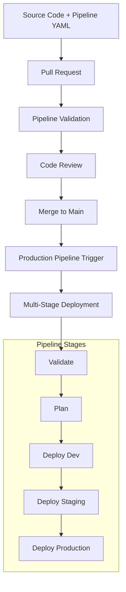
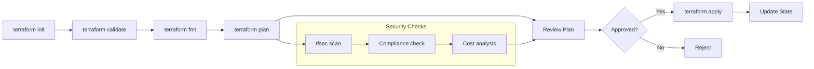

# GitHub Actions environment Setup

## Overview

This module covers the preparation of a GitHub Actions environment for implementing automated Infrastructure as Code deployment pipelines. You'll learn to create a GitHub repository, set up workflows, configure secrets, and install necessary extensions for Terraform integration.

## Learning Objectives

- Build GitHub Actions workflows for Terraform deployment
- Configure secure authentication using GitHub Secrets
- Establish state management and locking for team collaboration

---

## GitHub Actions Concepts

### 1. Workflow as Code with YAML

**Benefits of YAML Workflows**:

- ✅ **Version Controlled**: Workflow definition stored with code
- ✅ **Reproducible**: Consistent execution across environments
- ✅ **Reviewable**: Changes can be reviewed via pull requests
- ✅ **Branching Support**: Different pipelines per branch
- ✅ **Template Support**: Reusable pipeline components



### 2. Terraform Pipeline Workflow

The following diagram illustrates a typical Terraform pipeline workflow, including validation, planning, approval, and application stages, along with integrated security checks.

We will implement multiple adaptations of this workflow in this workshop.



---

## Setting Up GitHub Actions Environment

### 1. Project Creation and Configuration

**Create GitHub Repository**:

1. Go to [GitHub](https://github.com) and log in.
1. Click on **New Repository**.
1. Name the repository `terraform-iac-pipelines`.
1. Set it to **Private**.
1. Keep default options and click **Create Repository**.
1. Keep the page open for the next steps.

**Repository content setup**:

??? tip "Git via SSH or HTTPS ?"

    Choose your preferred method (SSH or HTTPS) for cloning the repository.

    * SSH will require you to set up SSH keys in your GitHub account.
    * HTTPS will require you to enter your GitHub credentials when pulling or pushing.


```bash
# Copy the data from previous workshop (option 1) or initialize a new repo with data from the workshop repository

# Option 1: Copy from previous workshop
cd <path-to-previous-workshop-code-you-generated>
git remote add origin https://github.com/<your_username>/terraform-iac-pipelines.git

# Option 2: Clone from the workshop repository
git clone https://github.com/lrivallain/ms-alz-workshop.git
cp -r ms-alz-workshop/Workshop-3-Azure-DevOps-Pipeline-Implementation/code/sample/* <path-to-your-new-repo>
cd <path-to-your-new-repo>
git init
git remote add origin https://github.com/<your_username>/terraform-iac-pipelines.git

# Check tree structure
tree .
```

Output should look like this:

```
.
├── terraform
│   ├── data.tf
│   ├── environments
│   │   ├── dev
│   │   │   └── terraform.tfvars
│   │   ├── prod
│   │   │   └── terraform.tfvars
│   │   └── staging
│   │       └── terraform.tfvars
│   ├── locals.tf
│   ├── main.tf
│   ├── modules
│   ├── outputs.tf
│   ├── variables.tf
│   └── versions.tf
```

### GitHub Actions Authentication Setup

#### Option 1: OIDC with Workload Identity Federation (Recommended)

##### Step 1: Create Azure AD Application

```bash
# Choose a unique trigram (could be your initials)
export TRIGRAM="XXX"

# Create the Azure AD application
az ad app create --display-name "gh-actions-terraform-oidc-$TRIGRAM"

# Get the application ID (save this as AZURE_CLIENT_ID)
APP_ID=$(az ad app list --display-name "gh-actions-terraform-oidc-$TRIGRAM" --query "[0].appId" -o tsv)
echo "Application ID: $APP_ID"

# Create service principal
az ad sp create --id $APP_ID

# Get the service principal object ID
SP_OBJECT_ID=$(az ad sp show --id $APP_ID --query "id" -o tsv)
echo "Service Principal Object ID: $SP_OBJECT_ID"
```

#### Step 2: Configure Workload Identity Federation

```bash
# Set your GitHub repository details
GITHUB_ORG="your-github-username"  # Replace with your GitHub username/org
GITHUB_REPO="terraform-iac-pipelines"  # Replace with your repo name
SUBSCRIPTION_ID="your-subscription-id"  # Replace with your subscription ID

# Create federated identity credential for main branch
az ad app federated-credential create \
  --id $APP_ID \
  --parameters '{
    "name": "github-actions-main",
    "issuer": "https://token.actions.githubusercontent.com",
    "subject": "repo:'$GITHUB_ORG'/'$GITHUB_REPO':ref:refs/heads/main",
    "audiences": ["api://AzureADTokenExchange"]
  }'

# Create federated identity credential for pull requests
az ad app federated-credential create \
  --id $APP_ID \
  --parameters '{
    "name": "github-actions-pr",
    "issuer": "https://token.actions.githubusercontent.com",
    "subject": "repo:'$GITHUB_ORG'/'$GITHUB_REPO':pull_request",
    "audiences": ["api://AzureADTokenExchange"]
  }'

# Create federated credential for development environment
az ad app federated-credential create \
  --id $APP_ID \
  --parameters '{
    "name": "github-actions-development",
    "issuer": "https://token.actions.githubusercontent.com",
    "subject": "repo:'$GITHUB_ORG'/'$GITHUB_REPO':environment:development",
    "audiences": ["api://AzureADTokenExchange"]
  }'

# Create federated credential for staging environment (optional)
az ad app federated-credential create \
  --id $APP_ID \
  --parameters '{
    "name": "github-actions-staging",
    "issuer": "https://token.actions.githubusercontent.com",
    "subject": "repo:'$GITHUB_ORG'/'$GITHUB_REPO':environment:staging",
    "audiences": ["api://AzureADTokenExchange"]
  }'

# Create federated credential for production environment
az ad app federated-credential create \
  --id $APP_ID \
  --parameters '{
    "name": "github-actions-production",
    "issuer": "https://token.actions.githubusercontent.com",
    "subject": "repo:'$GITHUB_ORG'/'$GITHUB_REPO':environment:production",
    "audiences": ["api://AzureADTokenExchange"]
  }'

# Assign Contributor role to the service principal
az role assignment create \
  --assignee $SP_OBJECT_ID \
  --role "Contributor" \
  --scope "/subscriptions/$SUBSCRIPTION_ID"

# Storage Blob Data Contributor
az role assignment create \
  --assignee $SP_OBJECT_ID \
  --role "Storage Blob Data Contributor" \
  --scope "/subscriptions/$SUBSCRIPTION_ID"
```

#### Step 3: Configure GitHub Repository Secrets

Add these secrets in your GitHub repository (Settings → Secrets and variables → Actions → Repository secrets):

```
AZURE_CLIENT_ID: <Application ID from Step 1>
AZURE_TENANT_ID: <Your Azure tenant ID>
AZURE_SUBSCRIPTION_ID: <Your subscription ID>
```

In future workflows, you will use the following action to log in:

```yaml
- name: Azure Login using OIDC
  uses: azure/login@v2
  with:
    client-id: ${{ secrets.AZURE_CLIENT_ID }}
    tenant-id: ${{ secrets.AZURE_TENANT_ID }}
    subscription-id: ${{ secrets.AZURE_SUBSCRIPTION_ID }}
```


#### Alternative Option 2: Service Principal with Secrets (Legacy)

If you are unable to use OIDC, you can create a service principal with a client secret.

```bash
# Choose a unique trigram (could be your initials)
export TRIGRAM="XXX"

# Create service principal with secret
az ad sp create-for-rbac \
  --name "sp-gh-actions-terraform-$TRIGRAM" \
  --role "Contributor" \
  --scopes "/subscriptions/<subscription-id>" \
  --sdk-auth
```

Add JSON output as GitHub secret: AZURE_CREDENTIALS (Settings → Secrets and variables → Actions → Repository secrets).

In future workflows, use the following action to log in:

```yaml
- name: Azure Login
  uses: azure/login@v2
  with:
    creds: ${{ secrets.AZURE_CREDENTIALS }}
```

#### State Management Setup

#### Generate a random suffix

This suffix will be used to create a unique storage account name (this name must be globally unique).

```bash
RANDOM_SUFFIX=$(uuidgen | cut -c1-6 | tr '[:upper:]' '[:lower:]')
echo $RANDOM_SUFFIX
```

Create a new variable in your GitHub repository (Settings → Secrets and variables → Actions → Variables → New repository variable):

```
RANDOM_SUFFIX: <the-random-suffix-generated-above>
```

#### Resource group and storage account provisioning

Create a resource group in Azure to store the Terraform state:

```bash
az group create --name "rg-terraform-state-$TRIGRAM" --location eastus2 --subscription <subscription-id>
```

Create a storage account in the resource group to store the Terraform state:

```bash
az storage account create \
  --name "tfstates$RANDOM_SUFFIX" \
  --resource-group "rg-terraform-state-$TRIGRAM" \
  --location eastus2 \
  --sku Standard_LRS \
  --kind StorageV2
```

Create a blob container in the storage account to store the Terraform state:

```bash
az storage container create \
  --name iac-workshop-tfstates \
  --account-name "tfstates$RANDOM_SUFFIX" \
  --public-access off
```

#### Configure backend for state management

Edit `terraform/versions.tf` to add the backend configuration in the `terraform` block:

```
  backend "azurerm" {}
```

---

**Congratulations!** You have successfully set up the GitHub Actions environment for Terraform pipeline automation.

**Next Lab**: [Lab 2: Simple Single-Stage Pipeline Automation](02-pipeline-automation.md)
