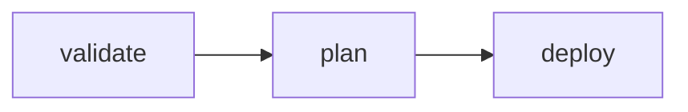
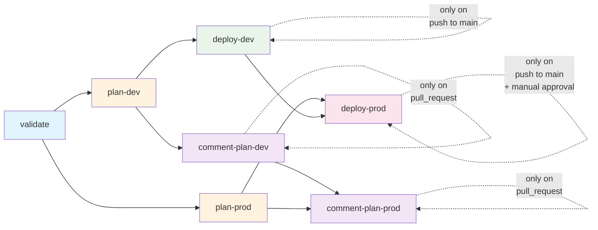

# Multi-Environment Pipeline Automation

## Overview

This module covers the implementation of automated Infrastructure as Code deployment pipelines using GitHub Actions. You'll learn to create YAML pipelines that automatically deploy Terraform configurations, implement multi-environment workflows, and establish proper security and governance practices for production deployments.

## Learning Objectives

- Implement multi-stage deployments
- Implement approval gates for production deployments
- Implement automated testing and validation in pipelines
- Troubleshoot common pipeline issues and deployment failures

---

### 2. Multi-stage Pipeline Example

To illustrate job dependencies, we will implement a multi-stage pipeline to split the CI/CD process into distinct phases:

1. **Job 1**: Validate
2. **Job 2**: Plan
3. **Job 3**: Deploy to Development

Between the *plan* and the *deploy* jobs, an artifact containing the Terraform plan will be shared in order to ensure that the exact same plan is applied in the next stage.

A transition from a job to another job is only possible if the previous job has succeeded based on `needs` statement that creates an explicit dependency between jobs.

```yaml
# .github/workflows/terraform-ci-cd.yml
name: 'Terraform CI/CD'

on:
  push:
    branches: [ main ]
  pull_request:
    branches: [ main ]

permissions:
  id-token: write   # Required for OIDC
  contents: read    # Required for checkout

jobs:
  # Job 1: Validate & Plan
  validate:
    runs-on: ubuntu-latest

    steps:
    - name: Checkout
      uses: actions/checkout@v5

    - name: Azure Login using OIDC
      uses: azure/login@v2
      with:
        client-id: ${{ secrets.AZURE_CLIENT_ID }}
        tenant-id: ${{ secrets.AZURE_TENANT_ID }}
        subscription-id: ${{ secrets.AZURE_SUBSCRIPTION_ID }}

    - name: Setup Terraform
      uses: hashicorp/setup-terraform@v3
      # with:
      #   terraform_version: 1.5.0    # It is recommended to pin to a specific version for production

    # Initialize a backend store for state management
    - name: Terraform Init with backend
      run: |
        terraform init \
          -backend-config="storage_account_name=tfstates${{ vars.RANDOM_SUFFIX }}" \
          -backend-config="container_name=iac-workshop-tfstates" \
          -backend-config="key=terraform-dev.tfstate" \
          -backend-config="resource_group_name=rg-terraform-state"
      working-directory: ./terraform

    - name: Terraform Validate
      run: terraform validate
      working-directory: ./terraform

    - name: Terraform Format Check
      run: terraform fmt -check=true -diff=true -recursive
      working-directory: ./terraform

  # Job 2: Plan
  plan:
    needs: validate
    runs-on: ubuntu-latest

    steps:
    - name: Checkout
      uses: actions/checkout@v5

    - name: Azure Login using OIDC
      uses: azure/login@v2
      with:
        client-id: ${{ secrets.AZURE_CLIENT_ID }}
        tenant-id: ${{ secrets.AZURE_TENANT_ID }}
        subscription-id: ${{ secrets.AZURE_SUBSCRIPTION_ID }}

    - name: Setup Terraform
      uses: hashicorp/setup-terraform@v3

    # Initialize a backend store for state management
    - name: Terraform Init with backend
      run: |
        terraform init \
          -backend-config="storage_account_name=tfstates${{ vars.RANDOM_SUFFIX }}" \
          -backend-config="container_name=iac-workshop-tfstates" \
          -backend-config="key=terraform-dev.tfstate" \
          -backend-config="resource_group_name=rg-terraform-state"
      working-directory: ./terraform

    - name: Terraform Plan
      run: terraform plan -var-file="environments/dev/terraform.tfvars" -out=plan.tfout
      working-directory: ./terraform

    - name: Terraform Show
      run: terraform show -no-color ./plan.tfout
      working-directory: ./terraform

    - name: Save Plan as Artifact
      uses: actions/upload-artifact@v4
      with:
        name: tfplan
        path: ./terraform/plan.tfout
        retention-days: 1

  # Job 3: Deploy to Development
  deploy:
    needs: plan
    runs-on: ubuntu-latest

    steps:
    - name: Checkout
      uses: actions/checkout@v5

    - name: Download Plan Artifact
      uses: actions/download-artifact@v4
      with:
        name: tfplan
        path: ./terraform/

    - name: Azure Login using OIDC
      uses: azure/login@v2
      with:
        client-id: ${{ secrets.AZURE_CLIENT_ID }}
        tenant-id: ${{ secrets.AZURE_TENANT_ID }}
        subscription-id: ${{ secrets.AZURE_SUBSCRIPTION_ID }}

    - name: Setup Terraform
      uses: hashicorp/setup-terraform@v3

    # Initialize a backend store for state management
    - name: Terraform Init with backend
      run: |
        terraform init \
          -backend-config="storage_account_name=tfstates${{ vars.RANDOM_SUFFIX }}" \
          -backend-config="container_name=iac-workshop-tfstates" \
          -backend-config="key=terraform-dev.tfstate" \
          -backend-config="resource_group_name=rg-terraform-state"
      working-directory: ./terraform

    - name: Terraform Apply
      if: github.ref == 'refs/heads/main' && github.event_name == 'push' # Only apply on push to main branch
      run: terraform apply -var-file="environments/dev/terraform.tfvars" plan.tfout
      working-directory: ./terraform
```

Once committed, then pushed to the `main` branch, this workflow will be triggered and you can monitor its progress in the Actions tab of your GitHub repository.

It should look like this:



#### Explore artifacts and logs

Once the workflow is completed, you can explore the logs of each job by clicking on them, focus on the *plan* job to see the output of the `terraform show` command that displays the execution plan.

You can also explore the artifact generated in the *plan* job by clicking on the `tfplan` link in the summary of the job. As the Terraform plan was saved as a binary file, you won't be able to read it directly but you can download it and use it in your local environment with the `terraform show` command.

### Multi-environment Pipeline

In the following section we will enhance the previous pipeline to support multiple environments: `dev` and `prod`. We are ignoring the `staging` environment for simplicity.

#### Composite Actions

To improve reusability and maintainability of your workflows, you can create composite actions that encapsulate a series of steps into a single action that can be reused across multiple workflows.

Create the following files and folders structure in your repository:

```bash
mkdir -p .github/actions/terraform-setup-init
mkdir -p .github/actions/terraform-plan
mkdir -p .github/actions/terraform-apply
mkdir -p .github/actions/terraform-comment

touch .github/actions/terraform-setup-init/action.yml
touch .github/actions/terraform-plan/action.yml
touch .github/actions/terraform-apply/action.yml
touch .github/actions/terraform-comment/action.yml
```

##### Composite Action: Setup Terraform and Init

```yaml
# .github/actions/terraform-setup-init/action.yml
name: 'Complete Terraform Setup and Init'
description: 'Setup Terraform, authenticate with Azure, and initialize with backend'

inputs:
  azure-client-id:
    description: 'Azure Client ID'
    required: true
  azure-tenant-id:
    description: 'Azure Tenant ID'
    required: true
  azure-subscription-id:
    description: 'Azure Subscription ID'
    required: true
  working-directory:
    description: 'Terraform working directory'
    required: false
    default: './terraform'
  environment:
    description: 'Target environment (dev, prod, staging)'
    required: true
  storage-account-suffix:
    description: 'Random suffix for storage account name'
    required: true
  resource-group-name:
    description: 'Resource group name for state storage'
    required: false
    default: 'rg-terraform-state'
  container-name:
    description: 'Storage container name for state'
    required: false
    default: 'iac-workshop-tfstates'
  terraform-version:
    description: 'Terraform version to install'
    required: false
    default: 'latest'

runs:
  using: 'composite'
  steps:
    - name: Azure Login using OIDC
      uses: azure/login@v2
      with:
        client-id: ${{ inputs.azure-client-id }}
        tenant-id: ${{ inputs.azure-tenant-id }}
        subscription-id: ${{ inputs.azure-subscription-id }}

    - name: Setup Terraform
      uses: hashicorp/setup-terraform@v3
      with:
        terraform_version: ${{ inputs.terraform-version }}

    - name: Verify Azure Authentication
      shell: bash
      run: |
        echo "Verifying Azure authentication..."
        az account show > /dev/null
        echo "Azure CLI authentication: OK"

    - name: Terraform Init with Backend
      shell: bash
      run: |
        terraform init \
          -backend-config="storage_account_name=tfstates${{ inputs.storage-account-suffix }}" \
          -backend-config="container_name=${{ inputs.container-name }}" \
          -backend-config="key=terraform-${{ inputs.environment }}.tfstate" \
          -backend-config="resource_group_name=${{ inputs.resource-group-name }}"
      working-directory: ${{ inputs.working-directory }}
```

##### Composite Action: Terraform Plan

```yaml
# .github/actions/terraform-plan/action.yml
name: 'Terraform Plan'
description: 'Run terraform plan and optionally save as artifact'

inputs:
  working-directory:
    description: 'Terraform working directory'
    required: false
    default: './terraform'
  environment:
    description: 'Target environment (dev, prod, staging)'
    required: true
  var-file-path:
    description: 'Path to terraform.tfvars file'
    required: false
    default: ''
  additional-vars:
    description: 'Additional terraform variables'
    required: false
    default: ''
  save-plan:
    description: 'Whether to save plan as artifact'
    required: false
    default: 'true'
  show-plan:
    description: 'Whether to show plan output'
    required: false
    default: 'true'

runs:
  using: 'composite'
  steps:
    - name: Terraform Plan
      shell: bash
      run: |
        VAR_FILE_ARG=""
        if [ -n "${{ inputs.var-file-path }}" ]; then
          VAR_FILE_ARG="-var-file=${{ inputs.var-file-path }}"
        elif [ -f "environments/${{ inputs.environment }}/terraform.tfvars" ]; then
          VAR_FILE_ARG="-var-file=environments/${{ inputs.environment }}/terraform.tfvars"
        fi

        terraform plan $VAR_FILE_ARG ${{ inputs.additional-vars }} -out=plan.tfout
      working-directory: ${{ inputs.working-directory }}

    - name: Show Plan
      if: inputs.show-plan == 'true'
      shell: bash
      run: terraform show -no-color plan.tfout
      working-directory: ${{ inputs.working-directory }}

    - name: Save Plan as Artifact
      if: inputs.save-plan == 'true'
      uses: actions/upload-artifact@v4
      with:
        name: tfplan-${{ inputs.environment }}
        path: ${{ inputs.working-directory }}/plan.tfout
        retention-days: 5
```

##### Composite Action: Terraform Apply

```yaml
# .github/actions/terraform-apply/action.yml
name: 'Terraform Apply'
description: 'Download plan and apply terraform configuration'

inputs:
  working-directory:
    description: 'Terraform working directory'
    required: false
    default: './terraform'
  environment:
    description: 'Target environment (dev, prod, staging)'
    required: true
  use-existing-plan:
    description: 'Whether to use existing plan artifact'
    required: false
    default: 'true'
  var-file-path:
    description: 'Path to terraform.tfvars file (if not using existing plan)'
    required: false
    default: ''
  additional-vars:
    description: 'Additional terraform variables (if not using existing plan)'
    required: false
    default: ''

runs:
  using: 'composite'
  steps:
    - name: Download Plan Artifact
      if: inputs.use-existing-plan == 'true'
      uses: actions/download-artifact@v4
      with:
        name: tfplan-${{ inputs.environment }}
        path: ${{ inputs.working-directory }}/

    - name: Terraform Apply (with existing plan)
      if: inputs.use-existing-plan == 'true'
      shell: bash
      run: terraform apply plan.tfout
      working-directory: ${{ inputs.working-directory }}

    - name: Terraform Apply (without existing plan)
      if: inputs.use-existing-plan == 'false'
      shell: bash
      run: |
        VAR_FILE_ARG=""
        if [ -n "${{ inputs.var-file-path }}" ]; then
          VAR_FILE_ARG="-var-file=${{ inputs.var-file-path }}"
        elif [ -f "environments/${{ inputs.environment }}/terraform.tfvars" ]; then
          VAR_FILE_ARG="-var-file=environments/${{ inputs.environment }}/terraform.tfvars"
        fi

        terraform apply -auto-approve $VAR_FILE_ARG ${{ inputs.additional-vars }}
      working-directory: ${{ inputs.working-directory }}
```

##### Composite Action: Terraform Comment

```yaml
# .github/actions/terraform-comment/action.yml
name: 'Terraform Plan Comment'
description: 'Download terraform plan, generate summary, and comment on PR'

inputs:
  azure-client-id:
    description: 'Azure Client ID'
    required: true
  azure-tenant-id:
    description: 'Azure Tenant ID'
    required: true
  azure-subscription-id:
    description: 'Azure Subscription ID'
    required: true
  working-directory:
    description: 'Terraform working directory'
    required: false
    default: './terraform'
  environment:
    description: 'Target environment (dev, prod, staging)'
    required: true
  storage-account-suffix:
    description: 'Random suffix for storage account name'
    required: true
  github-token:
    description: 'GitHub token for commenting'
    required: true

runs:
  using: 'composite'
  steps:
    - name: Download Plan
      uses: actions/download-artifact@v4
      with:
        name: tfplan-${{ inputs.environment }}
        path: ${{ inputs.working-directory }}/
      continue-on-error: true

    - name: Setup Terraform and Init
      uses: ./.github/actions/terraform-setup-init
      with:
        azure-client-id: ${{ inputs.azure-client-id }}
        azure-tenant-id: ${{ inputs.azure-tenant-id }}
        azure-subscription-id: ${{ inputs.azure-subscription-id }}
        working-directory: ${{ inputs.working-directory }}
        environment: ${{ inputs.environment }}
        storage-account-suffix: ${{ inputs.storage-account-suffix }}

    - name: Generate Complete Plan Summary
      shell: bash
      run: |
        set -e

        # Set emoji based on environment
        if [ "${{ inputs.environment }}" = "prod" ]; then
          EMOJI="🚨"
          ENV_NAME="Production"
        else
          EMOJI="🧪"
          ENV_NAME="Development"
        fi

        echo "## ${EMOJI} ${ENV_NAME}" > plan-summary.md
        echo "" >> plan-summary.md

        # Check if plan file exists
        if [ ! -f "plan.tfout" ]; then
          echo "❌ Plan file not found - check plan generation" >> plan-summary.md
          exit 0
        fi

        # Get plan output and check for changes
        PLAN_OUTPUT=$(terraform show -no-color plan.tfout 2>/dev/null || echo "Error reading plan")

        if echo "$PLAN_OUTPUT" | grep -q "No changes"; then
          echo "✅ No changes detected" >> plan-summary.md
        elif echo "$PLAN_OUTPUT" | grep -q "Error reading plan"; then
          echo "❌ Error reading plan file" >> plan-summary.md
        else
          # Count changes for summary
          ADD_COUNT=$(echo "$PLAN_OUTPUT" | grep -c "# .* will be created" || echo "0")
          CHANGE_COUNT=$(echo "$PLAN_OUTPUT" | grep -c "# .* will be updated" || echo "0")
          DESTROY_COUNT=$(echo "$PLAN_OUTPUT" | grep -c "# .* will be destroyed" || echo "0")

          # Summary line
          if [ "$DESTROY_COUNT" -gt "0" ] && [ "${{ inputs.environment }}" = "prod" ]; then
            echo "🔴 **${ADD_COUNT}** add, **${CHANGE_COUNT}** change, **${DESTROY_COUNT}** destroy" >> plan-summary.md
          else
            echo "📝 **${ADD_COUNT}** add, **${CHANGE_COUNT}** change, **${DESTROY_COUNT}** destroy" >> plan-summary.md
          fi

          echo "" >> plan-summary.md

          # Add collapsible section with full plan
          echo '<details>' >> plan-summary.md
          echo '<summary>📋 Click to view full plan details</summary>' >> plan-summary.md
          echo '' >> plan-summary.md
          echo '```terraform' >> plan-summary.md

          # Limit output to prevent GitHub comment size limits (65536 chars)
          # Show first 50KB of plan output
          echo "$PLAN_OUTPUT" | head -c 50000 >> plan-summary.md

          # Check if we truncated the output
          if [ ${#PLAN_OUTPUT} -gt 50000 ]; then
            echo "" >> plan-summary.md
            echo "... (output truncated - see workflow logs for complete plan)" >> plan-summary.md
          fi

          echo '```' >> plan-summary.md
          echo '</details>' >> plan-summary.md
        fi

        echo "" >> plan-summary.md
        echo "_Commit: ${GITHUB_SHA:0:7}_" >> plan-summary.md
      working-directory: ${{ inputs.working-directory }}

    - name: Comment on PR
      uses: actions/github-script@v7
      with:
        github-token: ${{ inputs.github-token }}
        script: |
          const fs = require('fs');

          try {
            const plan = fs.readFileSync('${{ inputs.working-directory }}/plan-summary.md', 'utf8');
            const environment = '${{ inputs.environment }}';
            const envName = environment === 'prod' ? 'Production' : 'Development';

            // Check GitHub comment size limit (65536 characters)
            if (plan.length > 65000) {
              console.log(`Plan comment is ${plan.length} characters, truncating to fit GitHub limits`);
              const truncatedPlan = plan.substring(0, 65000) + '\n\n... (comment truncated - see workflow logs for complete plan)';
              var finalPlan = truncatedPlan;
            } else {
              var finalPlan = plan;
            }

            // Find existing comment
            const comments = await github.rest.issues.listComments({
              issue_number: context.issue.number,
              owner: context.repo.owner,
              repo: context.repo.repo,
            });

            const existingComment = comments.data.find(comment =>
              comment.user.type === 'Bot' &&
              comment.body.includes(envName)
            );

            if (existingComment) {
              await github.rest.issues.updateComment({
                comment_id: existingComment.id,
                owner: context.repo.owner,
                repo: context.repo.repo,
                body: finalPlan
              });
              console.log(`Updated existing comment for ${envName}`);
            } else {
              await github.rest.issues.createComment({
                issue_number: context.issue.number,
                owner: context.repo.owner,
                repo: context.repo.repo,
                body: finalPlan
              });
              console.log(`Created new comment for ${envName}`);
            }
          } catch (error) {
            console.error('Error posting comment:', error);

            const environment = '${{ inputs.environment }}';
            const envName = environment === 'prod' ? 'Production' : 'Development';

            // Post error comment as fallback
            await github.rest.issues.createComment({
              issue_number: context.issue.number,
              owner: context.repo.owner,
              repo: context.repo.repo,
              body: `## ❌ ${envName} Plan Error\n\nFailed to generate plan summary. Check workflow logs for details.\n\n_Commit: ${context.sha.substring(0, 7)}_`
            });
          }
```

#### Github environment setup

In your GitHub repository:

1. Go to **Settings** → **Environments**
1. Create two environments:
    - `development` (no protection rules)
    - `production` (with protection rules)
1. For the `production` environment:
    - **Protection rules** → ✅ Required reviewers
    - Add yourself (or team members) as **required reviewers**

In our case, no environment secrets or variables are needed as we are using repository-level secrets and variables.

(Optional for the lab) Protect the `main` branch by enabling branch protection rules to require pull request reviews before merging:

1. Go to **Settings** → **Rules** → **Rulesets** → **New ruleset**
1. Create a ruleset for the `main` branch
    - Name: `Protect main branch`
    - Enforcement status: `Active`
    - Target branches: `include default branch`

#### Workflow Implementation

Update your workflow to use the composite actions and implement multi-environment deployments with approval gates for production:

```yaml
# .github/workflows/terraform-ci-cd.yml
name: 'Multi-Environment Terraform Deployment'

on:
  push:
    branches: [ main ]
  pull_request:
    branches: [ main ]

permissions:
  id-token: write       # Required for OIDC
  contents: read        # Required for checkout
  pull-requests: write  # Required for PR comments

env:
  TF_WORKING_DIR: './terraform'

jobs:
  # Validate on all events (push and PR)
  validate:
    runs-on: ubuntu-latest
    steps:
    - name: Checkout
      uses: actions/checkout@v5

    - name: Setup Terraform and Init for Dev
      uses: ./.github/actions/terraform-setup-init
      with:
        azure-client-id: ${{ secrets.AZURE_CLIENT_ID }}
        azure-tenant-id: ${{ secrets.AZURE_TENANT_ID }}
        azure-subscription-id: ${{ secrets.AZURE_SUBSCRIPTION_ID }}
        working-directory: ${{ env.TF_WORKING_DIR }}
        environment: 'dev'
        storage-account-suffix: ${{ vars.RANDOM_SUFFIX }}

    - name: Terraform Validate
      run: terraform validate
      working-directory: ${{ env.TF_WORKING_DIR }}

    - name: Terraform Format Check
      run: terraform fmt -check=true -diff=true -recursive
      working-directory: ${{ env.TF_WORKING_DIR }}

  # Plan for Dev environment (runs on both PR and push)
  plan-dev:
    needs: validate
    runs-on: ubuntu-latest
    steps:
    - name: Checkout
      uses: actions/checkout@v5

    - name: Setup Terraform and Init
      uses: ./.github/actions/terraform-setup-init
      with:
        azure-client-id: ${{ secrets.AZURE_CLIENT_ID }}
        azure-tenant-id: ${{ secrets.AZURE_TENANT_ID }}
        azure-subscription-id: ${{ secrets.AZURE_SUBSCRIPTION_ID }}
        working-directory: ${{ env.TF_WORKING_DIR }}
        environment: 'dev'
        storage-account-suffix: ${{ vars.RANDOM_SUFFIX }}

    - name: Plan Dev Environment
      uses: ./.github/actions/terraform-plan
      with:
        working-directory: ${{ env.TF_WORKING_DIR }}
        environment: 'dev'

  # Plan for Prod environment (now runs on both PR and push)
  plan-prod:
    needs: validate
    runs-on: ubuntu-latest
    steps:
    - name: Checkout
      uses: actions/checkout@v5

    - name: Setup Terraform and Init
      uses: ./.github/actions/terraform-setup-init
      with:
        azure-client-id: ${{ secrets.AZURE_CLIENT_ID }}
        azure-tenant-id: ${{ secrets.AZURE_TENANT_ID }}
        azure-subscription-id: ${{ secrets.AZURE_SUBSCRIPTION_ID }}
        working-directory: ${{ env.TF_WORKING_DIR }}
        environment: 'prod'
        storage-account-suffix: ${{ vars.RANDOM_SUFFIX }}

    - name: Plan Prod Environment
      uses: ./.github/actions/terraform-plan
      with:
        working-directory: ${{ env.TF_WORKING_DIR }}
        environment: 'prod'

  # Auto-deploy to DEV on push to main
  deploy-dev:
    needs: [plan-dev]
    runs-on: ubuntu-latest
    if: github.ref == 'refs/heads/main' && github.event_name == 'push'
    environment: development
    steps:
    - name: Checkout
      uses: actions/checkout@v5

    - name: Setup Terraform and Init
      uses: ./.github/actions/terraform-setup-init
      with:
        azure-client-id: ${{ secrets.AZURE_CLIENT_ID }}
        azure-tenant-id: ${{ secrets.AZURE_TENANT_ID }}
        azure-subscription-id: ${{ secrets.AZURE_SUBSCRIPTION_ID }}
        working-directory: ${{ env.TF_WORKING_DIR }}
        environment: 'dev'
        storage-account-suffix: ${{ vars.RANDOM_SUFFIX }}

    - name: Apply to Development
      uses: ./.github/actions/terraform-apply
      with:
        working-directory: ${{ env.TF_WORKING_DIR }}
        environment: 'dev'

    - name: Post-deployment validation
      run: |
        echo "🎉 Development deployment completed successfully!"
        echo "Environment: Development"
        echo "Timestamp: $(date)"
        echo "Commit: ${{ github.sha }}"

  # Deploy to PROD with manual approval
  deploy-prod:
    needs: [plan-prod, deploy-dev]
    runs-on: ubuntu-latest
    if: github.ref == 'refs/heads/main' && github.event_name == 'push'
    environment: production
    steps:
    - name: Checkout
      uses: actions/checkout@v5

    - name: Pre-deployment notification
      run: |
        echo "🚀 Starting PRODUCTION deployment"
        echo "⚠️  This deployment affects production systems"
        echo "Reviewer: ${{ github.triggering_actor }}"
        echo "Commit: ${{ github.sha }}"
        echo "Changes: ${{ github.event.head_commit.message }}"

    - name: Setup Terraform and Init
      uses: ./.github/actions/terraform-setup-init
      with:
        azure-client-id: ${{ secrets.AZURE_CLIENT_ID }}
        azure-tenant-id: ${{ secrets.AZURE_TENANT_ID }}
        azure-subscription-id: ${{ secrets.AZURE_SUBSCRIPTION_ID }}
        working-directory: ${{ env.TF_WORKING_DIR }}
        environment: 'prod'
        storage-account-suffix: ${{ vars.RANDOM_SUFFIX }}

    - name: Apply to Production
      uses: ./.github/actions/terraform-apply
      with:
        working-directory: ${{ env.TF_WORKING_DIR }}
        environment: 'prod'

    - name: Post-deployment validation
      run: |
        echo "✅ Production deployment completed successfully!"
        echo "Environment: Production"
        echo "Timestamp: $(date)"
        echo "Commit: ${{ github.sha }}"
        echo "Approved by: ${{ github.triggering_actor }}"

  # Comment Dev plan on PRs (using shared action) - runs first
  comment-plan-dev:
    needs: [plan-dev]
    runs-on: ubuntu-latest
    if: github.event_name == 'pull_request'
    steps:
    - name: Checkout
      uses: actions/checkout@v5

    - name: Comment Dev Plan
      uses: ./.github/actions/terraform-comment
      with:
        azure-client-id: ${{ secrets.AZURE_CLIENT_ID }}
        azure-tenant-id: ${{ secrets.AZURE_TENANT_ID }}
        azure-subscription-id: ${{ secrets.AZURE_SUBSCRIPTION_ID }}
        working-directory: ${{ env.TF_WORKING_DIR }}
        environment: 'dev'
        storage-account-suffix: ${{ vars.RANDOM_SUFFIX }}
        github-token: ${{ secrets.GITHUB_TOKEN }}

  # Comment Prod plan on PRs (using shared action) - runs after dev comment
  comment-plan-prod:
    needs: [plan-prod, comment-plan-dev]
    runs-on: ubuntu-latest
    if: github.event_name == 'pull_request'
    steps:
    - name: Checkout
      uses: actions/checkout@v5

    - name: Comment Prod Plan
      uses: ./.github/actions/terraform-comment
      with:
        azure-client-id: ${{ secrets.AZURE_CLIENT_ID }}
        azure-tenant-id: ${{ secrets.AZURE_TENANT_ID }}
        azure-subscription-id: ${{ secrets.AZURE_SUBSCRIPTION_ID }}
        working-directory: ${{ env.TF_WORKING_DIR }}
        environment: 'prod'
        storage-account-suffix: ${{ vars.RANDOM_SUFFIX }}
        github-token: ${{ secrets.GITHUB_TOKEN }}
```

#### Workflow Explanation



#### Branch and pull request

To test the multi-environment pipeline with pull requests, create a new branch from `main`, make changes to the Terraform code, and open a pull request:

```bash
# Create a new branch and switch to it
git checkout -b feature/add-a-beautiful-cicd-pipeline

# Stage and commit changes
git add .github/
git commit -m "Add multi-environment CICD pipeline"

# Push the branch to GitHub
git push origin feature/add-a-beautiful-cicd-pipeline
```

On GitHub, create a **pull request** from your branch to `main`.

1. You should see the `validate`, `plan-dev`, and `plan-prod` jobs running (+ the commenting jobs).
1. Once completed, comments with the Terraform plan summary will be added to the pull request.
    - One for the `dev` environment
    - One for the `prod` environment
1. Review the plan (including the collapsed details).

#### Merge and deploy to production

When ready, merge the pull request to `main` and observe the new workflow run triggered by the push event on `main`:

* The `deploy-dev` job will run automatically, followed by the `plan-prod` job.
* The `deploy-prod` job will wait for manual approval before proceeding with the production deployment.

If the `dev` deployment is successful, and you are ready to switch to production, approve the `production` deployment in the GitHub UI to proceed.

----

## Module Summary

In this module, you have implemented a multi-environment Terraform deployment pipeline using GitHub Actions. You learned how to create reusable composite actions, set up environment protection rules, and implement approval gates for production deployments. You also explored how to automate plan generation and provide feedback through pull request comments.

**Next Lab**: [Cleanup: Tear Down Resources](../04-cleanup)
